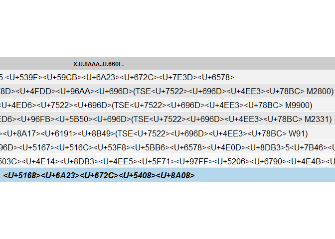
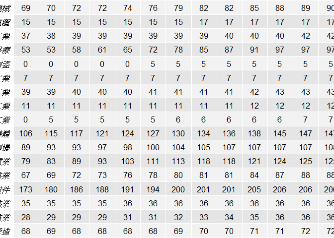

# 處理論文統計分析過程說明
Oscar-Deng  
2016年7月31日  
##**前言**
編輯人：鄧孝航
聯絡信箱：[402391174@mail.fju.edu.tw](mailto:402391174@mail.fju.edu.tw,402391174@mail.fju.edu.tw?subject=Questions&body=你好，我想請教關於...%0A請盡速回復，謝謝)
內容如有不當煩請告知，謝謝！
為了推廣「可重複研究**(Reproducible Research)**」的概念並方便將來再次研究分析，故建立此說明檔解釋相關的R語言函數及數據處理過程。
有關於可重複研究的概念，可參考維基百科[**(Reproducible Research)**](https://en.wikipedia.org/wiki/Reproducibility#Reproducible_research)。

本分析使用R語言作為統計分析之工具，並搭配R、Rstudio、Excel、TEJ資料庫。

> 
參考論文： **企業競爭策略與產業競爭程度對避稅行為之影響**
<br>
作者：**史宗玄**
<br>
指導教授：**黃美祝 博士**
<br>

本文僅供學術研究之用！
<br>

##**Ready to run R**
<br>
欲建立運行環境，請先至[R的網站](https://cran.r-project.org/mirrors.html)下載新版的R安裝。

>
1. 使用<kbd>Ctrl+F</kbd>搜尋**Taiwan**，並任選一鏡像下載點，或直接[點此下載](http://cran.csie.ntu.edu.tw/)。
2. 請選擇適合自己電腦運行介面的版本，R提供Linux, Mac及Windows三種版本。
3. R支援多國語言，從哪個鏡像下載不影響安裝。
4. 建議版本需**3.3.0**以後。

再至[Rstudio官網](https://www.rstudio.com/)下載主程式安裝，或[點此](https://www.rstudio.com/products/rstudio/download/)至下載頁面。
<br>
Rstudio載點快速連結：(**0.99.902**版，於2016/7/28更新)

> 
1. [Windows Vista/7/8/10](https://download1.rstudio.org/RStudio-0.99.902.exe "RStudio-0.99.902.exe")
2. [Mac OS X 10.6+ (64-bit)](https://download1.rstudio.org/RStudio-0.99.902.dmg "RStudio-0.99.902.dmg")
3. [Ubuntu 12.04+/Debian 8+ (64-bit)](https://download1.rstudio.org/rstudio-0.99.902-amd64.deb "rstudio-0.99.902-amd64.deb")
<br>

安裝完成後，請確認Rstudio或RGui之語言及區域(language & locale)設定正確：


```r
# 查看環境設定
sessionInfo()
# 查看語言/地區設定
Sys.getlocale(category = "LC_ALL")
# 若上述回傳非顯示相同值，請輸入下方設定
Sys.setlocale("LC_ALL",locale='cht')
```

其他疑難排解，請見[手冊](https://github.com/dspim/R/wiki/R-&-RStudio-Troubleshooting-Guide "R & RStudio Troubleshooting Guide")及[下方](#qa "Q&A")說明
<br>
<br>

##**Empirical Analysis**
### **Coding Process**

> 
1. TEJ資料庫抓取資料建立分析資料庫。**(Getting Data)**
2. 整理資料至可使用程度(排除不需要的欄位)。**(Preparing Data)**
3. 產生虛擬變數及可供分析建模的變數。**(Produce Variables)**
4. 以線性多變量回歸模型分析資料，並製作相關分析表。**(Analyze)**
5. 產生報表。**(Produce reports and graphs)**
6. 解釋分析結果。**(Explain)**


### **Getting Data**
> 
 1. 開啟Excel，使用TEJ的Excel增益集。 [(如何開啟TEJ增益集?)](#如何開啟tej增益集)
 2. 讀入記錄檔.dat，可以得到本分析資料庫的原始設定。
 3. 運行RStudio

### **使用R執行統計分析**
#### **設定及運行函數庫**
##### 環境設定


```r
# 在Rstudio，設定工作資料夾(EX: D:\Documents\Dropbox\MyEssay\Rcoding)
setwd("D:\\Documents\\Dropbox\\MyEssay\\Rcoding\\")
wd <- getwd()
# 清除環境清單
rm(list=ls())
# 執行R統計編程
source('run2.R',encoding='utf-8')
```

##### 讀入函數設定


```r
# Functions
# install all packages and load.
packtogo <- c("readxl","xlsx","plyr","dplyr","knitr","data.table",
              "grid","gridExtra","ggplot2","zoo","R.oo","R.utils","psych",
              "robustHD","rbenchmark","foreign","rgl","stargazer","rmarkdown")
Install.pack <- function(list = packtogo){
  list.of.packages <- list
  new.packages <- list.of.packages[!(list.of.packages %in% installed.packages()[,"Package"])]
  if(length(new.packages)){install.packages(new.packages)}else{update.packages(list.of.packages)}
}
Load.pack <- function(list=as.list(packtogo)){lapply(list, require, character.only = TRUE)}
```

使用函數


```
## [[1]]
## [1] TRUE
## 
## [[2]]
## [1] TRUE
## 
## [[3]]
## [1] TRUE
## 
## [[4]]
## [1] TRUE
## 
## [[5]]
## [1] TRUE
## 
## [[6]]
## [1] TRUE
## 
## [[7]]
## [1] TRUE
## 
## [[8]]
## [1] TRUE
## 
## [[9]]
## [1] TRUE
## 
## [[10]]
## [1] TRUE
## 
## [[11]]
## [1] TRUE
## 
## [[12]]
## [1] TRUE
## 
## [[13]]
## [1] TRUE
## 
## [[14]]
## [1] TRUE
## 
## [[15]]
## [1] TRUE
## 
## [[16]]
## [1] TRUE
## 
## [[17]]
## [1] TRUE
## 
## [[18]]
## [1] TRUE
## 
## [[19]]
## [1] TRUE
```

##### 設定讀入資料庫函數


```r
# readDB函數：讀入TEJ之excel檔，並用excel中之屬性表設定欄位
readDB <- function(fil = "DB2.xlsx", attr_sht = "TEJ_attr", xls_sht = "TEJ"){
  DBattr <- read_excel(fil, sheet=attr_sht, col_names = TRUE)
  # read in excel database: DB2.xlsx, excel sheet: TEJ, with column names.
  DBori <- read_excel(fil, sheet=xls_sht, col_names = TRUE, col_types = DBattr$attr)
  # rename columns
  setnames(DBori,old=as.character(DBattr$old), new=as.character(DBattr$new))
  return(DBori)
}
```

應用函數，讀入TEJ資料表，設定擷取活頁名：TEJ，資料表屬性：TEJ_attr


```r
TEJ <- readDB(fil = "DB2.xlsx", attr_sht = "TEJ_attr", xls_sht = "TEJ")
# 輸出TEJ資料前10筆，及TEJ基本統計敘述
head(TEJ,10)
```

```
## # A tibble: 10 x 36
##                  company       date market TSE_code
##                    <chr>     <time>  <chr>    <chr>
## 1  1101 <U+53F0><U+6CE5> 2015-12-31    TSE    M1100
## 2  1101 <U+53F0><U+6CE5> 2014-12-31    TSE    M1100
## 3  1101 <U+53F0><U+6CE5> 2013-12-31    TSE    M1100
## 4  1101 <U+53F0><U+6CE5> 2012-12-28    TSE    M1100
## 5  1101 <U+53F0><U+6CE5> 2011-12-30    TSE    M1100
## 6  1101 <U+53F0><U+6CE5> 2010-12-31    TSE    M1100
## 7  1101 <U+53F0><U+6CE5> 2009-12-31    TSE    M1100
## 8  1101 <U+53F0><U+6CE5> 2008-12-31    TSE    M1100
## 9  1101 <U+53F0><U+6CE5> 2007-12-31    TSE    M1100
## 10 1101 <U+53F0><U+6CE5> 2006-12-29    TSE    M1100
## # ... with 32 more variables: TSE_name <chr>, TEJ_name2 <chr>,
## #   TEJ_code2 <chr>, TEJ_name1 <chr>, TEJ_code1 <chr>, BTE <dbl>,
## #   CTP_GAAP <dbl>, CTP_IFRS_CFI <dbl>, CTP_IFRS_CFO <dbl>,
## #   CTP_IFRS_CFF <dbl>, PTEBX <dbl>, EBIT <dbl>, OERD <dbl>, OEPRO <dbl>,
## #   NetSales <dbl>, employee <dbl>, PB <dbl>, FA <dbl>, Land <dbl>,
## #   LandR <dbl>, GrossSales <dbl>, TA <dbl>, TL <dbl>, INTAN <dbl>,
## #   QUICK <dbl>, InvIn <dbl>, InvLoss <dbl>, OUTINSTI <dbl>,
## #   RELATIN <dbl>, RELATOUT <dbl>, FAMILY <chr>, FAMILY2 <chr>
```

```r
summary(TEJ)
```

```
##    company               date                        market         
##  Length:22184       Min.   :2001-12-31 00:00:00   Length:22184      
##  Class :character   1st Qu.:2005-12-30 00:00:00   Class :character  
##  Mode  :character   Median :2009-12-31 00:00:00   Mode  :character  
##                     Mean   :2009-05-14 17:14:41                     
##                     3rd Qu.:2012-12-28 00:00:00                     
##                     Max.   :2015-12-31 00:00:00                     
##                                                                     
##    TSE_code           TSE_name          TEJ_name2        
##  Length:22184       Length:22184       Length:22184      
##  Class :character   Class :character   Class :character  
##  Mode  :character   Mode  :character   Mode  :character  
##                                                          
##                                                          
##                                                          
##                                                          
##   TEJ_code2          TEJ_name1          TEJ_code1        
##  Length:22184       Length:22184       Length:22184      
##  Class :character   Class :character   Class :character  
##  Mode  :character   Mode  :character   Mode  :character  
##                                                          
##                                                          
##                                                          
##                                                          
##       BTE              CTP_GAAP         CTP_IFRS_CFI      
##  Min.   :-6227799   Min.   : -103558   Min.   :-621170.0  
##  1st Qu.:    1945   1st Qu.:    1410   1st Qu.:      0.0  
##  Median :   20768   Median :   14958   Median :      0.0  
##  Mean   :  143900   Mean   :  113712   Mean   :   -428.8  
##  3rd Qu.:   73609   3rd Qu.:   56722   3rd Qu.:      0.0  
##  Max.   :48836899   Max.   :24697266   Max.   : 104467.0  
##  NA's   :647        NA's   :5800       NA's   :15895      
##   CTP_IFRS_CFO        CTP_IFRS_CFF          PTEBX          
##  Min.   :-46279121   Min.   :-111.000   Min.   :-69730270  
##  1st Qu.:   -84844   1st Qu.:   0.000   1st Qu.:    10378  
##  Median :   -22519   Median :   0.000   Median :   117590  
##  Mean   :  -168415   Mean   :  -0.038   Mean   :   838071  
##  3rd Qu.:    -2914   3rd Qu.:   0.000   3rd Qu.:   424886  
##  Max.   :   477285   Max.   :   0.000   Max.   :350428911  
##  NA's   :9953        NA's   :15895      NA's   :634        
##       EBIT                OERD              OEPRO          
##  Min.   :-63845927   Min.   :       0   Min.   :        0  
##  1st Qu.:    23005   1st Qu.:    4207   1st Qu.:    40165  
##  Median :   141980   Median :   33570   Median :   104562  
##  Mean   :   940782   Mean   :  262589   Mean   :   593858  
##  3rd Qu.:   477150   3rd Qu.:  103326   3rd Qu.:   289762  
##  Max.   :353619242   Max.   :65544579   Max.   :104581183  
##  NA's   :1062        NA's   :2444       NA's   :2745       
##     NetSales             employee            PB         
##  Min.   :   -271204   Min.   :     1   Min.   :  0.000  
##  1st Qu.:    871616   1st Qu.:   192   1st Qu.:  0.840  
##  Median :   2168427   Median :   525   Median :  1.270  
##  Mean   :  13661317   Mean   :  2879   Mean   :  1.733  
##  3rd Qu.:   6118952   3rd Qu.:  1646   3rd Qu.:  1.990  
##  Max.   :4482145967   Max.   :961000   Max.   :295.620  
##  NA's   :633          NA's   :2413     NA's   :3452     
##        FA                 Land               LandR         
##  Min.   :        0   Min.   :        0   Min.   :       0  
##  1st Qu.:   216299   1st Qu.:    13250   1st Qu.:       0  
##  Median :   675880   Median :    93861   Median :       0  
##  Mean   :  5032264   Mean   :   481051   Mean   :  143037  
##  3rd Qu.:  2094052   3rd Qu.:   291532   3rd Qu.:       0  
##  Max.   :853470392   Max.   :104136053   Max.   :39546244  
##  NA's   :629         NA's   :1121        NA's   :1363      
##    GrossSales               TA                  TL           
##  Min.   :   -271204   Min.   :3.930e+02   Min.   :0.000e+00  
##  1st Qu.:    917956   1st Qu.:1.151e+06   1st Qu.:3.844e+05  
##  Median :   2242572   Median :2.748e+06   Median :1.071e+06  
##  Mean   :  13966454   Mean   :1.496e+07   Mean   :7.646e+06  
##  3rd Qu.:   6293404   3rd Qu.:7.443e+06   3rd Qu.:3.312e+06  
##  Max.   :4482145967   Max.   :2.463e+09   Max.   :1.507e+09  
##  NA's   :974          NA's   :628         NA's   :631        
##      INTAN              QUICK             InvIn          
##  Min.   :       0   Min.   :      0   Min.   :-80078499  
##  1st Qu.:       0   1st Qu.:     76   1st Qu.:        0  
##  Median :    8487   Median :    119   Median :        0  
##  Mean   :  285279   Mean   :    576   Mean   :   -70350  
##  3rd Qu.:   53607   3rd Qu.:    200   3rd Qu.:        0  
##  Max.   :75430673   Max.   :7700476   Max.   :     1521  
##  NA's   :878        NA's   :1008      NA's   :1076       
##     InvLoss            OUTINSTI         RELATIN           RELATOUT     
##  Min.   :       0   Min.   :  0.00   Min.   :   0.00   Min.   : -3.00  
##  1st Qu.:       0   1st Qu.: 18.58   1st Qu.:   0.00   1st Qu.:  0.00  
##  Median :       0   Median : 34.51   Median :   1.00   Median :  4.00  
##  Mean   :   19347   Mean   : 37.58   Mean   :  17.81   Mean   : 13.43  
##  3rd Qu.:     174   3rd Qu.: 54.56   3rd Qu.:  23.00   3rd Qu.: 18.00  
##  Max.   :10922567   Max.   :100.00   Max.   :2892.00   Max.   :114.00  
##  NA's   :1076       NA's   :2497     NA's   :5932      NA's   :2879    
##     FAMILY            FAMILY2         
##  Length:22184       Length:22184      
##  Class :character   Class :character  
##  Mode  :character   Mode  :character  
##                                       
##                                       
##                                       
## 
```

##### 設定篩選函數，


```r
DBfilter <- function(x = TEJ,filt='filtered'){
  DB <- as.data.table(x)
  DB$year <- year(DB$date)
  DB0 <- DB[,.SD[.N > 0],by=list(TSE_code,year)]
  DB1 <- DB0[!(DB0$TSE_code %in% c('M2800','M9900','M2331','W91'))] # M2800金融業 # M9900其他 # M2331其他電子 # W91存託憑證
  DB2 <- DB1[,.SD[.N >= 5],by=list(TSE_code,year)] # removed M1800<2001-2005>,M2200<2001>
  DB3 <- DB2[!(DB2$FAMILY %in% NA) & # most family with NA got lots of NAs in other columns
               !(DB2$PB %in% NA) & # important var, must not be NA
               !(DB2$TA %in% NA) & # denominator or main var as PPE, ROA, SIZE, LEV, INTANG, must not bo NA.
               !(DB2$NetSales %in% c(0,NA)) & # remove netsales = 0 ... Denominator of (RD,EMP,MARKET),HHI's main var,
               !(DB2$employee %in% NA)]
  DB4 <- rbind(DB0,DB3)
  DB4 <- DB4[order(DB4$TSE_code,DB4$year),]
  DB5 <- DB4[!(duplicated(DB4) | duplicated(DB4, fromLast = TRUE)),]
  base::ifelse(filt=='filtered', return(DB2), base::ifelse(filt=='dropped', return(DB5), print("please assign filter type")))
} # 篩選後的:filt=filtered, #篩選刪掉的filt=dropped
```


```r
# 應用函數：篩選資料表，使用函數DBfilter，指派已篩選的資料表為TEJ01，被篩去的為TEJ02
TEJ01 <- DBfilter(x = TEJ,filt = 'filtered')
TEJ02 <- DBfilter(x = TEJ,filt = 'dropped')
# 輸出資料前10筆及基本統計敘述
head(TEJ01,10)
```

```
##     TSE_code year               company       date market
##  1:    M1100 2015 1101 <U+53F0><U+6CE5> 2015-12-31    TSE
##  2:    M1100 2015 1102 <U+4E9E><U+6CE5> 2015-12-31    TSE
##  3:    M1100 2015 1103 <U+5609><U+6CE5> 2015-12-31    TSE
##  4:    M1100 2015 1104 <U+74B0><U+6CE5> 2015-12-31    TSE
##  5:    M1100 2015 1108 <U+5E78><U+798F> 2015-12-31    TSE
##  6:    M1100 2015 1109 <U+4FE1><U+5927> 2015-12-31    TSE
##  7:    M1100 2015 1110 <U+6771><U+6CE5> 2015-12-31    TSE
##  8:    M1100 2014 1101 <U+53F0><U+6CE5> 2014-12-31    TSE
##  9:    M1100 2014 1102 <U+4E9E><U+6CE5> 2014-12-31    TSE
## 10:    M1100 2014 1103 <U+5609><U+6CE5> 2014-12-31    TSE
##                             TSE_name                        TEJ_name2
##  1: <U+6C34><U+6CE5><U+5DE5><U+696D> <U+6C34><U+6CE5><U+88FD><U+9020>
##  2: <U+6C34><U+6CE5><U+5DE5><U+696D> <U+6C34><U+6CE5><U+88FD><U+9020>
##  3: <U+6C34><U+6CE5><U+5DE5><U+696D> <U+6C34><U+6CE5><U+88FD><U+9020>
##  4: <U+6C34><U+6CE5><U+5DE5><U+696D> <U+6C34><U+6CE5><U+88FD><U+9020>
##  5: <U+6C34><U+6CE5><U+5DE5><U+696D> <U+6C34><U+6CE5><U+88FD><U+9020>
##  6: <U+6C34><U+6CE5><U+5DE5><U+696D> <U+6C34><U+6CE5><U+88FD><U+9020>
##  7: <U+6C34><U+6CE5><U+5DE5><U+696D> <U+6C34><U+6CE5><U+88FD><U+9020>
##  8: <U+6C34><U+6CE5><U+5DE5><U+696D> <U+6C34><U+6CE5><U+88FD><U+9020>
##  9: <U+6C34><U+6CE5><U+5DE5><U+696D> <U+6C34><U+6CE5><U+88FD><U+9020>
## 10: <U+6C34><U+6CE5><U+5DE5><U+696D> <U+6C34><U+6CE5><U+88FD><U+9020>
##     TEJ_code2                        TEJ_name1 TEJ_code1     BTE CTP_GAAP
##  1:      M11A <U+6C34><U+6CE5><U+88FD><U+9020>      M11A 1740389       NA
##  2:      M11A <U+6C34><U+6CE5><U+88FD><U+9020>      M11A 1879675       NA
##  3:      M11A <U+6C34><U+6CE5><U+88FD><U+9020>      M11A  -18421       NA
##  4:      M11A <U+6C34><U+6CE5><U+88FD><U+9020>      M11A   88490       NA
##  5:      M11A <U+6C34><U+6CE5><U+88FD><U+9020>      M11A  112889       NA
##  6:      M11A <U+6C34><U+6CE5><U+88FD><U+9020>      M11A   68462       NA
##  7:      M11A <U+6C34><U+6CE5><U+88FD><U+9020>      M11A    -507       NA
##  8:      M11A <U+6C34><U+6CE5><U+88FD><U+9020>      M11A 4614844       NA
##  9:      M11A <U+6C34><U+6CE5><U+88FD><U+9020>      M11A 2813741       NA
## 10:      M11A <U+6C34><U+6CE5><U+88FD><U+9020>      M11A  -44487       NA
##     CTP_IFRS_CFI CTP_IFRS_CFO CTP_IFRS_CFF    PTEBX     EBIT  OERD  OEPRO
##  1:            0     -3227539            0  8666015 10539754  6895 859723
##  2:            0     -1216131            0  6814158  8462028    NA     NA
##  3:            0       -91217            0   194900   421125     0  44136
##  4:            0       -42436            0  1471598  1486192 67033 100022
##  5:            0       -21063            0   616324   658951     0 135878
##  6:            0       -44468            0    11055    35961     0 178586
##  7:            0        -7218            0   143959   144497     0   7311
##  8:            0     -4066554            0 21198720 23105935 38678 964818
##  9:            0     -2059597            0 13719739 15387337    NA     NA
## 10:            0       -78763            0     9301   202368     0  45915
##      NetSales employee   PB        FA     Land LandR GrossSales        TA
##  1:  93679076     9768 0.93 113310134 20766374     0   93679076 293066355
##  2:  66287480     6719 0.68  67264573  6551714     0   66287480 270077209
##  3:   2826519      561 0.60   2336208    10470     0    2826519  27383042
##  4:   5163751      539 0.89   5587635  4666670     0    5163751  19970871
##  5:   5021353      552 0.85   2157348   724675     0    5021353   7855502
##  6:   4350645      848 0.70   4094343   562960     0    4350645   8636326
##  7:   1857289      138 1.05    349465   252143     0    1857289   9382538
##  8: 118325809     8890 1.36 108445563 20792683     0  118325809 292743832
##  9:  77683281     6917 0.92  70586382  6545839     0   77683281 282819055
## 10:   3937686      567 0.63   3085890    10470     0    3937686  33666479
##            TL    INTAN  QUICK    InvIn InvLoss OUTINSTI RELATIN RELATOUT
##  1: 137582103 22607552 111.48  -737161       0    78.71      NA       12
##  2: 115223017  5304367  65.61 -2986137       0    80.36      NA       28
##  3:  13336696        0 420.56        0  117219    57.29      NA        9
##  4:   3970485     8523 103.81 -1100028       0    54.19      NA        3
##  5:   3009838        0  71.52        0       0    49.24      NA       12
##  6:   2248398     4310 151.96        0     916    13.11      NA        5
##  7:    742845       66 317.41        0    6290    83.28      NA        8
##  8: 130726151 19542637 117.97 -1250088       0    80.31      NA       11
##  9: 121091829  5485677  90.87 -4350273       0    81.00      NA       29
## 10:  14384421        0 280.30        0   17916    56.76      NA        8
##     FAMILY                                          FAMILY2
##  1:      F <U+55AE><U+4E00><U+5BB6><U+65CF><U+4E3B><U+5C0E>
##  2:      F <U+55AE><U+4E00><U+5BB6><U+65CF><U+4E3B><U+5C0E>
##  3:      F <U+55AE><U+4E00><U+5BB6><U+65CF><U+4E3B><U+5C0E>
##  4:      F <U+55AE><U+4E00><U+5BB6><U+65CF><U+4E3B><U+5C0E>
##  5:      F <U+55AE><U+4E00><U+5BB6><U+65CF><U+4E3B><U+5C0E>
##  6:      F <U+55AE><U+4E00><U+5BB6><U+65CF><U+4E3B><U+5C0E>
##  7:      F <U+55AE><U+4E00><U+5BB6><U+65CF><U+4E3B><U+5C0E>
##  8:      F <U+55AE><U+4E00><U+5BB6><U+65CF><U+4E3B><U+5C0E>
##  9:      F <U+55AE><U+4E00><U+5BB6><U+65CF><U+4E3B><U+5C0E>
## 10:      F <U+55AE><U+4E00><U+5BB6><U+65CF><U+4E3B><U+5C0E>
```

```r
summary(TEJ01)
```

```
##    TSE_code              year        company         
##  Length:18978       Min.   :2001   Length:18978      
##  Class :character   1st Qu.:2005   Class :character  
##  Mode  :character   Median :2009   Mode  :character  
##                     Mean   :2008                     
##                     3rd Qu.:2012                     
##                     Max.   :2015                     
##                                                      
##       date                        market            TSE_name        
##  Min.   :2001-12-31 00:00:00   Length:18978       Length:18978      
##  1st Qu.:2005-12-30 00:00:00   Class :character   Class :character  
##  Median :2009-12-31 00:00:00   Mode  :character   Mode  :character  
##  Mean   :2009-05-09 23:16:31                                        
##  3rd Qu.:2012-12-28 00:00:00                                        
##  Max.   :2015-12-31 00:00:00                                        
##                                                                     
##   TEJ_name2          TEJ_code2          TEJ_name1        
##  Length:18978       Length:18978       Length:18978      
##  Class :character   Class :character   Class :character  
##  Mode  :character   Mode  :character   Mode  :character  
##                                                          
##                                                          
##                                                          
##                                                          
##   TEJ_code1              BTE              CTP_GAAP       
##  Length:18978       Min.   :-6227799   Min.   :  -61689  
##  Class :character   1st Qu.:    1726   1st Qu.:    1212  
##  Mode  :character   Median :   19922   Median :   14176  
##                     Mean   :  133921   Mean   :  109381  
##                     3rd Qu.:   71150   3rd Qu.:   54208  
##                     Max.   :43872744   Max.   :20023478  
##                     NA's   :28         NA's   :4469      
##   CTP_IFRS_CFI        CTP_IFRS_CFO        CTP_IFRS_CFF  
##  Min.   :-621170.0   Min.   :-40943357   Min.   :0      
##  1st Qu.:      0.0   1st Qu.:   -82282   1st Qu.:0      
##  Median :      0.0   Median :   -21669   Median :0      
##  Mean   :   -473.5   Mean   :  -153718   Mean   :0      
##  3rd Qu.:      0.0   3rd Qu.:    -2734   3rd Qu.:0      
##  Max.   : 104467.0   Max.   :   477285   Max.   :0      
##  NA's   :13465       NA's   :8184        NA's   :13465  
##      PTEBX                EBIT                OERD         
##  Min.   :-69730270   Min.   :-63845927   Min.   :       0  
##  1st Qu.:     8372   1st Qu.:    21117   1st Qu.:    4807  
##  Median :   114036   Median :   138102   Median :   34466  
##  Mean   :   801075   Mean   :   905637   Mean   :  261293  
##  3rd Qu.:   416254   3rd Qu.:   467174   3rd Qu.:  107827  
##  Max.   :350428911   Max.   :353619242   Max.   :65544579  
##  NA's   :21          NA's   :304         NA's   :1506      
##      OEPRO             NetSales             employee            PB        
##  Min.   :       0   Min.   :   -271204   Min.   :     1   Min.   :  0.00  
##  1st Qu.:   41088   1st Qu.:    875098   1st Qu.:   190   1st Qu.:  0.84  
##  Median :  104693   Median :   2197858   Median :   512   Median :  1.26  
##  Mean   :  580094   Mean   :  12701995   Mean   :  2221   Mean   :  1.73  
##  3rd Qu.:  296529   3rd Qu.:   6324116   3rd Qu.:  1630   3rd Qu.:  1.97  
##  Max.   :94243220   Max.   :1213712976   Max.   :177948   Max.   :295.62  
##  NA's   :1775       NA's   :20           NA's   :1490     NA's   :2431    
##        FA                 Land               LandR         
##  Min.   :        0   Min.   :        0   Min.   :       0  
##  1st Qu.:   209235   1st Qu.:    12927   1st Qu.:       0  
##  Median :   665277   Median :    93990   Median :       0  
##  Mean   :  5205022   Mean   :   510668   Mean   :  157381  
##  3rd Qu.:  2186837   3rd Qu.:   302709   3rd Qu.:       0  
##  Max.   :853470392   Max.   :104136053   Max.   :39546244  
##  NA's   :17          NA's   :342         NA's   :537       
##    GrossSales               TA                  TL           
##  Min.   :   -271204   Min.   :5.030e+02   Min.   :        0  
##  1st Qu.:    922785   1st Qu.:1.155e+06   1st Qu.:   383490  
##  Median :   2281404   Median :2.739e+06   Median :  1072751  
##  Mean   :  13000163   Mean   :1.475e+07   Mean   :  7377121  
##  3rd Qu.:   6504083   3rd Qu.:7.737e+06   3rd Qu.:  3436938  
##  Max.   :1218853846   Max.   :1.658e+09   Max.   :850398589  
##  NA's   :310          NA's   :16          NA's   :19         
##      INTAN              QUICK             InvIn          
##  Min.   :       0   Min.   :      0   Min.   :-80078499  
##  1st Qu.:       0   1st Qu.:     77   1st Qu.:        0  
##  Median :    8166   Median :    121   Median :        0  
##  Mean   :  289617   Mean   :    630   Mean   :   -70571  
##  3rd Qu.:   51589   3rd Qu.:    202   3rd Qu.:        0  
##  Max.   :75430673   Max.   :7700476   Max.   :     1521  
##  NA's   :228        NA's   :343       NA's   :331        
##     InvLoss            OUTINSTI         RELATIN           RELATOUT    
##  Min.   :       0   Min.   :  0.00   Min.   :   0.00   Min.   : -3.0  
##  1st Qu.:       0   1st Qu.: 17.95   1st Qu.:   0.00   1st Qu.:  0.0  
##  Median :       0   Median : 33.39   Median :   1.00   Median :  3.0  
##  Mean   :   20604   Mean   : 36.66   Mean   :  17.84   Mean   : 13.4  
##  3rd Qu.:     272   3rd Qu.: 53.05   3rd Qu.:  23.00   3rd Qu.: 18.0  
##  Max.   :10922567   Max.   :100.00   Max.   :2892.00   Max.   :106.0  
##  NA's   :331        NA's   :1971     NA's   :4504      NA's   :1797   
##     FAMILY            FAMILY2         
##  Length:18978       Length:18978      
##  Class :character   Class :character  
##  Mode  :character   Mode  :character  
##                                       
##                                       
##                                       
## 
```

```r
# 輸出資料前10筆及基本統計敘述
head(TEJ02,10)
```

```
##     TSE_code year               company       date market
##  1:    M1100 2001 1101 <U+53F0><U+6CE5> 2001-12-31    TSE
##  2:    M1100 2001 1102 <U+4E9E><U+6CE5> 2001-12-31    TSE
##  3:    M1100 2001 1103 <U+5609><U+6CE5> 2001-12-31    TSE
##  4:    M1100 2001 1104 <U+74B0><U+6CE5> 2001-12-31    TSE
##  5:    M1100 2001 1108 <U+5E78><U+798F> 2001-12-31    TSE
##  6:    M1100 2001 1109 <U+4FE1><U+5927> 2001-12-31    TSE
##  7:    M1100 2001 1110 <U+6771><U+6CE5> 2001-12-31    TSE
##  8:    M1100 2002 1102 <U+4E9E><U+6CE5> 2002-12-31    TSE
##  9:    M1100 2002 1103 <U+5609><U+6CE5> 2002-12-31    TSE
## 10:    M1100 2002 1104 <U+74B0><U+6CE5> 2002-12-31    TSE
##                             TSE_name                        TEJ_name2
##  1: <U+6C34><U+6CE5><U+5DE5><U+696D> <U+6C34><U+6CE5><U+88FD><U+9020>
##  2: <U+6C34><U+6CE5><U+5DE5><U+696D> <U+6C34><U+6CE5><U+88FD><U+9020>
##  3: <U+6C34><U+6CE5><U+5DE5><U+696D> <U+6C34><U+6CE5><U+88FD><U+9020>
##  4: <U+6C34><U+6CE5><U+5DE5><U+696D> <U+6C34><U+6CE5><U+88FD><U+9020>
##  5: <U+6C34><U+6CE5><U+5DE5><U+696D> <U+6C34><U+6CE5><U+88FD><U+9020>
##  6: <U+6C34><U+6CE5><U+5DE5><U+696D> <U+6C34><U+6CE5><U+88FD><U+9020>
##  7: <U+6C34><U+6CE5><U+5DE5><U+696D> <U+6C34><U+6CE5><U+88FD><U+9020>
##  8: <U+6C34><U+6CE5><U+5DE5><U+696D> <U+6C34><U+6CE5><U+88FD><U+9020>
##  9: <U+6C34><U+6CE5><U+5DE5><U+696D> <U+6C34><U+6CE5><U+88FD><U+9020>
## 10: <U+6C34><U+6CE5><U+5DE5><U+696D> <U+6C34><U+6CE5><U+88FD><U+9020>
##     TEJ_code2                        TEJ_name1 TEJ_code1     BTE CTP_GAAP
##  1:      M11A <U+6C34><U+6CE5><U+88FD><U+9020>      M11A  -97593   127469
##  2:      M11A <U+6C34><U+6CE5><U+88FD><U+9020>      M11A   72627    15747
##  3:      M11A <U+6C34><U+6CE5><U+88FD><U+9020>      M11A  159477    62337
##  4:      M11A <U+6C34><U+6CE5><U+88FD><U+9020>      M11A    5684    13356
##  5:      M11A <U+6C34><U+6CE5><U+88FD><U+9020>      M11A -112260      474
##  6:      M11A <U+6C34><U+6CE5><U+88FD><U+9020>      M11A   -7244    22185
##  7:      M11A <U+6C34><U+6CE5><U+88FD><U+9020>      M11A  -27956     1341
##  8:      M11A <U+6C34><U+6CE5><U+88FD><U+9020>      M11A  151063   124418
##  9:      M11A <U+6C34><U+6CE5><U+88FD><U+9020>      M11A  206050    19723
## 10:      M11A <U+6C34><U+6CE5><U+88FD><U+9020>      M11A   23337    19929
##     CTP_IFRS_CFI CTP_IFRS_CFO CTP_IFRS_CFF   PTEBX    EBIT OERD  OEPRO
##  1:           NA           NA           NA  247214 2977781    0     NA
##  2:           NA           NA           NA  351659 1371361   NA     NA
##  3:           NA           NA           NA  245829 1557985   NA     NA
##  4:           NA           NA           NA -157963  -39248    0 136711
##  5:           NA           NA           NA -380804 -218792    0 109023
##  6:           NA           NA           NA   18140   19260   NA     NA
##  7:           NA           NA           NA -131878  -71513    0  17358
##  8:           NA           NA           NA 1383490 2355727   NA     NA
##  9:           NA           NA           NA  840204 1304304   NA     NA
## 10:           NA           NA           NA  106798  183518    0 112150
##     NetSales employee   PB        FA    Land    LandR GrossSales        TA
##  1: 30465854       NA 0.40 100333396 7126226 14659750   30557824 152903380
##  2: 14303609       NA 0.63  14264588  184893   275270   14520654  68471671
##  3:  7085633       NA 0.39  14912434  766904  1170652    7085633  40506401
##  4:  3792352       NA 0.32   6479819 1072491  3826734    3809383  13085252
##  5:  2860659       NA 0.32   2907295  698286        0    2860659   9682462
##  6:  1419347       NA 0.79   2458284 1442575        0    1432134   6185471
##  7:  1469555       NA 0.45   5792508 2413336   664490    1469562  10436294
##  8: 17540226       NA 0.76  17602098  202246   275270   17739354  71681810
##  9:  8503550       NA 0.74  14375432  394280  1003876    8503550  35664657
## 10:  4322678       NA 0.39   6292596 1051807  3826734    4346603  12998190
##            TL   INTAN  QUICK    InvIn InvLoss OUTINSTI RELATIN RELATOUT
##  1: 100869417 1029490  49.62        0  148623    44.37      NA       12
##  2:  34171344  371691  81.21  -663541       0    73.39      12       36
##  3:  27360222 3368898  83.34   -84432   54428    51.63      76       24
##  4:   6117288  294849  60.62  -147304       0    20.07       0       30
##  5:   5607653   16947  30.58   -36659       0    41.82      NA        9
##  6:    812386   60103 264.66    -3085       0    17.01      NA       10
##  7:   3100906   71396  64.87        0   13087    56.87      11       87
##  8:  36193139  544395  91.94 -1205414       0    72.41      16       35
##  9:  21877595 3012478 100.14   -78434       0    53.94      34       15
## 10:   5575218  270990  90.33  -170206       0    25.16       6       33
##     FAMILY                                          FAMILY2
##  1:      F <U+55AE><U+4E00><U+5BB6><U+65CF><U+4E3B><U+5C0E>
##  2:      F <U+55AE><U+4E00><U+5BB6><U+65CF><U+4E3B><U+5C0E>
##  3:      F <U+55AE><U+4E00><U+5BB6><U+65CF><U+4E3B><U+5C0E>
##  4:      A                 <U+5171><U+6CBB><U+578B><U+614B>
##  5:      F <U+55AE><U+4E00><U+5BB6><U+65CF><U+4E3B><U+5C0E>
##  6:      F <U+55AE><U+4E00><U+5BB6><U+65CF><U+4E3B><U+5C0E>
##  7:      F <U+55AE><U+4E00><U+5BB6><U+65CF><U+4E3B><U+5C0E>
##  8:      F <U+55AE><U+4E00><U+5BB6><U+65CF><U+4E3B><U+5C0E>
##  9:      F <U+55AE><U+4E00><U+5BB6><U+65CF><U+4E3B><U+5C0E>
## 10:      A                 <U+5171><U+6CBB><U+578B><U+614B>
```

```r
summary(TEJ02)
```

```
##    TSE_code              year        company         
##  Length:6459        Min.   :2001   Length:6459       
##  Class :character   1st Qu.:2002   Class :character  
##  Mode  :character   Median :2006   Mode  :character  
##                     Mean   :2006                     
##                     3rd Qu.:2010                     
##                     Max.   :2015                     
##                                                      
##       date                        market            TSE_name        
##  Min.   :2001-12-31 00:00:00   Length:6459        Length:6459       
##  1st Qu.:2002-12-31 00:00:00   Class :character   Class :character  
##  Median :2006-12-29 00:00:00   Mode  :character   Mode  :character  
##  Mean   :2007-06-26 02:54:07                                        
##  3rd Qu.:2010-12-31 00:00:00                                        
##  Max.   :2015-12-31 00:00:00                                        
##                                                                     
##   TEJ_name2          TEJ_code2          TEJ_name1        
##  Length:6459        Length:6459        Length:6459       
##  Class :character   Class :character   Class :character  
##  Mode  :character   Mode  :character   Mode  :character  
##                                                          
##                                                          
##                                                          
##                                                          
##   TEJ_code1              BTE              CTP_GAAP       
##  Length:6459        Min.   :-5399843   Min.   : -103558  
##  Class :character   1st Qu.:       0   1st Qu.:     358  
##  Mode  :character   Median :   12022   Median :    8868  
##                     Mean   :  110927   Mean   :   77773  
##                     3rd Qu.:   49940   3rd Qu.:   38024  
##                     Max.   :48836899   Max.   :24697266  
##                     NA's   :647        NA's   :1752      
##   CTP_IFRS_CFI        CTP_IFRS_CFO        CTP_IFRS_CFF     
##  Min.   :-66806.00   Min.   :-46279121   Min.   :-111.000  
##  1st Qu.:     0.00   1st Qu.:   -74544   1st Qu.:   0.000  
##  Median :     0.00   Median :   -19008   Median :   0.000  
##  Mean   :   -90.77   Mean   :  -196801   Mean   :  -0.252  
##  3rd Qu.:     0.00   3rd Qu.:    -1273   3rd Qu.:   0.000  
##  Max.   :     0.00   Max.   :    41057   Max.   :   0.000  
##  NA's   :5508        NA's   :4288        NA's   :5508      
##      PTEBX                EBIT                OERD         
##  Min.   :-44846205   Min.   :-44264061   Min.   :       0  
##  1st Qu.:     4333   1st Qu.:    17510   1st Qu.:    3110  
##  Median :    75996   Median :   100054   Median :   23133  
##  Mean   :   603415   Mean   :   705780   Mean   :  191335  
##  3rd Qu.:   279831   3rd Qu.:   337801   3rd Qu.:   70245  
##  Max.   :199038315   Max.   :217908854   Max.   :52491689  
##  NA's   :634         NA's   :1062        NA's   :1607      
##      OEPRO              NetSales             employee       
##  Min.   :        0   Min.   :    -61853   Min.   :     1.0  
##  1st Qu.:    23434   1st Qu.:    479125   1st Qu.:   130.0  
##  Median :    68774   Median :   1259464   Median :   343.5  
##  Mean   :   463092   Mean   :  11663021   Mean   :  4799.0  
##  3rd Qu.:   193560   3rd Qu.:   3720792   3rd Qu.:  1120.5  
##  Max.   :104581183   Max.   :4482145967   Max.   :961000.0  
##  NA's   :1702        NA's   :633          NA's   :2413      
##        PB               FA                 Land         
##  Min.   :  0.00   Min.   :        0   Min.   :       0  
##  1st Qu.:  0.80   1st Qu.:   122849   1st Qu.:       0  
##  Median :  1.29   Median :   437203   Median :   55900  
##  Mean   :  1.75   Mean   :  2961181   Mean   :  222997  
##  3rd Qu.:  2.07   3rd Qu.:  1331290   3rd Qu.:  175904  
##  Max.   :119.63   Max.   :390298219   Max.   :25417140  
##  NA's   :3452     NA's   :629         NA's   :1106      
##      LandR            GrossSales              TA           
##  Min.   :       0   Min.   :0.000e+00   Min.   :3.930e+02  
##  1st Qu.:       0   1st Qu.:5.648e+05   1st Qu.:6.207e+05  
##  Median :       0   Median :1.394e+06   Median :1.571e+06  
##  Mean   :   80156   Mean   :1.237e+07   Mean   :1.057e+07  
##  3rd Qu.:       0   3rd Qu.:3.986e+06   3rd Qu.:4.716e+06  
##  Max.   :29640916   Max.   :4.482e+09   Max.   :2.463e+09  
##  NA's   :1185       NA's   :970         NA's   :628        
##        TL                INTAN              QUICK        
##  Min.   :0.000e+00   Min.   :       0   Min.   :      0  
##  1st Qu.:2.170e+05   1st Qu.:       0   1st Qu.:     72  
##  Median :6.396e+05   Median :    4925   Median :    112  
##  Mean   :5.834e+06   Mean   :  179714   Mean   :   1656  
##  3rd Qu.:1.993e+06   3rd Qu.:   42103   3rd Qu.:    185  
##  Max.   :1.507e+09   Max.   :22881465   Max.   :7700476  
##  NA's   :631         NA's   :878        NA's   :1004     
##      InvIn              InvLoss           OUTINSTI         RELATIN      
##  Min.   :-30896535   Min.   :      0   Min.   :  0.00   Min.   :  0.00  
##  1st Qu.:        0   1st Qu.:      0   1st Qu.: 22.61   1st Qu.:  0.00  
##  Median :        0   Median :      0   Median : 39.26   Median :  2.00  
##  Mean   :   -39999   Mean   :  18303   Mean   : 41.52   Mean   : 17.56  
##  3rd Qu.:        0   3rd Qu.:    284   3rd Qu.: 60.50   3rd Qu.: 22.00  
##  Max.   :        0   Max.   :5982816   Max.   :100.00   Max.   :100.00  
##  NA's   :1076        NA's   :1076      NA's   :2421     NA's   :3098    
##     RELATOUT         FAMILY            FAMILY2         
##  Min.   :  0.00   Length:6459        Length:6459       
##  1st Qu.:  0.00   Class :character   Class :character  
##  Median :  5.00   Mode  :character   Mode  :character  
##  Mean   : 14.11                                        
##  3rd Qu.: 19.00                                        
##  Max.   :114.00                                        
##  NA's   :2633
```

#####
將特定欄位之變數缺漏值設為0


```r
NAto0 <- function(x = 'TEJ01',col=c(NA)){
  x1 <- captureOutput(
    for(y in col){cat(x,'$',y,'[is.na(',x,'$',y,')] <- 0',sep="",fill = TRUE)})
  x2 <- captureOutput(cat('return(',paste(x),')',sep=""))
  xx <- c(x1,x2)
  eval(base::parse(text=xx))} # replace NA with 0.
```


```r
TEJ1 <- NAto0(x ='TEJ01',col=c('OERD','OEPRO','Land','LandR','CTP_IFRS_CFI','CTP_IFRS_CFO','CTP_IFRS_CFF','CTP_GAAP'))
# 輸出資料前10筆及基本統計敘述
head(TEJ1,10)
```

```
##     TSE_code year               company       date market
##  1:    M1100 2015 1101 <U+53F0><U+6CE5> 2015-12-31    TSE
##  2:    M1100 2015 1102 <U+4E9E><U+6CE5> 2015-12-31    TSE
##  3:    M1100 2015 1103 <U+5609><U+6CE5> 2015-12-31    TSE
##  4:    M1100 2015 1104 <U+74B0><U+6CE5> 2015-12-31    TSE
##  5:    M1100 2015 1108 <U+5E78><U+798F> 2015-12-31    TSE
##  6:    M1100 2015 1109 <U+4FE1><U+5927> 2015-12-31    TSE
##  7:    M1100 2015 1110 <U+6771><U+6CE5> 2015-12-31    TSE
##  8:    M1100 2014 1101 <U+53F0><U+6CE5> 2014-12-31    TSE
##  9:    M1100 2014 1102 <U+4E9E><U+6CE5> 2014-12-31    TSE
## 10:    M1100 2014 1103 <U+5609><U+6CE5> 2014-12-31    TSE
##                             TSE_name                        TEJ_name2
##  1: <U+6C34><U+6CE5><U+5DE5><U+696D> <U+6C34><U+6CE5><U+88FD><U+9020>
##  2: <U+6C34><U+6CE5><U+5DE5><U+696D> <U+6C34><U+6CE5><U+88FD><U+9020>
##  3: <U+6C34><U+6CE5><U+5DE5><U+696D> <U+6C34><U+6CE5><U+88FD><U+9020>
##  4: <U+6C34><U+6CE5><U+5DE5><U+696D> <U+6C34><U+6CE5><U+88FD><U+9020>
##  5: <U+6C34><U+6CE5><U+5DE5><U+696D> <U+6C34><U+6CE5><U+88FD><U+9020>
##  6: <U+6C34><U+6CE5><U+5DE5><U+696D> <U+6C34><U+6CE5><U+88FD><U+9020>
##  7: <U+6C34><U+6CE5><U+5DE5><U+696D> <U+6C34><U+6CE5><U+88FD><U+9020>
##  8: <U+6C34><U+6CE5><U+5DE5><U+696D> <U+6C34><U+6CE5><U+88FD><U+9020>
##  9: <U+6C34><U+6CE5><U+5DE5><U+696D> <U+6C34><U+6CE5><U+88FD><U+9020>
## 10: <U+6C34><U+6CE5><U+5DE5><U+696D> <U+6C34><U+6CE5><U+88FD><U+9020>
##     TEJ_code2                        TEJ_name1 TEJ_code1     BTE CTP_GAAP
##  1:      M11A <U+6C34><U+6CE5><U+88FD><U+9020>      M11A 1740389        0
##  2:      M11A <U+6C34><U+6CE5><U+88FD><U+9020>      M11A 1879675        0
##  3:      M11A <U+6C34><U+6CE5><U+88FD><U+9020>      M11A  -18421        0
##  4:      M11A <U+6C34><U+6CE5><U+88FD><U+9020>      M11A   88490        0
##  5:      M11A <U+6C34><U+6CE5><U+88FD><U+9020>      M11A  112889        0
##  6:      M11A <U+6C34><U+6CE5><U+88FD><U+9020>      M11A   68462        0
##  7:      M11A <U+6C34><U+6CE5><U+88FD><U+9020>      M11A    -507        0
##  8:      M11A <U+6C34><U+6CE5><U+88FD><U+9020>      M11A 4614844        0
##  9:      M11A <U+6C34><U+6CE5><U+88FD><U+9020>      M11A 2813741        0
## 10:      M11A <U+6C34><U+6CE5><U+88FD><U+9020>      M11A  -44487        0
##     CTP_IFRS_CFI CTP_IFRS_CFO CTP_IFRS_CFF    PTEBX     EBIT  OERD  OEPRO
##  1:            0     -3227539            0  8666015 10539754  6895 859723
##  2:            0     -1216131            0  6814158  8462028     0      0
##  3:            0       -91217            0   194900   421125     0  44136
##  4:            0       -42436            0  1471598  1486192 67033 100022
##  5:            0       -21063            0   616324   658951     0 135878
##  6:            0       -44468            0    11055    35961     0 178586
##  7:            0        -7218            0   143959   144497     0   7311
##  8:            0     -4066554            0 21198720 23105935 38678 964818
##  9:            0     -2059597            0 13719739 15387337     0      0
## 10:            0       -78763            0     9301   202368     0  45915
##      NetSales employee   PB        FA     Land LandR GrossSales        TA
##  1:  93679076     9768 0.93 113310134 20766374     0   93679076 293066355
##  2:  66287480     6719 0.68  67264573  6551714     0   66287480 270077209
##  3:   2826519      561 0.60   2336208    10470     0    2826519  27383042
##  4:   5163751      539 0.89   5587635  4666670     0    5163751  19970871
##  5:   5021353      552 0.85   2157348   724675     0    5021353   7855502
##  6:   4350645      848 0.70   4094343   562960     0    4350645   8636326
##  7:   1857289      138 1.05    349465   252143     0    1857289   9382538
##  8: 118325809     8890 1.36 108445563 20792683     0  118325809 292743832
##  9:  77683281     6917 0.92  70586382  6545839     0   77683281 282819055
## 10:   3937686      567 0.63   3085890    10470     0    3937686  33666479
##            TL    INTAN  QUICK    InvIn InvLoss OUTINSTI RELATIN RELATOUT
##  1: 137582103 22607552 111.48  -737161       0    78.71      NA       12
##  2: 115223017  5304367  65.61 -2986137       0    80.36      NA       28
##  3:  13336696        0 420.56        0  117219    57.29      NA        9
##  4:   3970485     8523 103.81 -1100028       0    54.19      NA        3
##  5:   3009838        0  71.52        0       0    49.24      NA       12
##  6:   2248398     4310 151.96        0     916    13.11      NA        5
##  7:    742845       66 317.41        0    6290    83.28      NA        8
##  8: 130726151 19542637 117.97 -1250088       0    80.31      NA       11
##  9: 121091829  5485677  90.87 -4350273       0    81.00      NA       29
## 10:  14384421        0 280.30        0   17916    56.76      NA        8
##     FAMILY                                          FAMILY2
##  1:      F <U+55AE><U+4E00><U+5BB6><U+65CF><U+4E3B><U+5C0E>
##  2:      F <U+55AE><U+4E00><U+5BB6><U+65CF><U+4E3B><U+5C0E>
##  3:      F <U+55AE><U+4E00><U+5BB6><U+65CF><U+4E3B><U+5C0E>
##  4:      F <U+55AE><U+4E00><U+5BB6><U+65CF><U+4E3B><U+5C0E>
##  5:      F <U+55AE><U+4E00><U+5BB6><U+65CF><U+4E3B><U+5C0E>
##  6:      F <U+55AE><U+4E00><U+5BB6><U+65CF><U+4E3B><U+5C0E>
##  7:      F <U+55AE><U+4E00><U+5BB6><U+65CF><U+4E3B><U+5C0E>
##  8:      F <U+55AE><U+4E00><U+5BB6><U+65CF><U+4E3B><U+5C0E>
##  9:      F <U+55AE><U+4E00><U+5BB6><U+65CF><U+4E3B><U+5C0E>
## 10:      F <U+55AE><U+4E00><U+5BB6><U+65CF><U+4E3B><U+5C0E>
```

```r
summary(TEJ1)
```

```
##    TSE_code              year        company         
##  Length:18978       Min.   :2001   Length:18978      
##  Class :character   1st Qu.:2005   Class :character  
##  Mode  :character   Median :2009   Mode  :character  
##                     Mean   :2008                     
##                     3rd Qu.:2012                     
##                     Max.   :2015                     
##                                                      
##       date                        market            TSE_name        
##  Min.   :2001-12-31 00:00:00   Length:18978       Length:18978      
##  1st Qu.:2005-12-30 00:00:00   Class :character   Class :character  
##  Median :2009-12-31 00:00:00   Mode  :character   Mode  :character  
##  Mean   :2009-05-09 23:16:31                                        
##  3rd Qu.:2012-12-28 00:00:00                                        
##  Max.   :2015-12-31 00:00:00                                        
##                                                                     
##   TEJ_name2          TEJ_code2          TEJ_name1        
##  Length:18978       Length:18978       Length:18978      
##  Class :character   Class :character   Class :character  
##  Mode  :character   Mode  :character   Mode  :character  
##                                                          
##                                                          
##                                                          
##                                                          
##   TEJ_code1              BTE              CTP_GAAP       
##  Length:18978       Min.   :-6227799   Min.   :  -61689  
##  Class :character   1st Qu.:    1726   1st Qu.:       0  
##  Mode  :character   Median :   19922   Median :    4458  
##                     Mean   :  133921   Mean   :   83624  
##                     3rd Qu.:   71150   3rd Qu.:   35703  
##                     Max.   :43872744   Max.   :20023478  
##                     NA's   :28                           
##   CTP_IFRS_CFI        CTP_IFRS_CFO        CTP_IFRS_CFF     PTEBX          
##  Min.   :-621170.0   Min.   :-40943357   Min.   :0     Min.   :-69730270  
##  1st Qu.:      0.0   1st Qu.:   -30168   1st Qu.:0     1st Qu.:     8372  
##  Median :      0.0   Median :      -63   Median :0     Median :   114036  
##  Mean   :   -137.6   Mean   :   -87429   Mean   :0     Mean   :   801075  
##  3rd Qu.:      0.0   3rd Qu.:        0   3rd Qu.:0     3rd Qu.:   416254  
##  Max.   : 104467.0   Max.   :   477285   Max.   :0     Max.   :350428911  
##                                                        NA's   :21         
##       EBIT                OERD              OEPRO         
##  Min.   :-63845927   Min.   :       0   Min.   :       0  
##  1st Qu.:    21117   1st Qu.:       0   1st Qu.:   27318  
##  Median :   138102   Median :   27880   Median :   87520  
##  Mean   :   905637   Mean   :  240558   Mean   :  525838  
##  3rd Qu.:   467174   3rd Qu.:   96436   3rd Qu.:  258167  
##  Max.   :353619242   Max.   :65544579   Max.   :94243220  
##  NA's   :304                                              
##     NetSales             employee            PB        
##  Min.   :   -271204   Min.   :     1   Min.   :  0.00  
##  1st Qu.:    875098   1st Qu.:   190   1st Qu.:  0.84  
##  Median :   2197858   Median :   512   Median :  1.26  
##  Mean   :  12701995   Mean   :  2221   Mean   :  1.73  
##  3rd Qu.:   6324116   3rd Qu.:  1630   3rd Qu.:  1.97  
##  Max.   :1213712976   Max.   :177948   Max.   :295.62  
##  NA's   :20           NA's   :1490     NA's   :2431    
##        FA                 Land               LandR         
##  Min.   :        0   Min.   :        0   Min.   :       0  
##  1st Qu.:   209235   1st Qu.:     8820   1st Qu.:       0  
##  Median :   665277   Median :    90215   Median :       0  
##  Mean   :  5205022   Mean   :   501465   Mean   :  152928  
##  3rd Qu.:  2186837   3rd Qu.:   294250   3rd Qu.:       0  
##  Max.   :853470392   Max.   :104136053   Max.   :39546244  
##  NA's   :17                                                
##    GrossSales               TA                  TL           
##  Min.   :   -271204   Min.   :5.030e+02   Min.   :        0  
##  1st Qu.:    922785   1st Qu.:1.155e+06   1st Qu.:   383490  
##  Median :   2281404   Median :2.739e+06   Median :  1072751  
##  Mean   :  13000163   Mean   :1.475e+07   Mean   :  7377121  
##  3rd Qu.:   6504083   3rd Qu.:7.737e+06   3rd Qu.:  3436938  
##  Max.   :1218853846   Max.   :1.658e+09   Max.   :850398589  
##  NA's   :310          NA's   :16          NA's   :19         
##      INTAN              QUICK             InvIn          
##  Min.   :       0   Min.   :      0   Min.   :-80078499  
##  1st Qu.:       0   1st Qu.:     77   1st Qu.:        0  
##  Median :    8166   Median :    121   Median :        0  
##  Mean   :  289617   Mean   :    630   Mean   :   -70571  
##  3rd Qu.:   51589   3rd Qu.:    202   3rd Qu.:        0  
##  Max.   :75430673   Max.   :7700476   Max.   :     1521  
##  NA's   :228        NA's   :343       NA's   :331        
##     InvLoss            OUTINSTI         RELATIN           RELATOUT    
##  Min.   :       0   Min.   :  0.00   Min.   :   0.00   Min.   : -3.0  
##  1st Qu.:       0   1st Qu.: 17.95   1st Qu.:   0.00   1st Qu.:  0.0  
##  Median :       0   Median : 33.39   Median :   1.00   Median :  3.0  
##  Mean   :   20604   Mean   : 36.66   Mean   :  17.84   Mean   : 13.4  
##  3rd Qu.:     272   3rd Qu.: 53.05   3rd Qu.:  23.00   3rd Qu.: 18.0  
##  Max.   :10922567   Max.   :100.00   Max.   :2892.00   Max.   :106.0  
##  NA's   :331        NA's   :1971     NA's   :4504      NA's   :1797   
##     FAMILY            FAMILY2         
##  Length:18978       Length:18978      
##  Class :character   Class :character  
##  Mode  :character   Mode  :character  
##                                       
##                                       
##                                       
## 
```

#####


```r
control_var <- function(x=TEJ1){
  y <- transform(x,
                 ROA = as.numeric(PTEBX) / as.numeric(TA), # ROA : NetSales / TotalAssets
                 SIZE = as.numeric(log(x = as.numeric(TA), base = exp(1))), # SIZE : ln(TA)
                 LEV = as.numeric(TL) / as.numeric(TA), # LEV : TL / TA
                 INTANG = as.numeric(INTAN) / as.numeric(TA), # INTANG : intangible assets / TA
                 QUICK = ifelse(is.na(QUICK),0,as.numeric(QUICK)), # QUICK : = QUICK
                 EQINC = as.numeric(-(InvIn + InvLoss)) / as.numeric(TA), # EQINC : (InvIn + InvLos) / -TA
                 OUTINSTI = ifelse(is.na(OUTINSTI),0,as.numeric(OUTINSTI)), # OUTINSTI : = OUTINSTI
                 RELATIN = ifelse(is.na(RELATIN),0,as.numeric(RELATIN)),
                 RELATOUT = ifelse(is.na(RELATOUT),0,as.numeric(RELATOUT)),
                 FAM_Dum = ifelse(FAMILY == 'F', 1, 0)
  )
  DB <- as.data.table(y[order(y$company,y$year),]) # sort by company<ascending> and year<ascending>
  return(DB)}
```

加入控制變數：


```r
TEJ2 <- control_var(x=TEJ1)
# 輸出資料前10筆及基本統計敘述
head(TEJ2,10)
```

```
##     TSE_code year               company       date market
##  1:    M1100 2001 1101 <U+53F0><U+6CE5> 2001-12-31    TSE
##  2:    M1100 2002 1101 <U+53F0><U+6CE5> 2002-12-31    TSE
##  3:    M1100 2003 1101 <U+53F0><U+6CE5> 2003-12-31    TSE
##  4:    M1100 2004 1101 <U+53F0><U+6CE5> 2004-12-31    TSE
##  5:    M1100 2005 1101 <U+53F0><U+6CE5> 2005-12-30    TSE
##  6:    M1100 2006 1101 <U+53F0><U+6CE5> 2006-12-29    TSE
##  7:    M1100 2007 1101 <U+53F0><U+6CE5> 2007-12-31    TSE
##  8:    M1100 2008 1101 <U+53F0><U+6CE5> 2008-12-31    TSE
##  9:    M1100 2009 1101 <U+53F0><U+6CE5> 2009-12-31    TSE
## 10:    M1100 2010 1101 <U+53F0><U+6CE5> 2010-12-31    TSE
##                             TSE_name                        TEJ_name2
##  1: <U+6C34><U+6CE5><U+5DE5><U+696D> <U+6C34><U+6CE5><U+88FD><U+9020>
##  2: <U+6C34><U+6CE5><U+5DE5><U+696D> <U+6C34><U+6CE5><U+88FD><U+9020>
##  3: <U+6C34><U+6CE5><U+5DE5><U+696D> <U+6C34><U+6CE5><U+88FD><U+9020>
##  4: <U+6C34><U+6CE5><U+5DE5><U+696D> <U+6C34><U+6CE5><U+88FD><U+9020>
##  5: <U+6C34><U+6CE5><U+5DE5><U+696D> <U+6C34><U+6CE5><U+88FD><U+9020>
##  6: <U+6C34><U+6CE5><U+5DE5><U+696D> <U+6C34><U+6CE5><U+88FD><U+9020>
##  7: <U+6C34><U+6CE5><U+5DE5><U+696D> <U+6C34><U+6CE5><U+88FD><U+9020>
##  8: <U+6C34><U+6CE5><U+5DE5><U+696D> <U+6C34><U+6CE5><U+88FD><U+9020>
##  9: <U+6C34><U+6CE5><U+5DE5><U+696D> <U+6C34><U+6CE5><U+88FD><U+9020>
## 10: <U+6C34><U+6CE5><U+5DE5><U+696D> <U+6C34><U+6CE5><U+88FD><U+9020>
##     TEJ_code2                        TEJ_name1 TEJ_code1      BTE CTP_GAAP
##  1:      M11A <U+6C34><U+6CE5><U+88FD><U+9020>      M11A   -97593   127469
##  2:      M11A <U+6C34><U+6CE5><U+88FD><U+9020>      M11A -1967107    37571
##  3:      M11A <U+6C34><U+6CE5><U+88FD><U+9020>      M11A  1034621   145500
##  4:      M11A <U+6C34><U+6CE5><U+88FD><U+9020>      M11A  2486849   284980
##  5:      M11A <U+6C34><U+6CE5><U+88FD><U+9020>      M11A  1700334   617344
##  6:      M11A <U+6C34><U+6CE5><U+88FD><U+9020>      M11A   693090   398840
##  7:      M11A <U+6C34><U+6CE5><U+88FD><U+9020>      M11A  1770170   866938
##  8:      M11A <U+6C34><U+6CE5><U+88FD><U+9020>      M11A   106228  1430811
##  9:      M11A <U+6C34><U+6CE5><U+88FD><U+9020>      M11A   477397   507928
## 10:      M11A <U+6C34><U+6CE5><U+88FD><U+9020>      M11A  1555291  1241523
##     CTP_IFRS_CFI CTP_IFRS_CFO CTP_IFRS_CFF    PTEBX     EBIT  OERD  OEPRO
##  1:            0            0            0   247214  2977781     0      0
##  2:            0            0            0  -109872  2863485     0      0
##  3:            0            0            0  3366713  6211229     0      0
##  4:            0            0            0  7995322  9857714     0 216733
##  5:            0            0            0  9103508 11229110 33568 377835
##  6:            0            0            0  9293647 11660603 47849 654820
##  7:            0            0            0 12926227 15339448 42990 718531
##  8:            0     -1430811            0  6579907  9007434 34364 712312
##  9:            0      -507928            0 12179236 14291738 34310 749878
## 10:            0     -1241523            0 14951016 17172105 54457 943560
##      NetSales employee   PB        FA     Land    LandR GrossSales
##  1:  30465854       NA 0.40 100333396  7126226 14659750   30557824
##  2:  39137900     2551 0.45  99266648  7178525 14630270   39225200
##  3:  47506825     2516 0.73  97123566  7172466 14519799   47562876
##  4:  51643841     2336 0.90  95468947  7171478 14494145   51643841
##  5:  62085454     3315 1.00 103112732  9307037 14351657   62085454
##  6:  64942255     3633 1.19 101086839 10306448 13927002   64942255
##  7:  76644676     4623 1.42 115474752 10389121 13922668   76644676
##  8:  78476558     4864 0.98 125807120 10369837 13940695   78476558
##  9:  86804345     4780 1.11 128828473 10448537 13934555   86804345
## 10: 106207291     7129 0.97 139708763 10430182 13263959  106207291
##            TA        TL    INTAN  QUICK   InvIn InvLoss OUTINSTI RELATIN
##  1: 152903380 100869417  1029490  49.62       0  148623    44.37       0
##  2: 159636533 102013920   905970  55.25       0 1533860    43.87       0
##  3: 151274348  93010703  1451354  73.93       0 4000732    42.44       0
##  4: 149628664  87973018   670856 102.71       0  199208    46.83       7
##  5: 156448622  90294753   551492 107.68       0   79739    56.38      21
##  6: 161349504  83831405   882690 170.74   -8493       0    66.94      21
##  7: 191914424  89025892  3269465 155.35  -79741       0    69.73      24
##  8: 186867735  96618938  3256627  84.44       0   93581    75.13      21
##  9: 204741262 103627452  3401535  84.60 -358722       0    71.86      22
## 10: 261960788 137447010 12575826 115.08 -856758       0    65.39      24
##     RELATOUT FAMILY                                          FAMILY2
##  1:       12      F <U+55AE><U+4E00><U+5BB6><U+65CF><U+4E3B><U+5C0E>
##  2:       11      F <U+55AE><U+4E00><U+5BB6><U+65CF><U+4E3B><U+5C0E>
##  3:       12      F <U+55AE><U+4E00><U+5BB6><U+65CF><U+4E3B><U+5C0E>
##  4:       16      F <U+55AE><U+4E00><U+5BB6><U+65CF><U+4E3B><U+5C0E>
##  5:       15      F <U+55AE><U+4E00><U+5BB6><U+65CF><U+4E3B><U+5C0E>
##  6:       16      F <U+55AE><U+4E00><U+5BB6><U+65CF><U+4E3B><U+5C0E>
##  7:       14      F <U+55AE><U+4E00><U+5BB6><U+65CF><U+4E3B><U+5C0E>
##  8:       14      F <U+55AE><U+4E00><U+5BB6><U+65CF><U+4E3B><U+5C0E>
##  9:       14      F <U+55AE><U+4E00><U+5BB6><U+65CF><U+4E3B><U+5C0E>
## 10:       13      F <U+55AE><U+4E00><U+5BB6><U+65CF><U+4E3B><U+5C0E>
##               ROA     SIZE       LEV      INTANG         EQINC FAM_Dum
##  1:  0.0016167988 18.84532 0.6596938 0.006732945 -9.720060e-04       1
##  2: -0.0006882635 18.88841 0.6390387 0.005675205 -9.608452e-03       1
##  3:  0.0222556768 18.83461 0.6148478 0.009594184 -2.644686e-02       1
##  4:  0.0534344275 18.82367 0.5879423 0.004483472 -1.331349e-03       1
##  5:  0.0581884831 18.86824 0.5771528 0.003525068 -5.096817e-04       1
##  6:  0.0575994767 18.89908 0.5195641 0.005470671  5.263729e-05       1
##  7:  0.0673541193 19.07256 0.4638833 0.017036057  4.155029e-04       1
##  8:  0.0352115736 19.04591 0.5170445 0.017427444 -5.007874e-04       1
##  9:  0.0594859868 19.13726 0.5061386 0.016613823  1.752075e-03       1
## 10:  0.0570734884 19.38371 0.5246854 0.048006521  3.270558e-03       1
```

```r
summary(TEJ2)
```

```
##    TSE_code              year        company         
##  Length:18978       Min.   :2001   Length:18978      
##  Class :character   1st Qu.:2005   Class :character  
##  Mode  :character   Median :2009   Mode  :character  
##                     Mean   :2008                     
##                     3rd Qu.:2012                     
##                     Max.   :2015                     
##                                                      
##       date                        market            TSE_name        
##  Min.   :2001-12-31 00:00:00   Length:18978       Length:18978      
##  1st Qu.:2005-12-30 00:00:00   Class :character   Class :character  
##  Median :2009-12-31 00:00:00   Mode  :character   Mode  :character  
##  Mean   :2009-05-09 23:16:31                                        
##  3rd Qu.:2012-12-28 00:00:00                                        
##  Max.   :2015-12-31 00:00:00                                        
##                                                                     
##   TEJ_name2          TEJ_code2          TEJ_name1        
##  Length:18978       Length:18978       Length:18978      
##  Class :character   Class :character   Class :character  
##  Mode  :character   Mode  :character   Mode  :character  
##                                                          
##                                                          
##                                                          
##                                                          
##   TEJ_code1              BTE              CTP_GAAP       
##  Length:18978       Min.   :-6227799   Min.   :  -61689  
##  Class :character   1st Qu.:    1726   1st Qu.:       0  
##  Mode  :character   Median :   19922   Median :    4458  
##                     Mean   :  133921   Mean   :   83624  
##                     3rd Qu.:   71150   3rd Qu.:   35703  
##                     Max.   :43872744   Max.   :20023478  
##                     NA's   :28                           
##   CTP_IFRS_CFI        CTP_IFRS_CFO        CTP_IFRS_CFF     PTEBX          
##  Min.   :-621170.0   Min.   :-40943357   Min.   :0     Min.   :-69730270  
##  1st Qu.:      0.0   1st Qu.:   -30168   1st Qu.:0     1st Qu.:     8372  
##  Median :      0.0   Median :      -63   Median :0     Median :   114036  
##  Mean   :   -137.6   Mean   :   -87429   Mean   :0     Mean   :   801075  
##  3rd Qu.:      0.0   3rd Qu.:        0   3rd Qu.:0     3rd Qu.:   416254  
##  Max.   : 104467.0   Max.   :   477285   Max.   :0     Max.   :350428911  
##                                                        NA's   :21         
##       EBIT                OERD              OEPRO         
##  Min.   :-63845927   Min.   :       0   Min.   :       0  
##  1st Qu.:    21117   1st Qu.:       0   1st Qu.:   27318  
##  Median :   138102   Median :   27880   Median :   87520  
##  Mean   :   905637   Mean   :  240558   Mean   :  525838  
##  3rd Qu.:   467174   3rd Qu.:   96436   3rd Qu.:  258167  
##  Max.   :353619242   Max.   :65544579   Max.   :94243220  
##  NA's   :304                                              
##     NetSales             employee            PB        
##  Min.   :   -271204   Min.   :     1   Min.   :  0.00  
##  1st Qu.:    875098   1st Qu.:   190   1st Qu.:  0.84  
##  Median :   2197858   Median :   512   Median :  1.26  
##  Mean   :  12701995   Mean   :  2221   Mean   :  1.73  
##  3rd Qu.:   6324116   3rd Qu.:  1630   3rd Qu.:  1.97  
##  Max.   :1213712976   Max.   :177948   Max.   :295.62  
##  NA's   :20           NA's   :1490     NA's   :2431    
##        FA                 Land               LandR         
##  Min.   :        0   Min.   :        0   Min.   :       0  
##  1st Qu.:   209235   1st Qu.:     8820   1st Qu.:       0  
##  Median :   665277   Median :    90215   Median :       0  
##  Mean   :  5205022   Mean   :   501465   Mean   :  152928  
##  3rd Qu.:  2186837   3rd Qu.:   294250   3rd Qu.:       0  
##  Max.   :853470392   Max.   :104136053   Max.   :39546244  
##  NA's   :17                                                
##    GrossSales               TA                  TL           
##  Min.   :   -271204   Min.   :5.030e+02   Min.   :        0  
##  1st Qu.:    922785   1st Qu.:1.155e+06   1st Qu.:   383490  
##  Median :   2281404   Median :2.739e+06   Median :  1072751  
##  Mean   :  13000163   Mean   :1.475e+07   Mean   :  7377121  
##  3rd Qu.:   6504083   3rd Qu.:7.737e+06   3rd Qu.:  3436938  
##  Max.   :1218853846   Max.   :1.658e+09   Max.   :850398589  
##  NA's   :310          NA's   :16          NA's   :19         
##      INTAN              QUICK             InvIn          
##  Min.   :       0   Min.   :      0   Min.   :-80078499  
##  1st Qu.:       0   1st Qu.:     75   1st Qu.:        0  
##  Median :    8166   Median :    119   Median :        0  
##  Mean   :  289617   Mean   :    618   Mean   :   -70571  
##  3rd Qu.:   51589   3rd Qu.:    200   3rd Qu.:        0  
##  Max.   :75430673   Max.   :7700476   Max.   :     1521  
##  NA's   :228                          NA's   :331        
##     InvLoss            OUTINSTI         RELATIN          RELATOUT     
##  Min.   :       0   Min.   :  0.00   Min.   :   0.0   Min.   : -3.00  
##  1st Qu.:       0   1st Qu.: 12.74   1st Qu.:   0.0   1st Qu.:  0.00  
##  Median :       0   Median : 29.57   Median :   0.0   Median :  2.00  
##  Mean   :   20604   Mean   : 32.86   Mean   :  13.6   Mean   : 12.13  
##  3rd Qu.:     272   3rd Qu.: 50.75   3rd Qu.:  10.0   3rd Qu.: 16.00  
##  Max.   :10922567   Max.   :100.00   Max.   :2892.0   Max.   :106.00  
##  NA's   :331                                                          
##     FAMILY            FAMILY2               ROA                SIZE       
##  Length:18978       Length:18978       Min.   :-3.76740   Min.   : 6.221  
##  Class :character   Class :character   1st Qu.: 0.00504   1st Qu.:13.959  
##  Mode  :character   Mode  :character   Median : 0.04885   Median :14.823  
##                                        Mean   : 0.04303   Mean   :14.988  
##                                        3rd Qu.: 0.10140   3rd Qu.:15.862  
##                                        Max.   : 1.08026   Max.   :21.229  
##                                        NA's   :21         NA's   :16      
##       LEV             INTANG            EQINC            FAM_Dum      
##  Min.   :0.0000   Min.   :0.00000   Min.   :-1.5320   Min.   :0.0000  
##  1st Qu.:0.2836   1st Qu.:0.00000   1st Qu.:-0.0001   1st Qu.:0.0000  
##  Median :0.4216   Median :0.00289   Median : 0.0000   Median :1.0000  
##  Mean   :0.4204   Mean   :0.01466   Mean   :-0.0001   Mean   :0.6125  
##  3rd Qu.:0.5465   3rd Qu.:0.01294   3rd Qu.: 0.0000   3rd Qu.:1.0000  
##  Max.   :9.3640   Max.   :0.94139   Max.   : 0.6837   Max.   :1.0000  
##  NA's   :19       NA's   :228       NA's   :331       NA's   :1478
```

#####


```r
exp_var_STR <- function(x=TEJ1){
  y <- transform(x,
                 CTP_IFRS = as.numeric(-(CTP_IFRS_CFI + CTP_IFRS_CFO + CTP_IFRS_CFF)),
                 STR_RD = as.numeric(OERD) / as.numeric(NetSales),
                 STR_EMP = as.numeric(employee) / as.numeric(NetSales),
                 STR_MB = as.numeric(PB),
                 STR_MARKET = as.numeric(OEPRO) / as.numeric(NetSales),
                 STR_PPE = as.numeric( FA - Land - LandR ) / as.numeric(TA)
  )
  z <- transform(y, CTP = ifelse(year >= 2012,CTP_IFRS,CTP_GAAP)) # combine IFRS as 2012~ , GAAP as ~2011
  DB <- as.data.table(z[order(z$company,z$year),]) # sort by company<ascending> and year<ascending>
  return(DB)}
```

準備解釋變數欄位：


```r
TEJ3 <- exp_var_STR(x=TEJ2)
# 輸出資料前10筆及基本統計敘述
head(TEJ3,10)
```

```
##     TSE_code year               company       date market
##  1:    M1100 2001 1101 <U+53F0><U+6CE5> 2001-12-31    TSE
##  2:    M1100 2002 1101 <U+53F0><U+6CE5> 2002-12-31    TSE
##  3:    M1100 2003 1101 <U+53F0><U+6CE5> 2003-12-31    TSE
##  4:    M1100 2004 1101 <U+53F0><U+6CE5> 2004-12-31    TSE
##  5:    M1100 2005 1101 <U+53F0><U+6CE5> 2005-12-30    TSE
##  6:    M1100 2006 1101 <U+53F0><U+6CE5> 2006-12-29    TSE
##  7:    M1100 2007 1101 <U+53F0><U+6CE5> 2007-12-31    TSE
##  8:    M1100 2008 1101 <U+53F0><U+6CE5> 2008-12-31    TSE
##  9:    M1100 2009 1101 <U+53F0><U+6CE5> 2009-12-31    TSE
## 10:    M1100 2010 1101 <U+53F0><U+6CE5> 2010-12-31    TSE
##                             TSE_name                        TEJ_name2
##  1: <U+6C34><U+6CE5><U+5DE5><U+696D> <U+6C34><U+6CE5><U+88FD><U+9020>
##  2: <U+6C34><U+6CE5><U+5DE5><U+696D> <U+6C34><U+6CE5><U+88FD><U+9020>
##  3: <U+6C34><U+6CE5><U+5DE5><U+696D> <U+6C34><U+6CE5><U+88FD><U+9020>
##  4: <U+6C34><U+6CE5><U+5DE5><U+696D> <U+6C34><U+6CE5><U+88FD><U+9020>
##  5: <U+6C34><U+6CE5><U+5DE5><U+696D> <U+6C34><U+6CE5><U+88FD><U+9020>
##  6: <U+6C34><U+6CE5><U+5DE5><U+696D> <U+6C34><U+6CE5><U+88FD><U+9020>
##  7: <U+6C34><U+6CE5><U+5DE5><U+696D> <U+6C34><U+6CE5><U+88FD><U+9020>
##  8: <U+6C34><U+6CE5><U+5DE5><U+696D> <U+6C34><U+6CE5><U+88FD><U+9020>
##  9: <U+6C34><U+6CE5><U+5DE5><U+696D> <U+6C34><U+6CE5><U+88FD><U+9020>
## 10: <U+6C34><U+6CE5><U+5DE5><U+696D> <U+6C34><U+6CE5><U+88FD><U+9020>
##     TEJ_code2                        TEJ_name1 TEJ_code1      BTE CTP_GAAP
##  1:      M11A <U+6C34><U+6CE5><U+88FD><U+9020>      M11A   -97593   127469
##  2:      M11A <U+6C34><U+6CE5><U+88FD><U+9020>      M11A -1967107    37571
##  3:      M11A <U+6C34><U+6CE5><U+88FD><U+9020>      M11A  1034621   145500
##  4:      M11A <U+6C34><U+6CE5><U+88FD><U+9020>      M11A  2486849   284980
##  5:      M11A <U+6C34><U+6CE5><U+88FD><U+9020>      M11A  1700334   617344
##  6:      M11A <U+6C34><U+6CE5><U+88FD><U+9020>      M11A   693090   398840
##  7:      M11A <U+6C34><U+6CE5><U+88FD><U+9020>      M11A  1770170   866938
##  8:      M11A <U+6C34><U+6CE5><U+88FD><U+9020>      M11A   106228  1430811
##  9:      M11A <U+6C34><U+6CE5><U+88FD><U+9020>      M11A   477397   507928
## 10:      M11A <U+6C34><U+6CE5><U+88FD><U+9020>      M11A  1555291  1241523
##     CTP_IFRS_CFI CTP_IFRS_CFO CTP_IFRS_CFF    PTEBX     EBIT  OERD  OEPRO
##  1:            0            0            0   247214  2977781     0      0
##  2:            0            0            0  -109872  2863485     0      0
##  3:            0            0            0  3366713  6211229     0      0
##  4:            0            0            0  7995322  9857714     0 216733
##  5:            0            0            0  9103508 11229110 33568 377835
##  6:            0            0            0  9293647 11660603 47849 654820
##  7:            0            0            0 12926227 15339448 42990 718531
##  8:            0     -1430811            0  6579907  9007434 34364 712312
##  9:            0      -507928            0 12179236 14291738 34310 749878
## 10:            0     -1241523            0 14951016 17172105 54457 943560
##      NetSales employee   PB        FA     Land    LandR GrossSales
##  1:  30465854       NA 0.40 100333396  7126226 14659750   30557824
##  2:  39137900     2551 0.45  99266648  7178525 14630270   39225200
##  3:  47506825     2516 0.73  97123566  7172466 14519799   47562876
##  4:  51643841     2336 0.90  95468947  7171478 14494145   51643841
##  5:  62085454     3315 1.00 103112732  9307037 14351657   62085454
##  6:  64942255     3633 1.19 101086839 10306448 13927002   64942255
##  7:  76644676     4623 1.42 115474752 10389121 13922668   76644676
##  8:  78476558     4864 0.98 125807120 10369837 13940695   78476558
##  9:  86804345     4780 1.11 128828473 10448537 13934555   86804345
## 10: 106207291     7129 0.97 139708763 10430182 13263959  106207291
##            TA        TL    INTAN  QUICK   InvIn InvLoss OUTINSTI RELATIN
##  1: 152903380 100869417  1029490  49.62       0  148623    44.37       0
##  2: 159636533 102013920   905970  55.25       0 1533860    43.87       0
##  3: 151274348  93010703  1451354  73.93       0 4000732    42.44       0
##  4: 149628664  87973018   670856 102.71       0  199208    46.83       7
##  5: 156448622  90294753   551492 107.68       0   79739    56.38      21
##  6: 161349504  83831405   882690 170.74   -8493       0    66.94      21
##  7: 191914424  89025892  3269465 155.35  -79741       0    69.73      24
##  8: 186867735  96618938  3256627  84.44       0   93581    75.13      21
##  9: 204741262 103627452  3401535  84.60 -358722       0    71.86      22
## 10: 261960788 137447010 12575826 115.08 -856758       0    65.39      24
##     RELATOUT FAMILY                                          FAMILY2
##  1:       12      F <U+55AE><U+4E00><U+5BB6><U+65CF><U+4E3B><U+5C0E>
##  2:       11      F <U+55AE><U+4E00><U+5BB6><U+65CF><U+4E3B><U+5C0E>
##  3:       12      F <U+55AE><U+4E00><U+5BB6><U+65CF><U+4E3B><U+5C0E>
##  4:       16      F <U+55AE><U+4E00><U+5BB6><U+65CF><U+4E3B><U+5C0E>
##  5:       15      F <U+55AE><U+4E00><U+5BB6><U+65CF><U+4E3B><U+5C0E>
##  6:       16      F <U+55AE><U+4E00><U+5BB6><U+65CF><U+4E3B><U+5C0E>
##  7:       14      F <U+55AE><U+4E00><U+5BB6><U+65CF><U+4E3B><U+5C0E>
##  8:       14      F <U+55AE><U+4E00><U+5BB6><U+65CF><U+4E3B><U+5C0E>
##  9:       14      F <U+55AE><U+4E00><U+5BB6><U+65CF><U+4E3B><U+5C0E>
## 10:       13      F <U+55AE><U+4E00><U+5BB6><U+65CF><U+4E3B><U+5C0E>
##               ROA     SIZE       LEV      INTANG         EQINC FAM_Dum
##  1:  0.0016167988 18.84532 0.6596938 0.006732945 -9.720060e-04       1
##  2: -0.0006882635 18.88841 0.6390387 0.005675205 -9.608452e-03       1
##  3:  0.0222556768 18.83461 0.6148478 0.009594184 -2.644686e-02       1
##  4:  0.0534344275 18.82367 0.5879423 0.004483472 -1.331349e-03       1
##  5:  0.0581884831 18.86824 0.5771528 0.003525068 -5.096817e-04       1
##  6:  0.0575994767 18.89908 0.5195641 0.005470671  5.263729e-05       1
##  7:  0.0673541193 19.07256 0.4638833 0.017036057  4.155029e-04       1
##  8:  0.0352115736 19.04591 0.5170445 0.017427444 -5.007874e-04       1
##  9:  0.0594859868 19.13726 0.5061386 0.016613823  1.752075e-03       1
## 10:  0.0570734884 19.38371 0.5246854 0.048006521  3.270558e-03       1
##     CTP_IFRS       STR_RD      STR_EMP STR_MB  STR_MARKET   STR_PPE
##  1:        0 0.0000000000           NA   0.40 0.000000000 0.5137062
##  2:        0 0.0000000000 6.517979e-05   0.45 0.000000000 0.4852138
##  3:        0 0.0000000000 5.296081e-05   0.73 0.000000000 0.4986391
##  4:        0 0.0000000000 4.523289e-05   0.90 0.004196686 0.4932432
##  5:        0 0.0005406741 5.339415e-05   1.00 0.006085725 0.5078603
##  6:        0 0.0007367930 5.594201e-05   1.19 0.010083112 0.4763162
##  7:        0 0.0005609000 6.031730e-05   1.42 0.009374833 0.4750188
##  8:  1430811 0.0004378887 6.198029e-05   0.98 0.009076749 0.5431467
##  9:   507928 0.0003952567 5.506637e-05   1.11 0.008638715 0.5101335
## 10:  1241523 0.0005127426 6.712345e-05   0.97 0.008884136 0.4428702
##         CTP
##  1:  127469
##  2:   37571
##  3:  145500
##  4:  284980
##  5:  617344
##  6:  398840
##  7:  866938
##  8: 1430811
##  9:  507928
## 10: 1241523
```

```r
summary(TEJ3)
```

```
##    TSE_code              year        company         
##  Length:18978       Min.   :2001   Length:18978      
##  Class :character   1st Qu.:2005   Class :character  
##  Mode  :character   Median :2009   Mode  :character  
##                     Mean   :2008                     
##                     3rd Qu.:2012                     
##                     Max.   :2015                     
##                                                      
##       date                        market            TSE_name        
##  Min.   :2001-12-31 00:00:00   Length:18978       Length:18978      
##  1st Qu.:2005-12-30 00:00:00   Class :character   Class :character  
##  Median :2009-12-31 00:00:00   Mode  :character   Mode  :character  
##  Mean   :2009-05-09 23:16:31                                        
##  3rd Qu.:2012-12-28 00:00:00                                        
##  Max.   :2015-12-31 00:00:00                                        
##                                                                     
##   TEJ_name2          TEJ_code2          TEJ_name1        
##  Length:18978       Length:18978       Length:18978      
##  Class :character   Class :character   Class :character  
##  Mode  :character   Mode  :character   Mode  :character  
##                                                          
##                                                          
##                                                          
##                                                          
##   TEJ_code1              BTE              CTP_GAAP       
##  Length:18978       Min.   :-6227799   Min.   :  -61689  
##  Class :character   1st Qu.:    1726   1st Qu.:       0  
##  Mode  :character   Median :   19922   Median :    4458  
##                     Mean   :  133921   Mean   :   83624  
##                     3rd Qu.:   71150   3rd Qu.:   35703  
##                     Max.   :43872744   Max.   :20023478  
##                     NA's   :28                           
##   CTP_IFRS_CFI        CTP_IFRS_CFO        CTP_IFRS_CFF     PTEBX          
##  Min.   :-621170.0   Min.   :-40943357   Min.   :0     Min.   :-69730270  
##  1st Qu.:      0.0   1st Qu.:   -30168   1st Qu.:0     1st Qu.:     8372  
##  Median :      0.0   Median :      -63   Median :0     Median :   114036  
##  Mean   :   -137.6   Mean   :   -87429   Mean   :0     Mean   :   801075  
##  3rd Qu.:      0.0   3rd Qu.:        0   3rd Qu.:0     3rd Qu.:   416254  
##  Max.   : 104467.0   Max.   :   477285   Max.   :0     Max.   :350428911  
##                                                        NA's   :21         
##       EBIT                OERD              OEPRO         
##  Min.   :-63845927   Min.   :       0   Min.   :       0  
##  1st Qu.:    21117   1st Qu.:       0   1st Qu.:   27318  
##  Median :   138102   Median :   27880   Median :   87520  
##  Mean   :   905637   Mean   :  240558   Mean   :  525838  
##  3rd Qu.:   467174   3rd Qu.:   96436   3rd Qu.:  258167  
##  Max.   :353619242   Max.   :65544579   Max.   :94243220  
##  NA's   :304                                              
##     NetSales             employee            PB        
##  Min.   :   -271204   Min.   :     1   Min.   :  0.00  
##  1st Qu.:    875098   1st Qu.:   190   1st Qu.:  0.84  
##  Median :   2197858   Median :   512   Median :  1.26  
##  Mean   :  12701995   Mean   :  2221   Mean   :  1.73  
##  3rd Qu.:   6324116   3rd Qu.:  1630   3rd Qu.:  1.97  
##  Max.   :1213712976   Max.   :177948   Max.   :295.62  
##  NA's   :20           NA's   :1490     NA's   :2431    
##        FA                 Land               LandR         
##  Min.   :        0   Min.   :        0   Min.   :       0  
##  1st Qu.:   209235   1st Qu.:     8820   1st Qu.:       0  
##  Median :   665277   Median :    90215   Median :       0  
##  Mean   :  5205022   Mean   :   501465   Mean   :  152928  
##  3rd Qu.:  2186837   3rd Qu.:   294250   3rd Qu.:       0  
##  Max.   :853470392   Max.   :104136053   Max.   :39546244  
##  NA's   :17                                                
##    GrossSales               TA                  TL           
##  Min.   :   -271204   Min.   :5.030e+02   Min.   :        0  
##  1st Qu.:    922785   1st Qu.:1.155e+06   1st Qu.:   383490  
##  Median :   2281404   Median :2.739e+06   Median :  1072751  
##  Mean   :  13000163   Mean   :1.475e+07   Mean   :  7377121  
##  3rd Qu.:   6504083   3rd Qu.:7.737e+06   3rd Qu.:  3436938  
##  Max.   :1218853846   Max.   :1.658e+09   Max.   :850398589  
##  NA's   :310          NA's   :16          NA's   :19         
##      INTAN              QUICK             InvIn          
##  Min.   :       0   Min.   :      0   Min.   :-80078499  
##  1st Qu.:       0   1st Qu.:     75   1st Qu.:        0  
##  Median :    8166   Median :    119   Median :        0  
##  Mean   :  289617   Mean   :    618   Mean   :   -70571  
##  3rd Qu.:   51589   3rd Qu.:    200   3rd Qu.:        0  
##  Max.   :75430673   Max.   :7700476   Max.   :     1521  
##  NA's   :228                          NA's   :331        
##     InvLoss            OUTINSTI         RELATIN          RELATOUT     
##  Min.   :       0   Min.   :  0.00   Min.   :   0.0   Min.   : -3.00  
##  1st Qu.:       0   1st Qu.: 12.74   1st Qu.:   0.0   1st Qu.:  0.00  
##  Median :       0   Median : 29.57   Median :   0.0   Median :  2.00  
##  Mean   :   20604   Mean   : 32.86   Mean   :  13.6   Mean   : 12.13  
##  3rd Qu.:     272   3rd Qu.: 50.75   3rd Qu.:  10.0   3rd Qu.: 16.00  
##  Max.   :10922567   Max.   :100.00   Max.   :2892.0   Max.   :106.00  
##  NA's   :331                                                          
##     FAMILY            FAMILY2               ROA                SIZE       
##  Length:18978       Length:18978       Min.   :-3.76740   Min.   : 6.221  
##  Class :character   Class :character   1st Qu.: 0.00504   1st Qu.:13.959  
##  Mode  :character   Mode  :character   Median : 0.04885   Median :14.823  
##                                        Mean   : 0.04303   Mean   :14.988  
##                                        3rd Qu.: 0.10140   3rd Qu.:15.862  
##                                        Max.   : 1.08026   Max.   :21.229  
##                                        NA's   :21         NA's   :16      
##       LEV             INTANG            EQINC            FAM_Dum      
##  Min.   :0.0000   Min.   :0.00000   Min.   :-1.5320   Min.   :0.0000  
##  1st Qu.:0.2836   1st Qu.:0.00000   1st Qu.:-0.0001   1st Qu.:0.0000  
##  Median :0.4216   Median :0.00289   Median : 0.0000   Median :1.0000  
##  Mean   :0.4204   Mean   :0.01466   Mean   :-0.0001   Mean   :0.6125  
##  3rd Qu.:0.5465   3rd Qu.:0.01294   3rd Qu.: 0.0000   3rd Qu.:1.0000  
##  Max.   :9.3640   Max.   :0.94139   Max.   : 0.6837   Max.   :1.0000  
##  NA's   :19       NA's   :228       NA's   :331       NA's   :1478    
##     CTP_IFRS            STR_RD           STR_EMP           STR_MB      
##  Min.   : -477285   Min.   :0.00000   Min.   :-3e-04   Min.   :  0.00  
##  1st Qu.:       0   1st Qu.:0.00000   1st Qu.: 1e-04   1st Qu.:  0.84  
##  Median :      64   Median :0.01356   Median : 2e-04   Median :  1.26  
##  Mean   :   87567   Mean   :    Inf   Mean   :   Inf   Mean   :  1.73  
##  3rd Qu.:   30269   3rd Qu.:0.04112   3rd Qu.: 5e-04   3rd Qu.:  1.97  
##  Max.   :40943357   Max.   :    Inf   Max.   :   Inf   Max.   :295.62  
##                     NA's   :64        NA's   :1490     NA's   :2431    
##    STR_MARKET          STR_PPE              CTP          
##  Min.   :-0.19583   Min.   :-0.15718   Min.   : -477285  
##  1st Qu.: 0.01983   1st Qu.: 0.08843   1st Qu.:    1223  
##  Median : 0.04144   Median : 0.19600   Median :   15612  
##  Mean   :     Inf   Mean   : 0.22652   Mean   :  121129  
##  3rd Qu.: 0.07386   3rd Qu.: 0.33140   3rd Qu.:   60994  
##  Max.   :     Inf   Max.   : 0.94321   Max.   :40943357  
##  NA's   :95         NA's   :17
```

#####


```r
dep_var <- function(x=TEJ2,k=5){
  DB01 <- x[,.SD[.N >= k],by=company]
  DB02 <- x[,.SD[.N < k],by=company]
  DB1 <- DB01[,`:=`(BTE5yrsum = rollapplyr(BTE, width = 5, FUN = sum, fill = NA),
                    CTP5yrsum = rollapplyr(CTP, width = 5, FUN = sum, fill = NA),
                    PTEBX5yrsum = rollapplyr(PTEBX, width = 5, FUN = sum, fill = NA)),
              by=company]
  DB2 <- DB02[,`:=`(BTE5yrsum = NA,CTP5yrsum = NA,PTEBX5yrsum = NA),by=company]
  DB3 <- rbind(DB1,DB2)
  DB <- transform(DB3,
                  ETR = as.numeric(BTE5yrsum) / as.numeric(PTEBX5yrsum),
                  CETR = as.numeric(CTP5yrsum) / as.numeric(PTEBX5yrsum))
  return(as.data.table(DB[order(DB$company,DB$year),]))} # add up 5 years moving sum
```

加入應變數：


```r
TEJ4 <- dep_var(TEJ3,k=5)
# 輸出資料前10筆及基本統計敘述
head(TEJ4,10)
```

```
##                   company TSE_code year       date market
##  1: 1101 <U+53F0><U+6CE5>    M1100 2001 2001-12-31    TSE
##  2: 1101 <U+53F0><U+6CE5>    M1100 2002 2002-12-31    TSE
##  3: 1101 <U+53F0><U+6CE5>    M1100 2003 2003-12-31    TSE
##  4: 1101 <U+53F0><U+6CE5>    M1100 2004 2004-12-31    TSE
##  5: 1101 <U+53F0><U+6CE5>    M1100 2005 2005-12-30    TSE
##  6: 1101 <U+53F0><U+6CE5>    M1100 2006 2006-12-29    TSE
##  7: 1101 <U+53F0><U+6CE5>    M1100 2007 2007-12-31    TSE
##  8: 1101 <U+53F0><U+6CE5>    M1100 2008 2008-12-31    TSE
##  9: 1101 <U+53F0><U+6CE5>    M1100 2009 2009-12-31    TSE
## 10: 1101 <U+53F0><U+6CE5>    M1100 2010 2010-12-31    TSE
##                             TSE_name                        TEJ_name2
##  1: <U+6C34><U+6CE5><U+5DE5><U+696D> <U+6C34><U+6CE5><U+88FD><U+9020>
##  2: <U+6C34><U+6CE5><U+5DE5><U+696D> <U+6C34><U+6CE5><U+88FD><U+9020>
##  3: <U+6C34><U+6CE5><U+5DE5><U+696D> <U+6C34><U+6CE5><U+88FD><U+9020>
##  4: <U+6C34><U+6CE5><U+5DE5><U+696D> <U+6C34><U+6CE5><U+88FD><U+9020>
##  5: <U+6C34><U+6CE5><U+5DE5><U+696D> <U+6C34><U+6CE5><U+88FD><U+9020>
##  6: <U+6C34><U+6CE5><U+5DE5><U+696D> <U+6C34><U+6CE5><U+88FD><U+9020>
##  7: <U+6C34><U+6CE5><U+5DE5><U+696D> <U+6C34><U+6CE5><U+88FD><U+9020>
##  8: <U+6C34><U+6CE5><U+5DE5><U+696D> <U+6C34><U+6CE5><U+88FD><U+9020>
##  9: <U+6C34><U+6CE5><U+5DE5><U+696D> <U+6C34><U+6CE5><U+88FD><U+9020>
## 10: <U+6C34><U+6CE5><U+5DE5><U+696D> <U+6C34><U+6CE5><U+88FD><U+9020>
##     TEJ_code2                        TEJ_name1 TEJ_code1      BTE CTP_GAAP
##  1:      M11A <U+6C34><U+6CE5><U+88FD><U+9020>      M11A   -97593   127469
##  2:      M11A <U+6C34><U+6CE5><U+88FD><U+9020>      M11A -1967107    37571
##  3:      M11A <U+6C34><U+6CE5><U+88FD><U+9020>      M11A  1034621   145500
##  4:      M11A <U+6C34><U+6CE5><U+88FD><U+9020>      M11A  2486849   284980
##  5:      M11A <U+6C34><U+6CE5><U+88FD><U+9020>      M11A  1700334   617344
##  6:      M11A <U+6C34><U+6CE5><U+88FD><U+9020>      M11A   693090   398840
##  7:      M11A <U+6C34><U+6CE5><U+88FD><U+9020>      M11A  1770170   866938
##  8:      M11A <U+6C34><U+6CE5><U+88FD><U+9020>      M11A   106228  1430811
##  9:      M11A <U+6C34><U+6CE5><U+88FD><U+9020>      M11A   477397   507928
## 10:      M11A <U+6C34><U+6CE5><U+88FD><U+9020>      M11A  1555291  1241523
##     CTP_IFRS_CFI CTP_IFRS_CFO CTP_IFRS_CFF    PTEBX     EBIT  OERD  OEPRO
##  1:            0            0            0   247214  2977781     0      0
##  2:            0            0            0  -109872  2863485     0      0
##  3:            0            0            0  3366713  6211229     0      0
##  4:            0            0            0  7995322  9857714     0 216733
##  5:            0            0            0  9103508 11229110 33568 377835
##  6:            0            0            0  9293647 11660603 47849 654820
##  7:            0            0            0 12926227 15339448 42990 718531
##  8:            0     -1430811            0  6579907  9007434 34364 712312
##  9:            0      -507928            0 12179236 14291738 34310 749878
## 10:            0     -1241523            0 14951016 17172105 54457 943560
##      NetSales employee   PB        FA     Land    LandR GrossSales
##  1:  30465854       NA 0.40 100333396  7126226 14659750   30557824
##  2:  39137900     2551 0.45  99266648  7178525 14630270   39225200
##  3:  47506825     2516 0.73  97123566  7172466 14519799   47562876
##  4:  51643841     2336 0.90  95468947  7171478 14494145   51643841
##  5:  62085454     3315 1.00 103112732  9307037 14351657   62085454
##  6:  64942255     3633 1.19 101086839 10306448 13927002   64942255
##  7:  76644676     4623 1.42 115474752 10389121 13922668   76644676
##  8:  78476558     4864 0.98 125807120 10369837 13940695   78476558
##  9:  86804345     4780 1.11 128828473 10448537 13934555   86804345
## 10: 106207291     7129 0.97 139708763 10430182 13263959  106207291
##            TA        TL    INTAN  QUICK   InvIn InvLoss OUTINSTI RELATIN
##  1: 152903380 100869417  1029490  49.62       0  148623    44.37       0
##  2: 159636533 102013920   905970  55.25       0 1533860    43.87       0
##  3: 151274348  93010703  1451354  73.93       0 4000732    42.44       0
##  4: 149628664  87973018   670856 102.71       0  199208    46.83       7
##  5: 156448622  90294753   551492 107.68       0   79739    56.38      21
##  6: 161349504  83831405   882690 170.74   -8493       0    66.94      21
##  7: 191914424  89025892  3269465 155.35  -79741       0    69.73      24
##  8: 186867735  96618938  3256627  84.44       0   93581    75.13      21
##  9: 204741262 103627452  3401535  84.60 -358722       0    71.86      22
## 10: 261960788 137447010 12575826 115.08 -856758       0    65.39      24
##     RELATOUT FAMILY                                          FAMILY2
##  1:       12      F <U+55AE><U+4E00><U+5BB6><U+65CF><U+4E3B><U+5C0E>
##  2:       11      F <U+55AE><U+4E00><U+5BB6><U+65CF><U+4E3B><U+5C0E>
##  3:       12      F <U+55AE><U+4E00><U+5BB6><U+65CF><U+4E3B><U+5C0E>
##  4:       16      F <U+55AE><U+4E00><U+5BB6><U+65CF><U+4E3B><U+5C0E>
##  5:       15      F <U+55AE><U+4E00><U+5BB6><U+65CF><U+4E3B><U+5C0E>
##  6:       16      F <U+55AE><U+4E00><U+5BB6><U+65CF><U+4E3B><U+5C0E>
##  7:       14      F <U+55AE><U+4E00><U+5BB6><U+65CF><U+4E3B><U+5C0E>
##  8:       14      F <U+55AE><U+4E00><U+5BB6><U+65CF><U+4E3B><U+5C0E>
##  9:       14      F <U+55AE><U+4E00><U+5BB6><U+65CF><U+4E3B><U+5C0E>
## 10:       13      F <U+55AE><U+4E00><U+5BB6><U+65CF><U+4E3B><U+5C0E>
##               ROA     SIZE       LEV      INTANG         EQINC FAM_Dum
##  1:  0.0016167988 18.84532 0.6596938 0.006732945 -9.720060e-04       1
##  2: -0.0006882635 18.88841 0.6390387 0.005675205 -9.608452e-03       1
##  3:  0.0222556768 18.83461 0.6148478 0.009594184 -2.644686e-02       1
##  4:  0.0534344275 18.82367 0.5879423 0.004483472 -1.331349e-03       1
##  5:  0.0581884831 18.86824 0.5771528 0.003525068 -5.096817e-04       1
##  6:  0.0575994767 18.89908 0.5195641 0.005470671  5.263729e-05       1
##  7:  0.0673541193 19.07256 0.4638833 0.017036057  4.155029e-04       1
##  8:  0.0352115736 19.04591 0.5170445 0.017427444 -5.007874e-04       1
##  9:  0.0594859868 19.13726 0.5061386 0.016613823  1.752075e-03       1
## 10:  0.0570734884 19.38371 0.5246854 0.048006521  3.270558e-03       1
##     CTP_IFRS       STR_RD      STR_EMP STR_MB  STR_MARKET   STR_PPE
##  1:        0 0.0000000000           NA   0.40 0.000000000 0.5137062
##  2:        0 0.0000000000 6.517979e-05   0.45 0.000000000 0.4852138
##  3:        0 0.0000000000 5.296081e-05   0.73 0.000000000 0.4986391
##  4:        0 0.0000000000 4.523289e-05   0.90 0.004196686 0.4932432
##  5:        0 0.0005406741 5.339415e-05   1.00 0.006085725 0.5078603
##  6:        0 0.0007367930 5.594201e-05   1.19 0.010083112 0.4763162
##  7:        0 0.0005609000 6.031730e-05   1.42 0.009374833 0.4750188
##  8:  1430811 0.0004378887 6.198029e-05   0.98 0.009076749 0.5431467
##  9:   507928 0.0003952567 5.506637e-05   1.11 0.008638715 0.5101335
## 10:  1241523 0.0005127426 6.712345e-05   0.97 0.008884136 0.4428702
##         CTP BTE5yrsum CTP5yrsum PTEBX5yrsum        ETR       CETR
##  1:  127469        NA        NA          NA         NA         NA
##  2:   37571        NA        NA          NA         NA         NA
##  3:  145500        NA        NA          NA         NA         NA
##  4:  284980        NA        NA          NA         NA         NA
##  5:  617344   3157104   1212864    20602885 0.15323602 0.05886865
##  6:  398840   3947787   1484235    29649318 0.13314934 0.05005967
##  7:  866938   7685064   2313602    42685417 0.18003957 0.05420123
##  8: 1430811   6756671   3598913    45898611 0.14720862 0.07841006
##  9:  507928   4747219   3821861    50082525 0.09478793 0.07631127
## 10: 1241523   4602176   4446040    55930033 0.08228452 0.07949289
```

```r
summary(TEJ4)
```

```
##    company            TSE_code              year     
##  Length:18978       Length:18978       Min.   :2001  
##  Class :character   Class :character   1st Qu.:2005  
##  Mode  :character   Mode  :character   Median :2009  
##                                        Mean   :2008  
##                                        3rd Qu.:2012  
##                                        Max.   :2015  
##                                                      
##       date                        market            TSE_name        
##  Min.   :2001-12-31 00:00:00   Length:18978       Length:18978      
##  1st Qu.:2005-12-30 00:00:00   Class :character   Class :character  
##  Median :2009-12-31 00:00:00   Mode  :character   Mode  :character  
##  Mean   :2009-05-09 23:16:31                                        
##  3rd Qu.:2012-12-28 00:00:00                                        
##  Max.   :2015-12-31 00:00:00                                        
##                                                                     
##   TEJ_name2          TEJ_code2          TEJ_name1        
##  Length:18978       Length:18978       Length:18978      
##  Class :character   Class :character   Class :character  
##  Mode  :character   Mode  :character   Mode  :character  
##                                                          
##                                                          
##                                                          
##                                                          
##   TEJ_code1              BTE              CTP_GAAP       
##  Length:18978       Min.   :-6227799   Min.   :  -61689  
##  Class :character   1st Qu.:    1726   1st Qu.:       0  
##  Mode  :character   Median :   19922   Median :    4458  
##                     Mean   :  133921   Mean   :   83624  
##                     3rd Qu.:   71150   3rd Qu.:   35703  
##                     Max.   :43872744   Max.   :20023478  
##                     NA's   :28                           
##   CTP_IFRS_CFI        CTP_IFRS_CFO        CTP_IFRS_CFF     PTEBX          
##  Min.   :-621170.0   Min.   :-40943357   Min.   :0     Min.   :-69730270  
##  1st Qu.:      0.0   1st Qu.:   -30168   1st Qu.:0     1st Qu.:     8372  
##  Median :      0.0   Median :      -63   Median :0     Median :   114036  
##  Mean   :   -137.6   Mean   :   -87429   Mean   :0     Mean   :   801075  
##  3rd Qu.:      0.0   3rd Qu.:        0   3rd Qu.:0     3rd Qu.:   416254  
##  Max.   : 104467.0   Max.   :   477285   Max.   :0     Max.   :350428911  
##                                                        NA's   :21         
##       EBIT                OERD              OEPRO         
##  Min.   :-63845927   Min.   :       0   Min.   :       0  
##  1st Qu.:    21117   1st Qu.:       0   1st Qu.:   27318  
##  Median :   138102   Median :   27880   Median :   87520  
##  Mean   :   905637   Mean   :  240558   Mean   :  525838  
##  3rd Qu.:   467174   3rd Qu.:   96436   3rd Qu.:  258167  
##  Max.   :353619242   Max.   :65544579   Max.   :94243220  
##  NA's   :304                                              
##     NetSales             employee            PB        
##  Min.   :   -271204   Min.   :     1   Min.   :  0.00  
##  1st Qu.:    875098   1st Qu.:   190   1st Qu.:  0.84  
##  Median :   2197858   Median :   512   Median :  1.26  
##  Mean   :  12701995   Mean   :  2221   Mean   :  1.73  
##  3rd Qu.:   6324116   3rd Qu.:  1630   3rd Qu.:  1.97  
##  Max.   :1213712976   Max.   :177948   Max.   :295.62  
##  NA's   :20           NA's   :1490     NA's   :2431    
##        FA                 Land               LandR         
##  Min.   :        0   Min.   :        0   Min.   :       0  
##  1st Qu.:   209235   1st Qu.:     8820   1st Qu.:       0  
##  Median :   665277   Median :    90215   Median :       0  
##  Mean   :  5205022   Mean   :   501465   Mean   :  152928  
##  3rd Qu.:  2186837   3rd Qu.:   294250   3rd Qu.:       0  
##  Max.   :853470392   Max.   :104136053   Max.   :39546244  
##  NA's   :17                                                
##    GrossSales               TA                  TL           
##  Min.   :   -271204   Min.   :5.030e+02   Min.   :        0  
##  1st Qu.:    922785   1st Qu.:1.155e+06   1st Qu.:   383490  
##  Median :   2281404   Median :2.739e+06   Median :  1072751  
##  Mean   :  13000163   Mean   :1.475e+07   Mean   :  7377121  
##  3rd Qu.:   6504083   3rd Qu.:7.737e+06   3rd Qu.:  3436938  
##  Max.   :1218853846   Max.   :1.658e+09   Max.   :850398589  
##  NA's   :310          NA's   :16          NA's   :19         
##      INTAN              QUICK             InvIn          
##  Min.   :       0   Min.   :      0   Min.   :-80078499  
##  1st Qu.:       0   1st Qu.:     75   1st Qu.:        0  
##  Median :    8166   Median :    119   Median :        0  
##  Mean   :  289617   Mean   :    618   Mean   :   -70571  
##  3rd Qu.:   51589   3rd Qu.:    200   3rd Qu.:        0  
##  Max.   :75430673   Max.   :7700476   Max.   :     1521  
##  NA's   :228                          NA's   :331        
##     InvLoss            OUTINSTI         RELATIN          RELATOUT     
##  Min.   :       0   Min.   :  0.00   Min.   :   0.0   Min.   : -3.00  
##  1st Qu.:       0   1st Qu.: 12.74   1st Qu.:   0.0   1st Qu.:  0.00  
##  Median :       0   Median : 29.57   Median :   0.0   Median :  2.00  
##  Mean   :   20604   Mean   : 32.86   Mean   :  13.6   Mean   : 12.13  
##  3rd Qu.:     272   3rd Qu.: 50.75   3rd Qu.:  10.0   3rd Qu.: 16.00  
##  Max.   :10922567   Max.   :100.00   Max.   :2892.0   Max.   :106.00  
##  NA's   :331                                                          
##     FAMILY            FAMILY2               ROA                SIZE       
##  Length:18978       Length:18978       Min.   :-3.76740   Min.   : 6.221  
##  Class :character   Class :character   1st Qu.: 0.00504   1st Qu.:13.959  
##  Mode  :character   Mode  :character   Median : 0.04885   Median :14.823  
##                                        Mean   : 0.04303   Mean   :14.988  
##                                        3rd Qu.: 0.10140   3rd Qu.:15.862  
##                                        Max.   : 1.08026   Max.   :21.229  
##                                        NA's   :21         NA's   :16      
##       LEV             INTANG            EQINC            FAM_Dum      
##  Min.   :0.0000   Min.   :0.00000   Min.   :-1.5320   Min.   :0.0000  
##  1st Qu.:0.2836   1st Qu.:0.00000   1st Qu.:-0.0001   1st Qu.:0.0000  
##  Median :0.4216   Median :0.00289   Median : 0.0000   Median :1.0000  
##  Mean   :0.4204   Mean   :0.01466   Mean   :-0.0001   Mean   :0.6125  
##  3rd Qu.:0.5465   3rd Qu.:0.01294   3rd Qu.: 0.0000   3rd Qu.:1.0000  
##  Max.   :9.3640   Max.   :0.94139   Max.   : 0.6837   Max.   :1.0000  
##  NA's   :19       NA's   :228       NA's   :331       NA's   :1478    
##     CTP_IFRS            STR_RD           STR_EMP           STR_MB      
##  Min.   : -477285   Min.   :0.00000   Min.   :-3e-04   Min.   :  0.00  
##  1st Qu.:       0   1st Qu.:0.00000   1st Qu.: 1e-04   1st Qu.:  0.84  
##  Median :      64   Median :0.01356   Median : 2e-04   Median :  1.26  
##  Mean   :   87567   Mean   :    Inf   Mean   :   Inf   Mean   :  1.73  
##  3rd Qu.:   30269   3rd Qu.:0.04112   3rd Qu.: 5e-04   3rd Qu.:  1.97  
##  Max.   :40943357   Max.   :    Inf   Max.   :   Inf   Max.   :295.62  
##                     NA's   :64        NA's   :1490     NA's   :2431    
##    STR_MARKET          STR_PPE              CTP          
##  Min.   :-0.19583   Min.   :-0.15718   Min.   : -477285  
##  1st Qu.: 0.01983   1st Qu.: 0.08843   1st Qu.:    1223  
##  Median : 0.04144   Median : 0.19600   Median :   15612  
##  Mean   :     Inf   Mean   : 0.22652   Mean   :  121129  
##  3rd Qu.: 0.07386   3rd Qu.: 0.33140   3rd Qu.:   60994  
##  Max.   :     Inf   Max.   : 0.94321   Max.   :40943357  
##  NA's   :95         NA's   :17                           
##    BTE5yrsum           CTP5yrsum          PTEBX5yrsum        
##  Min.   : -6227799   Min.   :   -41019   Min.   :-148401930  
##  1st Qu.:    31680   1st Qu.:    28112   1st Qu.:     86261  
##  Median :   120882   Median :   110267   Median :    635885  
##  Mean   :   699024   Mean   :   629508   Mean   :   4225542  
##  3rd Qu.:   380988   3rd Qu.:   346904   3rd Qu.:   2185158  
##  Max.   :135940032   Max.   :104313649   Max.   :1194696043  
##  NA's   :5553        NA's   :5528        NA's   :5545        
##       ETR                 CETR          
##  Min.   :-2655.526   Min.   :-2281.526  
##  1st Qu.:    0.033   1st Qu.:    0.014  
##  Median :    0.159   Median :    0.126  
##  Mean   :   -0.163   Mean   :   -0.129  
##  3rd Qu.:    0.226   3rd Qu.:    0.206  
##  Max.   :  387.842   Max.   :  161.591  
##  NA's   :5554        NA's   :5545
```

#####


```r
STR <- function(x=TEJ4) {
  x <- x[order(x$company,x$year),]
  rollmn <- function(x) rollapplyr(x, width, function(x) mean(x, na.rm = TRUE), fill=NA)
  mkdt <- capture.output(for(i in 1:15){
    cat('DB',i,"<- x[,.SD[.N==",i,"],by=company]",sep="",fill=TRUE)
    if(i>5){cat("width <- list(numeric(0),-1,-(1:2),-(1:3),-(1:4)",rep(',-(1:5)',i-5),')',sep="",fill=TRUE)}
    if(i==5){cat("width <- list(numeric(0),-1,-(1:2),-(1:3),-(1:4)",')',sep="",fill=TRUE)}
    if(i==4){cat("width <- list(numeric(0),-1,-(1:2),-(1:3)",')',sep="",fill=TRUE)}
    if(i==3){cat("width <- list(numeric(0),-1,-(1:2)",')',sep="",fill=TRUE)}
    if(i==2){cat("width <- list(numeric(0),-1",')',sep="",fill=TRUE)}
    if(i==1){cat("width <- numeric(0)",sep="",fill=TRUE)}
    cat('DB',i,'<-transform(DB',i, 
        #cat(
        ",STR_RD_mean = ave(STR_RD, company, FUN=rollmn),STR_EMP_mean = ave(STR_EMP, company, FUN=rollmn),STR_MB_mean = ave(STR_MB, company, FUN=rollmn),STR_MARKET_mean = ave(STR_MARKET, company, FUN=rollmn),STR_PPE_mean = ave(STR_PPE, company, FUN=rollmn))",sep="",fill=TRUE)
  })
  eval(base::parse(text=mkdt))
  DT <- rbind(DB1,DB2,DB3,DB4,DB5,DB6,DB7,DB8,DB9,DB10,DB11,DB12,DB13,DB14,DB15)
  NAto0 <- function(x = 'DT',col=c('STR_RD_mean','STR_EMP_mean','STR_MB_mean','STR_MARKET_mean','STR_PPE_mean')){
    x1 <- captureOutput(
      for(y in col){cat(x,'$',y,'[is.nan(',x,'$',y,')] <- 0',sep="",fill = TRUE)})
    x2 <- captureOutput(cat('return(',paste(x),')',sep=""))
    xx <- c(x1,x2)
    eval(base::parse(text=xx))} # replace NA with 0.
  DT1 <- NAto0()
  DBA <- as.data.table(DT1[order(DT1$company,DT1$year),])
  return(DBA)
}
```

加入解釋變數1：「企業競爭策略變數」


```r
TEJ5 <- STR(TEJ4)
# 輸出資料前10筆及基本統計敘述
head(TEJ5,10)
```

```
##                   company TSE_code year       date market
##  1: 1101 <U+53F0><U+6CE5>    M1100 2001 2001-12-31    TSE
##  2: 1101 <U+53F0><U+6CE5>    M1100 2002 2002-12-31    TSE
##  3: 1101 <U+53F0><U+6CE5>    M1100 2003 2003-12-31    TSE
##  4: 1101 <U+53F0><U+6CE5>    M1100 2004 2004-12-31    TSE
##  5: 1101 <U+53F0><U+6CE5>    M1100 2005 2005-12-30    TSE
##  6: 1101 <U+53F0><U+6CE5>    M1100 2006 2006-12-29    TSE
##  7: 1101 <U+53F0><U+6CE5>    M1100 2007 2007-12-31    TSE
##  8: 1101 <U+53F0><U+6CE5>    M1100 2008 2008-12-31    TSE
##  9: 1101 <U+53F0><U+6CE5>    M1100 2009 2009-12-31    TSE
## 10: 1101 <U+53F0><U+6CE5>    M1100 2010 2010-12-31    TSE
##                             TSE_name                        TEJ_name2
##  1: <U+6C34><U+6CE5><U+5DE5><U+696D> <U+6C34><U+6CE5><U+88FD><U+9020>
##  2: <U+6C34><U+6CE5><U+5DE5><U+696D> <U+6C34><U+6CE5><U+88FD><U+9020>
##  3: <U+6C34><U+6CE5><U+5DE5><U+696D> <U+6C34><U+6CE5><U+88FD><U+9020>
##  4: <U+6C34><U+6CE5><U+5DE5><U+696D> <U+6C34><U+6CE5><U+88FD><U+9020>
##  5: <U+6C34><U+6CE5><U+5DE5><U+696D> <U+6C34><U+6CE5><U+88FD><U+9020>
##  6: <U+6C34><U+6CE5><U+5DE5><U+696D> <U+6C34><U+6CE5><U+88FD><U+9020>
##  7: <U+6C34><U+6CE5><U+5DE5><U+696D> <U+6C34><U+6CE5><U+88FD><U+9020>
##  8: <U+6C34><U+6CE5><U+5DE5><U+696D> <U+6C34><U+6CE5><U+88FD><U+9020>
##  9: <U+6C34><U+6CE5><U+5DE5><U+696D> <U+6C34><U+6CE5><U+88FD><U+9020>
## 10: <U+6C34><U+6CE5><U+5DE5><U+696D> <U+6C34><U+6CE5><U+88FD><U+9020>
##     TEJ_code2                        TEJ_name1 TEJ_code1      BTE CTP_GAAP
##  1:      M11A <U+6C34><U+6CE5><U+88FD><U+9020>      M11A   -97593   127469
##  2:      M11A <U+6C34><U+6CE5><U+88FD><U+9020>      M11A -1967107    37571
##  3:      M11A <U+6C34><U+6CE5><U+88FD><U+9020>      M11A  1034621   145500
##  4:      M11A <U+6C34><U+6CE5><U+88FD><U+9020>      M11A  2486849   284980
##  5:      M11A <U+6C34><U+6CE5><U+88FD><U+9020>      M11A  1700334   617344
##  6:      M11A <U+6C34><U+6CE5><U+88FD><U+9020>      M11A   693090   398840
##  7:      M11A <U+6C34><U+6CE5><U+88FD><U+9020>      M11A  1770170   866938
##  8:      M11A <U+6C34><U+6CE5><U+88FD><U+9020>      M11A   106228  1430811
##  9:      M11A <U+6C34><U+6CE5><U+88FD><U+9020>      M11A   477397   507928
## 10:      M11A <U+6C34><U+6CE5><U+88FD><U+9020>      M11A  1555291  1241523
##     CTP_IFRS_CFI CTP_IFRS_CFO CTP_IFRS_CFF    PTEBX     EBIT  OERD  OEPRO
##  1:            0            0            0   247214  2977781     0      0
##  2:            0            0            0  -109872  2863485     0      0
##  3:            0            0            0  3366713  6211229     0      0
##  4:            0            0            0  7995322  9857714     0 216733
##  5:            0            0            0  9103508 11229110 33568 377835
##  6:            0            0            0  9293647 11660603 47849 654820
##  7:            0            0            0 12926227 15339448 42990 718531
##  8:            0     -1430811            0  6579907  9007434 34364 712312
##  9:            0      -507928            0 12179236 14291738 34310 749878
## 10:            0     -1241523            0 14951016 17172105 54457 943560
##      NetSales employee   PB        FA     Land    LandR GrossSales
##  1:  30465854       NA 0.40 100333396  7126226 14659750   30557824
##  2:  39137900     2551 0.45  99266648  7178525 14630270   39225200
##  3:  47506825     2516 0.73  97123566  7172466 14519799   47562876
##  4:  51643841     2336 0.90  95468947  7171478 14494145   51643841
##  5:  62085454     3315 1.00 103112732  9307037 14351657   62085454
##  6:  64942255     3633 1.19 101086839 10306448 13927002   64942255
##  7:  76644676     4623 1.42 115474752 10389121 13922668   76644676
##  8:  78476558     4864 0.98 125807120 10369837 13940695   78476558
##  9:  86804345     4780 1.11 128828473 10448537 13934555   86804345
## 10: 106207291     7129 0.97 139708763 10430182 13263959  106207291
##            TA        TL    INTAN  QUICK   InvIn InvLoss OUTINSTI RELATIN
##  1: 152903380 100869417  1029490  49.62       0  148623    44.37       0
##  2: 159636533 102013920   905970  55.25       0 1533860    43.87       0
##  3: 151274348  93010703  1451354  73.93       0 4000732    42.44       0
##  4: 149628664  87973018   670856 102.71       0  199208    46.83       7
##  5: 156448622  90294753   551492 107.68       0   79739    56.38      21
##  6: 161349504  83831405   882690 170.74   -8493       0    66.94      21
##  7: 191914424  89025892  3269465 155.35  -79741       0    69.73      24
##  8: 186867735  96618938  3256627  84.44       0   93581    75.13      21
##  9: 204741262 103627452  3401535  84.60 -358722       0    71.86      22
## 10: 261960788 137447010 12575826 115.08 -856758       0    65.39      24
##     RELATOUT FAMILY                                          FAMILY2
##  1:       12      F <U+55AE><U+4E00><U+5BB6><U+65CF><U+4E3B><U+5C0E>
##  2:       11      F <U+55AE><U+4E00><U+5BB6><U+65CF><U+4E3B><U+5C0E>
##  3:       12      F <U+55AE><U+4E00><U+5BB6><U+65CF><U+4E3B><U+5C0E>
##  4:       16      F <U+55AE><U+4E00><U+5BB6><U+65CF><U+4E3B><U+5C0E>
##  5:       15      F <U+55AE><U+4E00><U+5BB6><U+65CF><U+4E3B><U+5C0E>
##  6:       16      F <U+55AE><U+4E00><U+5BB6><U+65CF><U+4E3B><U+5C0E>
##  7:       14      F <U+55AE><U+4E00><U+5BB6><U+65CF><U+4E3B><U+5C0E>
##  8:       14      F <U+55AE><U+4E00><U+5BB6><U+65CF><U+4E3B><U+5C0E>
##  9:       14      F <U+55AE><U+4E00><U+5BB6><U+65CF><U+4E3B><U+5C0E>
## 10:       13      F <U+55AE><U+4E00><U+5BB6><U+65CF><U+4E3B><U+5C0E>
##               ROA     SIZE       LEV      INTANG         EQINC FAM_Dum
##  1:  0.0016167988 18.84532 0.6596938 0.006732945 -9.720060e-04       1
##  2: -0.0006882635 18.88841 0.6390387 0.005675205 -9.608452e-03       1
##  3:  0.0222556768 18.83461 0.6148478 0.009594184 -2.644686e-02       1
##  4:  0.0534344275 18.82367 0.5879423 0.004483472 -1.331349e-03       1
##  5:  0.0581884831 18.86824 0.5771528 0.003525068 -5.096817e-04       1
##  6:  0.0575994767 18.89908 0.5195641 0.005470671  5.263729e-05       1
##  7:  0.0673541193 19.07256 0.4638833 0.017036057  4.155029e-04       1
##  8:  0.0352115736 19.04591 0.5170445 0.017427444 -5.007874e-04       1
##  9:  0.0594859868 19.13726 0.5061386 0.016613823  1.752075e-03       1
## 10:  0.0570734884 19.38371 0.5246854 0.048006521  3.270558e-03       1
##     CTP_IFRS       STR_RD      STR_EMP STR_MB  STR_MARKET   STR_PPE
##  1:        0 0.0000000000           NA   0.40 0.000000000 0.5137062
##  2:        0 0.0000000000 6.517979e-05   0.45 0.000000000 0.4852138
##  3:        0 0.0000000000 5.296081e-05   0.73 0.000000000 0.4986391
##  4:        0 0.0000000000 4.523289e-05   0.90 0.004196686 0.4932432
##  5:        0 0.0005406741 5.339415e-05   1.00 0.006085725 0.5078603
##  6:        0 0.0007367930 5.594201e-05   1.19 0.010083112 0.4763162
##  7:        0 0.0005609000 6.031730e-05   1.42 0.009374833 0.4750188
##  8:  1430811 0.0004378887 6.198029e-05   0.98 0.009076749 0.5431467
##  9:   507928 0.0003952567 5.506637e-05   1.11 0.008638715 0.5101335
## 10:  1241523 0.0005127426 6.712345e-05   0.97 0.008884136 0.4428702
##         CTP BTE5yrsum CTP5yrsum PTEBX5yrsum        ETR       CETR
##  1:  127469        NA        NA          NA         NA         NA
##  2:   37571        NA        NA          NA         NA         NA
##  3:  145500        NA        NA          NA         NA         NA
##  4:  284980        NA        NA          NA         NA         NA
##  5:  617344   3157104   1212864    20602885 0.15323602 0.05886865
##  6:  398840   3947787   1484235    29649318 0.13314934 0.05005967
##  7:  866938   7685064   2313602    42685417 0.18003957 0.05420123
##  8: 1430811   6756671   3598913    45898611 0.14720862 0.07841006
##  9:  507928   4747219   3821861    50082525 0.09478793 0.07631127
## 10: 1241523   4602176   4446040    55930033 0.08228452 0.07949289
##      STR_RD_mean STR_EMP_mean STR_MB_mean STR_MARKET_mean STR_PPE_mean
##  1: 0.0000000000 0.000000e+00   0.0000000     0.000000000    0.0000000
##  2: 0.0000000000 0.000000e+00   0.4000000     0.000000000    0.5137062
##  3: 0.0000000000 6.517979e-05   0.4250000     0.000000000    0.4994600
##  4: 0.0000000000 5.907030e-05   0.5266667     0.000000000    0.4991864
##  5: 0.0000000000 5.445783e-05   0.6200000     0.001049172    0.4977006
##  6: 0.0001081348 5.419191e-05   0.6960000     0.002056482    0.4997325
##  7: 0.0002554934 5.454193e-05   0.8540000     0.004073105    0.4922545
##  8: 0.0003676734 5.356943e-05   1.0480000     0.005948071    0.4902155
##  9: 0.0004552512 5.537333e-05   1.0980000     0.007763421    0.4991170
## 10: 0.0005343025 5.734002e-05   1.1400000     0.008651827    0.5024951
```

```r
summary(TEJ5)
```

```
##    company            TSE_code              year     
##  Length:18978       Length:18978       Min.   :2001  
##  Class :character   Class :character   1st Qu.:2005  
##  Mode  :character   Mode  :character   Median :2009  
##                                        Mean   :2008  
##                                        3rd Qu.:2012  
##                                        Max.   :2015  
##                                                      
##       date                        market            TSE_name        
##  Min.   :2001-12-31 00:00:00   Length:18978       Length:18978      
##  1st Qu.:2005-12-30 00:00:00   Class :character   Class :character  
##  Median :2009-12-31 00:00:00   Mode  :character   Mode  :character  
##  Mean   :2009-05-09 23:16:31                                        
##  3rd Qu.:2012-12-28 00:00:00                                        
##  Max.   :2015-12-31 00:00:00                                        
##                                                                     
##   TEJ_name2          TEJ_code2          TEJ_name1        
##  Length:18978       Length:18978       Length:18978      
##  Class :character   Class :character   Class :character  
##  Mode  :character   Mode  :character   Mode  :character  
##                                                          
##                                                          
##                                                          
##                                                          
##   TEJ_code1              BTE              CTP_GAAP       
##  Length:18978       Min.   :-6227799   Min.   :  -61689  
##  Class :character   1st Qu.:    1726   1st Qu.:       0  
##  Mode  :character   Median :   19922   Median :    4458  
##                     Mean   :  133921   Mean   :   83624  
##                     3rd Qu.:   71150   3rd Qu.:   35703  
##                     Max.   :43872744   Max.   :20023478  
##                     NA's   :28                           
##   CTP_IFRS_CFI        CTP_IFRS_CFO        CTP_IFRS_CFF     PTEBX          
##  Min.   :-621170.0   Min.   :-40943357   Min.   :0     Min.   :-69730270  
##  1st Qu.:      0.0   1st Qu.:   -30168   1st Qu.:0     1st Qu.:     8372  
##  Median :      0.0   Median :      -63   Median :0     Median :   114036  
##  Mean   :   -137.6   Mean   :   -87429   Mean   :0     Mean   :   801075  
##  3rd Qu.:      0.0   3rd Qu.:        0   3rd Qu.:0     3rd Qu.:   416254  
##  Max.   : 104467.0   Max.   :   477285   Max.   :0     Max.   :350428911  
##                                                        NA's   :21         
##       EBIT                OERD              OEPRO         
##  Min.   :-63845927   Min.   :       0   Min.   :       0  
##  1st Qu.:    21117   1st Qu.:       0   1st Qu.:   27318  
##  Median :   138102   Median :   27880   Median :   87520  
##  Mean   :   905637   Mean   :  240558   Mean   :  525838  
##  3rd Qu.:   467174   3rd Qu.:   96436   3rd Qu.:  258167  
##  Max.   :353619242   Max.   :65544579   Max.   :94243220  
##  NA's   :304                                              
##     NetSales             employee            PB        
##  Min.   :   -271204   Min.   :     1   Min.   :  0.00  
##  1st Qu.:    875098   1st Qu.:   190   1st Qu.:  0.84  
##  Median :   2197858   Median :   512   Median :  1.26  
##  Mean   :  12701995   Mean   :  2221   Mean   :  1.73  
##  3rd Qu.:   6324116   3rd Qu.:  1630   3rd Qu.:  1.97  
##  Max.   :1213712976   Max.   :177948   Max.   :295.62  
##  NA's   :20           NA's   :1490     NA's   :2431    
##        FA                 Land               LandR         
##  Min.   :        0   Min.   :        0   Min.   :       0  
##  1st Qu.:   209235   1st Qu.:     8820   1st Qu.:       0  
##  Median :   665277   Median :    90215   Median :       0  
##  Mean   :  5205022   Mean   :   501465   Mean   :  152928  
##  3rd Qu.:  2186837   3rd Qu.:   294250   3rd Qu.:       0  
##  Max.   :853470392   Max.   :104136053   Max.   :39546244  
##  NA's   :17                                                
##    GrossSales               TA                  TL           
##  Min.   :   -271204   Min.   :5.030e+02   Min.   :        0  
##  1st Qu.:    922785   1st Qu.:1.155e+06   1st Qu.:   383490  
##  Median :   2281404   Median :2.739e+06   Median :  1072751  
##  Mean   :  13000163   Mean   :1.475e+07   Mean   :  7377121  
##  3rd Qu.:   6504083   3rd Qu.:7.737e+06   3rd Qu.:  3436938  
##  Max.   :1218853846   Max.   :1.658e+09   Max.   :850398589  
##  NA's   :310          NA's   :16          NA's   :19         
##      INTAN              QUICK             InvIn          
##  Min.   :       0   Min.   :      0   Min.   :-80078499  
##  1st Qu.:       0   1st Qu.:     75   1st Qu.:        0  
##  Median :    8166   Median :    119   Median :        0  
##  Mean   :  289617   Mean   :    618   Mean   :   -70571  
##  3rd Qu.:   51589   3rd Qu.:    200   3rd Qu.:        0  
##  Max.   :75430673   Max.   :7700476   Max.   :     1521  
##  NA's   :228                          NA's   :331        
##     InvLoss            OUTINSTI         RELATIN          RELATOUT     
##  Min.   :       0   Min.   :  0.00   Min.   :   0.0   Min.   : -3.00  
##  1st Qu.:       0   1st Qu.: 12.74   1st Qu.:   0.0   1st Qu.:  0.00  
##  Median :       0   Median : 29.57   Median :   0.0   Median :  2.00  
##  Mean   :   20604   Mean   : 32.86   Mean   :  13.6   Mean   : 12.13  
##  3rd Qu.:     272   3rd Qu.: 50.75   3rd Qu.:  10.0   3rd Qu.: 16.00  
##  Max.   :10922567   Max.   :100.00   Max.   :2892.0   Max.   :106.00  
##  NA's   :331                                                          
##     FAMILY            FAMILY2               ROA                SIZE       
##  Length:18978       Length:18978       Min.   :-3.76740   Min.   : 6.221  
##  Class :character   Class :character   1st Qu.: 0.00504   1st Qu.:13.959  
##  Mode  :character   Mode  :character   Median : 0.04885   Median :14.823  
##                                        Mean   : 0.04303   Mean   :14.988  
##                                        3rd Qu.: 0.10140   3rd Qu.:15.862  
##                                        Max.   : 1.08026   Max.   :21.229  
##                                        NA's   :21         NA's   :16      
##       LEV             INTANG            EQINC            FAM_Dum      
##  Min.   :0.0000   Min.   :0.00000   Min.   :-1.5320   Min.   :0.0000  
##  1st Qu.:0.2836   1st Qu.:0.00000   1st Qu.:-0.0001   1st Qu.:0.0000  
##  Median :0.4216   Median :0.00289   Median : 0.0000   Median :1.0000  
##  Mean   :0.4204   Mean   :0.01466   Mean   :-0.0001   Mean   :0.6125  
##  3rd Qu.:0.5465   3rd Qu.:0.01294   3rd Qu.: 0.0000   3rd Qu.:1.0000  
##  Max.   :9.3640   Max.   :0.94139   Max.   : 0.6837   Max.   :1.0000  
##  NA's   :19       NA's   :228       NA's   :331       NA's   :1478    
##     CTP_IFRS            STR_RD           STR_EMP           STR_MB      
##  Min.   : -477285   Min.   :0.00000   Min.   :-3e-04   Min.   :  0.00  
##  1st Qu.:       0   1st Qu.:0.00000   1st Qu.: 1e-04   1st Qu.:  0.84  
##  Median :      64   Median :0.01356   Median : 2e-04   Median :  1.26  
##  Mean   :   87567   Mean   :    Inf   Mean   :   Inf   Mean   :  1.73  
##  3rd Qu.:   30269   3rd Qu.:0.04112   3rd Qu.: 5e-04   3rd Qu.:  1.97  
##  Max.   :40943357   Max.   :    Inf   Max.   :   Inf   Max.   :295.62  
##                     NA's   :64        NA's   :1490     NA's   :2431    
##    STR_MARKET          STR_PPE              CTP          
##  Min.   :-0.19583   Min.   :-0.15718   Min.   : -477285  
##  1st Qu.: 0.01983   1st Qu.: 0.08843   1st Qu.:    1223  
##  Median : 0.04144   Median : 0.19600   Median :   15612  
##  Mean   :     Inf   Mean   : 0.22652   Mean   :  121129  
##  3rd Qu.: 0.07386   3rd Qu.: 0.33140   3rd Qu.:   60994  
##  Max.   :     Inf   Max.   : 0.94321   Max.   :40943357  
##  NA's   :95         NA's   :17                           
##    BTE5yrsum           CTP5yrsum          PTEBX5yrsum        
##  Min.   : -6227799   Min.   :   -41019   Min.   :-148401930  
##  1st Qu.:    31680   1st Qu.:    28112   1st Qu.:     86261  
##  Median :   120882   Median :   110267   Median :    635885  
##  Mean   :   699024   Mean   :   629508   Mean   :   4225542  
##  3rd Qu.:   380988   3rd Qu.:   346904   3rd Qu.:   2185158  
##  Max.   :135940032   Max.   :104313649   Max.   :1194696043  
##  NA's   :5553        NA's   :5528        NA's   :5545        
##       ETR                 CETR            STR_RD_mean     
##  Min.   :-2655.526   Min.   :-2281.526   Min.   :0.00000  
##  1st Qu.:    0.033   1st Qu.:    0.014   1st Qu.:0.00000  
##  Median :    0.159   Median :    0.126   Median :0.01045  
##  Mean   :   -0.163   Mean   :   -0.129   Mean   :    Inf  
##  3rd Qu.:    0.226   3rd Qu.:    0.206   3rd Qu.:0.03680  
##  Max.   :  387.842   Max.   :  161.591   Max.   :    Inf  
##  NA's   :5554        NA's   :5545                         
##   STR_EMP_mean         STR_MB_mean      STR_MARKET_mean   
##  Min.   :-0.0003429   Min.   :  0.000   Min.   :-0.03954  
##  1st Qu.: 0.0000672   1st Qu.:  0.598   1st Qu.: 0.01431  
##  Median : 0.0002036   Median :  1.123   Median : 0.03760  
##  Mean   :       Inf   Mean   :  1.411   Mean   :     Inf  
##  3rd Qu.: 0.0004368   3rd Qu.:  1.827   3rd Qu.: 0.06880  
##  Max.   :       Inf   Max.   :295.620   Max.   :     Inf  
##                                                           
##   STR_PPE_mean     
##  Min.   :-0.02286  
##  1st Qu.: 0.07533  
##  Median : 0.18783  
##  Mean   : 0.21791  
##  3rd Qu.: 0.32589  
##  Max.   : 0.91785  
## 
```

#####


```r
STRrank <- function(x=TEJ5){
  prank<-function(x) {ifelse(is.na(x),NA,rank(x,ties.method = 'min')/sum(!is.na(x)))} # STRATEGY ranktile.
  rankscore <- function(x) ifelse(x>=0 & x<=0.2,1,ifelse(x>0.2 & x<=0.4,2,ifelse(x>0.4 & x<=0.6,3,ifelse(x>0.6 & x<=0.8,4,ifelse(x>0.8 & x<=1,5,NA)))))
  DB <- transform(x[,by=c(TSE_code,year)],
                  STR_RD_mean_rank = prank(STR_RD_mean),
                  STR_EMP_mean_rank = prank(STR_EMP_mean),
                  STR_MB_mean_rank = prank(STR_MB_mean),
                  STR_MARKET_mean_rank = prank(STR_MARKET_mean),
                  STR_PPE_mean_rank = prank(STR_PPE_mean))
  DB2 <- transform(DB,
                   RD = rankscore(STR_RD_mean_rank),
                   EMP = rankscore(STR_EMP_mean_rank),
                   MB = rankscore(STR_MB_mean_rank),
                   MARKET = rankscore(STR_MARKET_mean_rank),
                   PPE = rankscore(STR_PPE_mean_rank))
  DB2$STR <- as.numeric(DB2$RD) + as.numeric(DB2$EMP) + as.numeric(DB2$MB) + as.numeric(DB2$MARKET) + as.numeric(DB2$PPE)
  return(DB2)} # rank score function
```

將「企業競爭策略變數」以五分位法評分


```r
TEJ6 <- STRrank(TEJ5)
# 輸出資料前10筆及基本統計敘述
head(TEJ6,10)
```

```
##                   company TSE_code year       date market
##  1: 1101 <U+53F0><U+6CE5>    M1100 2001 2001-12-31    TSE
##  2: 1101 <U+53F0><U+6CE5>    M1100 2002 2002-12-31    TSE
##  3: 1101 <U+53F0><U+6CE5>    M1100 2003 2003-12-31    TSE
##  4: 1101 <U+53F0><U+6CE5>    M1100 2004 2004-12-31    TSE
##  5: 1101 <U+53F0><U+6CE5>    M1100 2005 2005-12-30    TSE
##  6: 1101 <U+53F0><U+6CE5>    M1100 2006 2006-12-29    TSE
##  7: 1101 <U+53F0><U+6CE5>    M1100 2007 2007-12-31    TSE
##  8: 1101 <U+53F0><U+6CE5>    M1100 2008 2008-12-31    TSE
##  9: 1101 <U+53F0><U+6CE5>    M1100 2009 2009-12-31    TSE
## 10: 1101 <U+53F0><U+6CE5>    M1100 2010 2010-12-31    TSE
##                             TSE_name                        TEJ_name2
##  1: <U+6C34><U+6CE5><U+5DE5><U+696D> <U+6C34><U+6CE5><U+88FD><U+9020>
##  2: <U+6C34><U+6CE5><U+5DE5><U+696D> <U+6C34><U+6CE5><U+88FD><U+9020>
##  3: <U+6C34><U+6CE5><U+5DE5><U+696D> <U+6C34><U+6CE5><U+88FD><U+9020>
##  4: <U+6C34><U+6CE5><U+5DE5><U+696D> <U+6C34><U+6CE5><U+88FD><U+9020>
##  5: <U+6C34><U+6CE5><U+5DE5><U+696D> <U+6C34><U+6CE5><U+88FD><U+9020>
##  6: <U+6C34><U+6CE5><U+5DE5><U+696D> <U+6C34><U+6CE5><U+88FD><U+9020>
##  7: <U+6C34><U+6CE5><U+5DE5><U+696D> <U+6C34><U+6CE5><U+88FD><U+9020>
##  8: <U+6C34><U+6CE5><U+5DE5><U+696D> <U+6C34><U+6CE5><U+88FD><U+9020>
##  9: <U+6C34><U+6CE5><U+5DE5><U+696D> <U+6C34><U+6CE5><U+88FD><U+9020>
## 10: <U+6C34><U+6CE5><U+5DE5><U+696D> <U+6C34><U+6CE5><U+88FD><U+9020>
##     TEJ_code2                        TEJ_name1 TEJ_code1      BTE CTP_GAAP
##  1:      M11A <U+6C34><U+6CE5><U+88FD><U+9020>      M11A   -97593   127469
##  2:      M11A <U+6C34><U+6CE5><U+88FD><U+9020>      M11A -1967107    37571
##  3:      M11A <U+6C34><U+6CE5><U+88FD><U+9020>      M11A  1034621   145500
##  4:      M11A <U+6C34><U+6CE5><U+88FD><U+9020>      M11A  2486849   284980
##  5:      M11A <U+6C34><U+6CE5><U+88FD><U+9020>      M11A  1700334   617344
##  6:      M11A <U+6C34><U+6CE5><U+88FD><U+9020>      M11A   693090   398840
##  7:      M11A <U+6C34><U+6CE5><U+88FD><U+9020>      M11A  1770170   866938
##  8:      M11A <U+6C34><U+6CE5><U+88FD><U+9020>      M11A   106228  1430811
##  9:      M11A <U+6C34><U+6CE5><U+88FD><U+9020>      M11A   477397   507928
## 10:      M11A <U+6C34><U+6CE5><U+88FD><U+9020>      M11A  1555291  1241523
##     CTP_IFRS_CFI CTP_IFRS_CFO CTP_IFRS_CFF    PTEBX     EBIT  OERD  OEPRO
##  1:            0            0            0   247214  2977781     0      0
##  2:            0            0            0  -109872  2863485     0      0
##  3:            0            0            0  3366713  6211229     0      0
##  4:            0            0            0  7995322  9857714     0 216733
##  5:            0            0            0  9103508 11229110 33568 377835
##  6:            0            0            0  9293647 11660603 47849 654820
##  7:            0            0            0 12926227 15339448 42990 718531
##  8:            0     -1430811            0  6579907  9007434 34364 712312
##  9:            0      -507928            0 12179236 14291738 34310 749878
## 10:            0     -1241523            0 14951016 17172105 54457 943560
##      NetSales employee   PB        FA     Land    LandR GrossSales
##  1:  30465854       NA 0.40 100333396  7126226 14659750   30557824
##  2:  39137900     2551 0.45  99266648  7178525 14630270   39225200
##  3:  47506825     2516 0.73  97123566  7172466 14519799   47562876
##  4:  51643841     2336 0.90  95468947  7171478 14494145   51643841
##  5:  62085454     3315 1.00 103112732  9307037 14351657   62085454
##  6:  64942255     3633 1.19 101086839 10306448 13927002   64942255
##  7:  76644676     4623 1.42 115474752 10389121 13922668   76644676
##  8:  78476558     4864 0.98 125807120 10369837 13940695   78476558
##  9:  86804345     4780 1.11 128828473 10448537 13934555   86804345
## 10: 106207291     7129 0.97 139708763 10430182 13263959  106207291
##            TA        TL    INTAN  QUICK   InvIn InvLoss OUTINSTI RELATIN
##  1: 152903380 100869417  1029490  49.62       0  148623    44.37       0
##  2: 159636533 102013920   905970  55.25       0 1533860    43.87       0
##  3: 151274348  93010703  1451354  73.93       0 4000732    42.44       0
##  4: 149628664  87973018   670856 102.71       0  199208    46.83       7
##  5: 156448622  90294753   551492 107.68       0   79739    56.38      21
##  6: 161349504  83831405   882690 170.74   -8493       0    66.94      21
##  7: 191914424  89025892  3269465 155.35  -79741       0    69.73      24
##  8: 186867735  96618938  3256627  84.44       0   93581    75.13      21
##  9: 204741262 103627452  3401535  84.60 -358722       0    71.86      22
## 10: 261960788 137447010 12575826 115.08 -856758       0    65.39      24
##     RELATOUT FAMILY                                          FAMILY2
##  1:       12      F <U+55AE><U+4E00><U+5BB6><U+65CF><U+4E3B><U+5C0E>
##  2:       11      F <U+55AE><U+4E00><U+5BB6><U+65CF><U+4E3B><U+5C0E>
##  3:       12      F <U+55AE><U+4E00><U+5BB6><U+65CF><U+4E3B><U+5C0E>
##  4:       16      F <U+55AE><U+4E00><U+5BB6><U+65CF><U+4E3B><U+5C0E>
##  5:       15      F <U+55AE><U+4E00><U+5BB6><U+65CF><U+4E3B><U+5C0E>
##  6:       16      F <U+55AE><U+4E00><U+5BB6><U+65CF><U+4E3B><U+5C0E>
##  7:       14      F <U+55AE><U+4E00><U+5BB6><U+65CF><U+4E3B><U+5C0E>
##  8:       14      F <U+55AE><U+4E00><U+5BB6><U+65CF><U+4E3B><U+5C0E>
##  9:       14      F <U+55AE><U+4E00><U+5BB6><U+65CF><U+4E3B><U+5C0E>
## 10:       13      F <U+55AE><U+4E00><U+5BB6><U+65CF><U+4E3B><U+5C0E>
##               ROA     SIZE       LEV      INTANG         EQINC FAM_Dum
##  1:  0.0016167988 18.84532 0.6596938 0.006732945 -9.720060e-04       1
##  2: -0.0006882635 18.88841 0.6390387 0.005675205 -9.608452e-03       1
##  3:  0.0222556768 18.83461 0.6148478 0.009594184 -2.644686e-02       1
##  4:  0.0534344275 18.82367 0.5879423 0.004483472 -1.331349e-03       1
##  5:  0.0581884831 18.86824 0.5771528 0.003525068 -5.096817e-04       1
##  6:  0.0575994767 18.89908 0.5195641 0.005470671  5.263729e-05       1
##  7:  0.0673541193 19.07256 0.4638833 0.017036057  4.155029e-04       1
##  8:  0.0352115736 19.04591 0.5170445 0.017427444 -5.007874e-04       1
##  9:  0.0594859868 19.13726 0.5061386 0.016613823  1.752075e-03       1
## 10:  0.0570734884 19.38371 0.5246854 0.048006521  3.270558e-03       1
##     CTP_IFRS       STR_RD      STR_EMP STR_MB  STR_MARKET   STR_PPE
##  1:        0 0.0000000000           NA   0.40 0.000000000 0.5137062
##  2:        0 0.0000000000 6.517979e-05   0.45 0.000000000 0.4852138
##  3:        0 0.0000000000 5.296081e-05   0.73 0.000000000 0.4986391
##  4:        0 0.0000000000 4.523289e-05   0.90 0.004196686 0.4932432
##  5:        0 0.0005406741 5.339415e-05   1.00 0.006085725 0.5078603
##  6:        0 0.0007367930 5.594201e-05   1.19 0.010083112 0.4763162
##  7:        0 0.0005609000 6.031730e-05   1.42 0.009374833 0.4750188
##  8:  1430811 0.0004378887 6.198029e-05   0.98 0.009076749 0.5431467
##  9:   507928 0.0003952567 5.506637e-05   1.11 0.008638715 0.5101335
## 10:  1241523 0.0005127426 6.712345e-05   0.97 0.008884136 0.4428702
##         CTP BTE5yrsum CTP5yrsum PTEBX5yrsum        ETR       CETR
##  1:  127469        NA        NA          NA         NA         NA
##  2:   37571        NA        NA          NA         NA         NA
##  3:  145500        NA        NA          NA         NA         NA
##  4:  284980        NA        NA          NA         NA         NA
##  5:  617344   3157104   1212864    20602885 0.15323602 0.05886865
##  6:  398840   3947787   1484235    29649318 0.13314934 0.05005967
##  7:  866938   7685064   2313602    42685417 0.18003957 0.05420123
##  8: 1430811   6756671   3598913    45898611 0.14720862 0.07841006
##  9:  507928   4747219   3821861    50082525 0.09478793 0.07631127
## 10: 1241523   4602176   4446040    55930033 0.08228452 0.07949289
##      STR_RD_mean STR_EMP_mean STR_MB_mean STR_MARKET_mean STR_PPE_mean
##  1: 0.0000000000 0.000000e+00   0.0000000     0.000000000    0.0000000
##  2: 0.0000000000 0.000000e+00   0.4000000     0.000000000    0.5137062
##  3: 0.0000000000 6.517979e-05   0.4250000     0.000000000    0.4994600
##  4: 0.0000000000 5.907030e-05   0.5266667     0.000000000    0.4991864
##  5: 0.0000000000 5.445783e-05   0.6200000     0.001049172    0.4977006
##  6: 0.0001081348 5.419191e-05   0.6960000     0.002056482    0.4997325
##  7: 0.0002554934 5.454193e-05   0.8540000     0.004073105    0.4922545
##  8: 0.0003676734 5.356943e-05   1.0480000     0.005948071    0.4902155
##  9: 0.0004552512 5.537333e-05   1.0980000     0.007763421    0.4991170
## 10: 0.0005343025 5.734002e-05   1.1400000     0.008651827    0.5024951
##     STR_RD_mean_rank STR_EMP_mean_rank STR_MB_mean_rank
##  1:     5.269259e-05      0.0003161555     5.269259e-05
##  2:     5.269259e-05      0.0003161555     2.126146e-01
##  3:     5.269259e-05      0.2466013279     2.153019e-01
##  4:     5.269259e-05      0.2343239541     2.332174e-01
##  5:     5.269259e-05      0.2248392876     2.557698e-01
##  6:     3.073559e-01      0.2242069765     2.832227e-01
##  7:     3.113078e-01      0.2249973654     3.615239e-01
##  8:     3.142586e-01      0.2227315839     4.615344e-01
##  9:     3.167352e-01      0.2269996838     4.871957e-01
## 10:     3.189483e-01      0.2304773949     5.073243e-01
##     STR_MARKET_mean_rank STR_PPE_mean_rank RD EMP MB MARKET PPE STR
##  1:         0.0001580778      0.0002107704  1   1  1      1   1   5
##  2:         0.0001580778      0.9346611866  1   1  2      1   5  10
##  3:         0.0001580778      0.9258088313  1   2  2      1   5  11
##  4:         0.0001580778      0.9255980609  1   2  2      1   5  11
##  5:         0.1769417220      0.9241753609  1   2  2      1   5  11
##  6:         0.1788913479      0.9260722942  2   2  2      1   5  12
##  7:         0.1850563811      0.9206449573  2   2  2      1   5  12
##  8:         0.1937506587      0.9193803351  2   2  3      1   5  13
##  9:         0.2026557066      0.9254926757  2   2  3      2   5  14
## 10:         0.2095057435      0.9281799979  2   2  3      2   5  14
```

```r
summary(TEJ6)
```

```
##    company            TSE_code              year     
##  Length:18978       Length:18978       Min.   :2001  
##  Class :character   Class :character   1st Qu.:2005  
##  Mode  :character   Mode  :character   Median :2009  
##                                        Mean   :2008  
##                                        3rd Qu.:2012  
##                                        Max.   :2015  
##                                                      
##       date                        market            TSE_name        
##  Min.   :2001-12-31 00:00:00   Length:18978       Length:18978      
##  1st Qu.:2005-12-30 00:00:00   Class :character   Class :character  
##  Median :2009-12-31 00:00:00   Mode  :character   Mode  :character  
##  Mean   :2009-05-09 23:16:31                                        
##  3rd Qu.:2012-12-28 00:00:00                                        
##  Max.   :2015-12-31 00:00:00                                        
##                                                                     
##   TEJ_name2          TEJ_code2          TEJ_name1        
##  Length:18978       Length:18978       Length:18978      
##  Class :character   Class :character   Class :character  
##  Mode  :character   Mode  :character   Mode  :character  
##                                                          
##                                                          
##                                                          
##                                                          
##   TEJ_code1              BTE              CTP_GAAP       
##  Length:18978       Min.   :-6227799   Min.   :  -61689  
##  Class :character   1st Qu.:    1726   1st Qu.:       0  
##  Mode  :character   Median :   19922   Median :    4458  
##                     Mean   :  133921   Mean   :   83624  
##                     3rd Qu.:   71150   3rd Qu.:   35703  
##                     Max.   :43872744   Max.   :20023478  
##                     NA's   :28                           
##   CTP_IFRS_CFI        CTP_IFRS_CFO        CTP_IFRS_CFF     PTEBX          
##  Min.   :-621170.0   Min.   :-40943357   Min.   :0     Min.   :-69730270  
##  1st Qu.:      0.0   1st Qu.:   -30168   1st Qu.:0     1st Qu.:     8372  
##  Median :      0.0   Median :      -63   Median :0     Median :   114036  
##  Mean   :   -137.6   Mean   :   -87429   Mean   :0     Mean   :   801075  
##  3rd Qu.:      0.0   3rd Qu.:        0   3rd Qu.:0     3rd Qu.:   416254  
##  Max.   : 104467.0   Max.   :   477285   Max.   :0     Max.   :350428911  
##                                                        NA's   :21         
##       EBIT                OERD              OEPRO         
##  Min.   :-63845927   Min.   :       0   Min.   :       0  
##  1st Qu.:    21117   1st Qu.:       0   1st Qu.:   27318  
##  Median :   138102   Median :   27880   Median :   87520  
##  Mean   :   905637   Mean   :  240558   Mean   :  525838  
##  3rd Qu.:   467174   3rd Qu.:   96436   3rd Qu.:  258167  
##  Max.   :353619242   Max.   :65544579   Max.   :94243220  
##  NA's   :304                                              
##     NetSales             employee            PB        
##  Min.   :   -271204   Min.   :     1   Min.   :  0.00  
##  1st Qu.:    875098   1st Qu.:   190   1st Qu.:  0.84  
##  Median :   2197858   Median :   512   Median :  1.26  
##  Mean   :  12701995   Mean   :  2221   Mean   :  1.73  
##  3rd Qu.:   6324116   3rd Qu.:  1630   3rd Qu.:  1.97  
##  Max.   :1213712976   Max.   :177948   Max.   :295.62  
##  NA's   :20           NA's   :1490     NA's   :2431    
##        FA                 Land               LandR         
##  Min.   :        0   Min.   :        0   Min.   :       0  
##  1st Qu.:   209235   1st Qu.:     8820   1st Qu.:       0  
##  Median :   665277   Median :    90215   Median :       0  
##  Mean   :  5205022   Mean   :   501465   Mean   :  152928  
##  3rd Qu.:  2186837   3rd Qu.:   294250   3rd Qu.:       0  
##  Max.   :853470392   Max.   :104136053   Max.   :39546244  
##  NA's   :17                                                
##    GrossSales               TA                  TL           
##  Min.   :   -271204   Min.   :5.030e+02   Min.   :        0  
##  1st Qu.:    922785   1st Qu.:1.155e+06   1st Qu.:   383490  
##  Median :   2281404   Median :2.739e+06   Median :  1072751  
##  Mean   :  13000163   Mean   :1.475e+07   Mean   :  7377121  
##  3rd Qu.:   6504083   3rd Qu.:7.737e+06   3rd Qu.:  3436938  
##  Max.   :1218853846   Max.   :1.658e+09   Max.   :850398589  
##  NA's   :310          NA's   :16          NA's   :19         
##      INTAN              QUICK             InvIn          
##  Min.   :       0   Min.   :      0   Min.   :-80078499  
##  1st Qu.:       0   1st Qu.:     75   1st Qu.:        0  
##  Median :    8166   Median :    119   Median :        0  
##  Mean   :  289617   Mean   :    618   Mean   :   -70571  
##  3rd Qu.:   51589   3rd Qu.:    200   3rd Qu.:        0  
##  Max.   :75430673   Max.   :7700476   Max.   :     1521  
##  NA's   :228                          NA's   :331        
##     InvLoss            OUTINSTI         RELATIN          RELATOUT     
##  Min.   :       0   Min.   :  0.00   Min.   :   0.0   Min.   : -3.00  
##  1st Qu.:       0   1st Qu.: 12.74   1st Qu.:   0.0   1st Qu.:  0.00  
##  Median :       0   Median : 29.57   Median :   0.0   Median :  2.00  
##  Mean   :   20604   Mean   : 32.86   Mean   :  13.6   Mean   : 12.13  
##  3rd Qu.:     272   3rd Qu.: 50.75   3rd Qu.:  10.0   3rd Qu.: 16.00  
##  Max.   :10922567   Max.   :100.00   Max.   :2892.0   Max.   :106.00  
##  NA's   :331                                                          
##     FAMILY            FAMILY2               ROA                SIZE       
##  Length:18978       Length:18978       Min.   :-3.76740   Min.   : 6.221  
##  Class :character   Class :character   1st Qu.: 0.00504   1st Qu.:13.959  
##  Mode  :character   Mode  :character   Median : 0.04885   Median :14.823  
##                                        Mean   : 0.04303   Mean   :14.988  
##                                        3rd Qu.: 0.10140   3rd Qu.:15.862  
##                                        Max.   : 1.08026   Max.   :21.229  
##                                        NA's   :21         NA's   :16      
##       LEV             INTANG            EQINC            FAM_Dum      
##  Min.   :0.0000   Min.   :0.00000   Min.   :-1.5320   Min.   :0.0000  
##  1st Qu.:0.2836   1st Qu.:0.00000   1st Qu.:-0.0001   1st Qu.:0.0000  
##  Median :0.4216   Median :0.00289   Median : 0.0000   Median :1.0000  
##  Mean   :0.4204   Mean   :0.01466   Mean   :-0.0001   Mean   :0.6125  
##  3rd Qu.:0.5465   3rd Qu.:0.01294   3rd Qu.: 0.0000   3rd Qu.:1.0000  
##  Max.   :9.3640   Max.   :0.94139   Max.   : 0.6837   Max.   :1.0000  
##  NA's   :19       NA's   :228       NA's   :331       NA's   :1478    
##     CTP_IFRS            STR_RD           STR_EMP           STR_MB      
##  Min.   : -477285   Min.   :0.00000   Min.   :-3e-04   Min.   :  0.00  
##  1st Qu.:       0   1st Qu.:0.00000   1st Qu.: 1e-04   1st Qu.:  0.84  
##  Median :      64   Median :0.01356   Median : 2e-04   Median :  1.26  
##  Mean   :   87567   Mean   :    Inf   Mean   :   Inf   Mean   :  1.73  
##  3rd Qu.:   30269   3rd Qu.:0.04112   3rd Qu.: 5e-04   3rd Qu.:  1.97  
##  Max.   :40943357   Max.   :    Inf   Max.   :   Inf   Max.   :295.62  
##                     NA's   :64        NA's   :1490     NA's   :2431    
##    STR_MARKET          STR_PPE              CTP          
##  Min.   :-0.19583   Min.   :-0.15718   Min.   : -477285  
##  1st Qu.: 0.01983   1st Qu.: 0.08843   1st Qu.:    1223  
##  Median : 0.04144   Median : 0.19600   Median :   15612  
##  Mean   :     Inf   Mean   : 0.22652   Mean   :  121129  
##  3rd Qu.: 0.07386   3rd Qu.: 0.33140   3rd Qu.:   60994  
##  Max.   :     Inf   Max.   : 0.94321   Max.   :40943357  
##  NA's   :95         NA's   :17                           
##    BTE5yrsum           CTP5yrsum          PTEBX5yrsum        
##  Min.   : -6227799   Min.   :   -41019   Min.   :-148401930  
##  1st Qu.:    31680   1st Qu.:    28112   1st Qu.:     86261  
##  Median :   120882   Median :   110267   Median :    635885  
##  Mean   :   699024   Mean   :   629508   Mean   :   4225542  
##  3rd Qu.:   380988   3rd Qu.:   346904   3rd Qu.:   2185158  
##  Max.   :135940032   Max.   :104313649   Max.   :1194696043  
##  NA's   :5553        NA's   :5528        NA's   :5545        
##       ETR                 CETR            STR_RD_mean     
##  Min.   :-2655.526   Min.   :-2281.526   Min.   :0.00000  
##  1st Qu.:    0.033   1st Qu.:    0.014   1st Qu.:0.00000  
##  Median :    0.159   Median :    0.126   Median :0.01045  
##  Mean   :   -0.163   Mean   :   -0.129   Mean   :    Inf  
##  3rd Qu.:    0.226   3rd Qu.:    0.206   3rd Qu.:0.03680  
##  Max.   :  387.842   Max.   :  161.591   Max.   :    Inf  
##  NA's   :5554        NA's   :5545                         
##   STR_EMP_mean         STR_MB_mean      STR_MARKET_mean   
##  Min.   :-0.0003429   Min.   :  0.000   Min.   :-0.03954  
##  1st Qu.: 0.0000672   1st Qu.:  0.598   1st Qu.: 0.01431  
##  Median : 0.0002036   Median :  1.123   Median : 0.03760  
##  Mean   :       Inf   Mean   :  1.411   Mean   :     Inf  
##  3rd Qu.: 0.0004368   3rd Qu.:  1.827   3rd Qu.: 0.06880  
##  Max.   :       Inf   Max.   :295.620   Max.   :     Inf  
##                                                           
##   STR_PPE_mean      STR_RD_mean_rank    STR_EMP_mean_rank  
##  Min.   :-0.02286   Min.   :0.0000527   Min.   :0.0000527  
##  1st Qu.: 0.07533   1st Qu.:0.0000527   1st Qu.:0.2500395  
##  Median : 0.18783   Median :0.5000263   Median :0.5000263  
##  Mean   : 0.21791   Mean   :0.4542974   Mean   :0.4895057  
##  3rd Qu.: 0.32589   3rd Qu.:0.7500132   3rd Qu.:0.7500132  
##  Max.   : 0.91785   Max.   :0.9949415   Max.   :0.9928865  
##                                                            
##  STR_MB_mean_rank    STR_MARKET_mean_rank STR_PPE_mean_rank  
##  Min.   :0.0000527   Min.   :0.0000527    Min.   :0.0000527  
##  1st Qu.:0.2499210   1st Qu.:0.2500395    1st Qu.:0.2500395  
##  Median :0.5000000   Median :0.5000263    Median :0.5000263  
##  Mean   :0.4798404   Mean   :0.4846904    Mean   :0.4972290  
##  3rd Qu.:0.7499737   3rd Qu.:0.7500132    3rd Qu.:0.7500132  
##  Max.   :1.0000000   Max.   :0.9981558    Max.   :1.0000000  
##                                                              
##        RD             EMP          MB            MARKET       PPE   
##  Min.   :1.000   Min.   :1   Min.   :1.000   Min.   :1   Min.   :1  
##  1st Qu.:1.000   1st Qu.:2   1st Qu.:2.000   1st Qu.:2   1st Qu.:2  
##  Median :3.000   Median :3   Median :3.000   Median :3   Median :3  
##  Mean   :2.898   Mean   :3   Mean   :2.999   Mean   :3   Mean   :3  
##  3rd Qu.:4.000   3rd Qu.:4   3rd Qu.:4.000   3rd Qu.:4   3rd Qu.:4  
##  Max.   :5.000   Max.   :5   Max.   :5.000   Max.   :5   Max.   :5  
##                                                                     
##       STR      
##  Min.   : 5.0  
##  1st Qu.:12.0  
##  Median :16.0  
##  Mean   :14.9  
##  3rd Qu.:18.0  
##  Max.   :25.0  
## 
```

#####


```r
fnHHI <- function(x=TEJ6) {
  func <- function(z=y2) {
    rollmn <- function(x) rollapplyr(x, width, function(x) mean(x, na.rm = TRUE), fill=NA)
    mkdt <- capture.output(for(i in 1:15){
      cat('DB',i,"<- z[,.SD[.N==",i,"],by=TSE_code]",sep="",fill=TRUE)
      if(i>5){cat("width <- list(numeric(0),-1,-(1:2),-(1:3),-(1:4)",rep(',-(1:5)',i-5),')',sep="",fill=TRUE)}
      if(i==5){cat("width <- list(numeric(0),-1,-(1:2),-(1:3),-(1:4)",')',sep="",fill=TRUE)}
      if(i==4){cat("width <- list(numeric(0),-1,-(1:2),-(1:3)",')',sep="",fill=TRUE)}
      if(i==3){cat("width <- list(numeric(0),-1,-(1:2)",')',sep="",fill=TRUE)}
      if(i==2){cat("width <- list(numeric(0),-1",')',sep="",fill=TRUE)}
      if(i==1){cat("width <- numeric(0)",sep="",fill=TRUE)}
      cat('DB',i,'<-transform(DB',i, ",HHI = ave(HHIsum, TSE_code, FUN=rollmn))",sep="",fill=TRUE)
    })
    eval(base::parse(text=mkdt))
    DT <- rbind(DB1,DB2,DB3,DB4,DB5,DB6,DB7,DB8,DB9,DB10,DB11,DB12,DB13,DB14,DB15)
    return(DT)
  }
  x1 <- x[,NSsum := sum(NetSales,na.rm = TRUE),by=list(TSE_code,year)]
  x2 <- x1[,NSalpha2 := (as.numeric(NetSales) / as.numeric(NSsum))^2 ]
  x3 <- x2[,HHIsum := sum(NSalpha2,na.rm = TRUE),by=list(TSE_code,year)]
  y1 <- subset(x3,select=c(TSE_code,year,HHIsum))
  y2 <- y1[!duplicated(y1)][order(TSE_code, year),]
  y3 <- func(y2)
  y4 <- subset(y3,select=c(TSE_code,year,HHI))
  z1 <- merge(x3,y4,by=c("TSE_code","year"))
  z1$HHI <- ifelse(is.nan(z1$HHI),as.numeric(NA),as.numeric(z1$HHI))
  z1$HHI_mark <- ifelse(z1$HHI < 0.1,1,0)
  DB <- transform(z1, STR_HHI = as.numeric(STR * HHI_mark))
  #DBA <- DB[order(TSE_code,year,company)]
  return(DB)
}
```


```r
TEJ7 <- fnHHI(TEJ6)
# 輸出資料前10筆及基本統計敘述
head(TEJ7,10)
```

```
##     TSE_code year               company       date market
##  1:    M1100 2001 1101 <U+53F0><U+6CE5> 2001-12-31    TSE
##  2:    M1100 2001 1102 <U+4E9E><U+6CE5> 2001-12-31    TSE
##  3:    M1100 2001 1103 <U+5609><U+6CE5> 2001-12-31    TSE
##  4:    M1100 2001 1104 <U+74B0><U+6CE5> 2001-12-31    TSE
##  5:    M1100 2001 1108 <U+5E78><U+798F> 2001-12-31    TSE
##  6:    M1100 2001 1109 <U+4FE1><U+5927> 2001-12-31    TSE
##  7:    M1100 2001 1110 <U+6771><U+6CE5> 2001-12-31    TSE
##  8:    M1100 2002 1101 <U+53F0><U+6CE5> 2002-12-31    TSE
##  9:    M1100 2002 1102 <U+4E9E><U+6CE5> 2002-12-31    TSE
## 10:    M1100 2002 1103 <U+5609><U+6CE5> 2002-12-31    TSE
##                             TSE_name                        TEJ_name2
##  1: <U+6C34><U+6CE5><U+5DE5><U+696D> <U+6C34><U+6CE5><U+88FD><U+9020>
##  2: <U+6C34><U+6CE5><U+5DE5><U+696D> <U+6C34><U+6CE5><U+88FD><U+9020>
##  3: <U+6C34><U+6CE5><U+5DE5><U+696D> <U+6C34><U+6CE5><U+88FD><U+9020>
##  4: <U+6C34><U+6CE5><U+5DE5><U+696D> <U+6C34><U+6CE5><U+88FD><U+9020>
##  5: <U+6C34><U+6CE5><U+5DE5><U+696D> <U+6C34><U+6CE5><U+88FD><U+9020>
##  6: <U+6C34><U+6CE5><U+5DE5><U+696D> <U+6C34><U+6CE5><U+88FD><U+9020>
##  7: <U+6C34><U+6CE5><U+5DE5><U+696D> <U+6C34><U+6CE5><U+88FD><U+9020>
##  8: <U+6C34><U+6CE5><U+5DE5><U+696D> <U+6C34><U+6CE5><U+88FD><U+9020>
##  9: <U+6C34><U+6CE5><U+5DE5><U+696D> <U+6C34><U+6CE5><U+88FD><U+9020>
## 10: <U+6C34><U+6CE5><U+5DE5><U+696D> <U+6C34><U+6CE5><U+88FD><U+9020>
##     TEJ_code2                        TEJ_name1 TEJ_code1      BTE CTP_GAAP
##  1:      M11A <U+6C34><U+6CE5><U+88FD><U+9020>      M11A   -97593   127469
##  2:      M11A <U+6C34><U+6CE5><U+88FD><U+9020>      M11A    72627    15747
##  3:      M11A <U+6C34><U+6CE5><U+88FD><U+9020>      M11A   159477    62337
##  4:      M11A <U+6C34><U+6CE5><U+88FD><U+9020>      M11A     5684    13356
##  5:      M11A <U+6C34><U+6CE5><U+88FD><U+9020>      M11A  -112260      474
##  6:      M11A <U+6C34><U+6CE5><U+88FD><U+9020>      M11A    -7244    22185
##  7:      M11A <U+6C34><U+6CE5><U+88FD><U+9020>      M11A   -27956     1341
##  8:      M11A <U+6C34><U+6CE5><U+88FD><U+9020>      M11A -1967107    37571
##  9:      M11A <U+6C34><U+6CE5><U+88FD><U+9020>      M11A   151063   124418
## 10:      M11A <U+6C34><U+6CE5><U+88FD><U+9020>      M11A   206050    19723
##     CTP_IFRS_CFI CTP_IFRS_CFO CTP_IFRS_CFF   PTEBX    EBIT OERD  OEPRO
##  1:            0            0            0  247214 2977781    0      0
##  2:            0            0            0  351659 1371361    0      0
##  3:            0            0            0  245829 1557985    0      0
##  4:            0            0            0 -157963  -39248    0 136711
##  5:            0            0            0 -380804 -218792    0 109023
##  6:            0            0            0   18140   19260    0      0
##  7:            0            0            0 -131878  -71513    0  17358
##  8:            0            0            0 -109872 2863485    0      0
##  9:            0            0            0 1383490 2355727    0      0
## 10:            0            0            0  840204 1304304    0      0
##     NetSales employee   PB        FA    Land    LandR GrossSales        TA
##  1: 30465854       NA 0.40 100333396 7126226 14659750   30557824 152903380
##  2: 14303609       NA 0.63  14264588  184893   275270   14520654  68471671
##  3:  7085633       NA 0.39  14912434  766904  1170652    7085633  40506401
##  4:  3792352       NA 0.32   6479819 1072491  3826734    3809383  13085252
##  5:  2860659       NA 0.32   2907295  698286        0    2860659   9682462
##  6:  1419347       NA 0.79   2458284 1442575        0    1432134   6185471
##  7:  1469555       NA 0.45   5792508 2413336   664490    1469562  10436294
##  8: 39137900     2551 0.45  99266648 7178525 14630270   39225200 159636533
##  9: 17540226       NA 0.76  17602098  202246   275270   17739354  71681810
## 10:  8503550       NA 0.74  14375432  394280  1003876    8503550  35664657
##            TL   INTAN  QUICK    InvIn InvLoss OUTINSTI RELATIN RELATOUT
##  1: 100869417 1029490  49.62        0  148623    44.37       0       12
##  2:  34171344  371691  81.21  -663541       0    73.39      12       36
##  3:  27360222 3368898  83.34   -84432   54428    51.63      76       24
##  4:   6117288  294849  60.62  -147304       0    20.07       0       30
##  5:   5607653   16947  30.58   -36659       0    41.82       0        9
##  6:    812386   60103 264.66    -3085       0    17.01       0       10
##  7:   3100906   71396  64.87        0   13087    56.87      11       87
##  8: 102013920  905970  55.25        0 1533860    43.87       0       11
##  9:  36193139  544395  91.94 -1205414       0    72.41      16       35
## 10:  21877595 3012478 100.14   -78434       0    53.94      34       15
##     FAMILY                                          FAMILY2           ROA
##  1:      F <U+55AE><U+4E00><U+5BB6><U+65CF><U+4E3B><U+5C0E>  0.0016167988
##  2:      F <U+55AE><U+4E00><U+5BB6><U+65CF><U+4E3B><U+5C0E>  0.0051358320
##  3:      F <U+55AE><U+4E00><U+5BB6><U+65CF><U+4E3B><U+5C0E>  0.0060688927
##  4:      A                 <U+5171><U+6CBB><U+578B><U+614B> -0.0120718348
##  5:      F <U+55AE><U+4E00><U+5BB6><U+65CF><U+4E3B><U+5C0E> -0.0393292532
##  6:      F <U+55AE><U+4E00><U+5BB6><U+65CF><U+4E3B><U+5C0E>  0.0029326789
##  7:      F <U+55AE><U+4E00><U+5BB6><U+65CF><U+4E3B><U+5C0E> -0.0126364780
##  8:      F <U+55AE><U+4E00><U+5BB6><U+65CF><U+4E3B><U+5C0E> -0.0006882635
##  9:      F <U+55AE><U+4E00><U+5BB6><U+65CF><U+4E3B><U+5C0E>  0.0193004334
## 10:      F <U+55AE><U+4E00><U+5BB6><U+65CF><U+4E3B><U+5C0E>  0.0235584489
##         SIZE       LEV      INTANG         EQINC FAM_Dum CTP_IFRS STR_RD
##  1: 18.84532 0.6596938 0.006732945 -0.0009720060       1        0      0
##  2: 18.04193 0.4990581 0.005428391  0.0096907376       1        0      0
##  3: 17.51697 0.6754543 0.083169522  0.0007407224       1        0      0
##  4: 16.38700 0.4674949 0.022532925  0.0112572536       0        0      0
##  5: 16.08583 0.5791557 0.001750278  0.0037861238       1        0      0
##  6: 15.63771 0.1313378 0.009716802  0.0004987494       1        0      0
##  7: 16.16080 0.2971271 0.006841126 -0.0012539892       1        0      0
##  8: 18.88841 0.6390387 0.005675205 -0.0096084522       1        0      0
##  9: 18.08775 0.5049139 0.007594605  0.0168161769       1        0      0
## 10: 17.38967 0.6134251 0.084466759  0.0021992080       1        0      0
##          STR_EMP STR_MB STR_MARKET   STR_PPE    CTP BTE5yrsum CTP5yrsum
##  1:           NA   0.40 0.00000000 0.5137062 127469        NA        NA
##  2:           NA   0.63 0.00000000 0.2016078  15747        NA        NA
##  3:           NA   0.39 0.00000000 0.3203167  62337        NA        NA
##  4:           NA   0.32 0.03604913 0.1207920  13356        NA        NA
##  5:           NA   0.32 0.03811115 0.2281454    474        NA        NA
##  6:           NA   0.79 0.00000000 0.1642088  22185        NA        NA
##  7:           NA   0.45 0.01181174 0.2601193   1341        NA        NA
##  8: 6.517979e-05   0.45 0.00000000 0.4852138  37571        NA        NA
##  9:           NA   0.76 0.00000000 0.2388972 124418        NA        NA
## 10:           NA   0.74 0.00000000 0.3638694  19723        NA        NA
##     PTEBX5yrsum ETR CETR STR_RD_mean STR_EMP_mean STR_MB_mean
##  1:          NA  NA   NA           0            0        0.00
##  2:          NA  NA   NA           0            0        0.00
##  3:          NA  NA   NA           0            0        0.00
##  4:          NA  NA   NA           0            0        0.00
##  5:          NA  NA   NA           0            0        0.00
##  6:          NA  NA   NA           0            0        0.00
##  7:          NA  NA   NA           0            0        0.00
##  8:          NA  NA   NA           0            0        0.40
##  9:          NA  NA   NA           0            0        0.63
## 10:          NA  NA   NA           0            0        0.39
##     STR_MARKET_mean STR_PPE_mean STR_RD_mean_rank STR_EMP_mean_rank
##  1:               0    0.0000000     5.269259e-05      0.0003161555
##  2:               0    0.0000000     5.269259e-05      0.0003161555
##  3:               0    0.0000000     5.269259e-05      0.0003161555
##  4:               0    0.0000000     5.269259e-05      0.0003161555
##  5:               0    0.0000000     5.269259e-05      0.0003161555
##  6:               0    0.0000000     5.269259e-05      0.0003161555
##  7:               0    0.0000000     5.269259e-05      0.0003161555
##  8:               0    0.5137062     5.269259e-05      0.0003161555
##  9:               0    0.2016078     5.269259e-05      0.0003161555
## 10:               0    0.3203167     5.269259e-05      0.0003161555
##     STR_MB_mean_rank STR_MARKET_mean_rank STR_PPE_mean_rank RD EMP MB
##  1:     5.269259e-05         0.0001580778      0.0002107704  1   1  1
##  2:     5.269259e-05         0.0001580778      0.0002107704  1   1  1
##  3:     5.269259e-05         0.0001580778      0.0002107704  1   1  1
##  4:     5.269259e-05         0.0001580778      0.0002107704  1   1  1
##  5:     5.269259e-05         0.0001580778      0.0002107704  1   1  1
##  6:     5.269259e-05         0.0001580778      0.0002107704  1   1  1
##  7:     5.269259e-05         0.0001580778      0.0002107704  1   1  1
##  8:     2.126146e-01         0.0001580778      0.9346611866  1   1  2
##  9:     2.593529e-01         0.0001580778      0.5270839920  1   1  2
## 10:     2.115081e-01         0.0001580778      0.7410686058  1   1  2
##     MARKET PPE STR    NSsum     NSalpha2    HHIsum       HHI HHI_mark
##  1:      1   1   5 61397009 0.2462250780 0.3209119        NA       NA
##  2:      1   1   5 61397009 0.0542746249 0.3209119        NA       NA
##  3:      1   1   5 61397009 0.0133187320 0.3209119        NA       NA
##  4:      1   1   5 61397009 0.0038152487 0.3209119        NA       NA
##  5:      1   1   5 61397009 0.0021708897 0.3209119        NA       NA
##  6:      1   1   5 61397009 0.0005344200 0.3209119        NA       NA
##  7:      1   1   5 61397009 0.0005728979 0.3209119        NA       NA
##  8:      1   5  10 76671149 0.2605740092 0.3317432 0.3209119        0
##  9:      1   3   8 76671149 0.0523367109 0.3317432 0.3209119        0
## 10:      1   4   9 76671149 0.0123008917 0.3317432 0.3209119        0
##     STR_HHI
##  1:      NA
##  2:      NA
##  3:      NA
##  4:      NA
##  5:      NA
##  6:      NA
##  7:      NA
##  8:       0
##  9:       0
## 10:       0
```

```r
summary(TEJ7)
```

```
##    TSE_code              year        company         
##  Length:18978       Min.   :2001   Length:18978      
##  Class :character   1st Qu.:2005   Class :character  
##  Mode  :character   Median :2009   Mode  :character  
##                     Mean   :2008                     
##                     3rd Qu.:2012                     
##                     Max.   :2015                     
##                                                      
##       date                        market            TSE_name        
##  Min.   :2001-12-31 00:00:00   Length:18978       Length:18978      
##  1st Qu.:2005-12-30 00:00:00   Class :character   Class :character  
##  Median :2009-12-31 00:00:00   Mode  :character   Mode  :character  
##  Mean   :2009-05-09 23:16:31                                        
##  3rd Qu.:2012-12-28 00:00:00                                        
##  Max.   :2015-12-31 00:00:00                                        
##                                                                     
##   TEJ_name2          TEJ_code2          TEJ_name1        
##  Length:18978       Length:18978       Length:18978      
##  Class :character   Class :character   Class :character  
##  Mode  :character   Mode  :character   Mode  :character  
##                                                          
##                                                          
##                                                          
##                                                          
##   TEJ_code1              BTE              CTP_GAAP       
##  Length:18978       Min.   :-6227799   Min.   :  -61689  
##  Class :character   1st Qu.:    1726   1st Qu.:       0  
##  Mode  :character   Median :   19922   Median :    4458  
##                     Mean   :  133921   Mean   :   83624  
##                     3rd Qu.:   71150   3rd Qu.:   35703  
##                     Max.   :43872744   Max.   :20023478  
##                     NA's   :28                           
##   CTP_IFRS_CFI        CTP_IFRS_CFO        CTP_IFRS_CFF     PTEBX          
##  Min.   :-621170.0   Min.   :-40943357   Min.   :0     Min.   :-69730270  
##  1st Qu.:      0.0   1st Qu.:   -30168   1st Qu.:0     1st Qu.:     8372  
##  Median :      0.0   Median :      -63   Median :0     Median :   114036  
##  Mean   :   -137.6   Mean   :   -87429   Mean   :0     Mean   :   801075  
##  3rd Qu.:      0.0   3rd Qu.:        0   3rd Qu.:0     3rd Qu.:   416254  
##  Max.   : 104467.0   Max.   :   477285   Max.   :0     Max.   :350428911  
##                                                        NA's   :21         
##       EBIT                OERD              OEPRO         
##  Min.   :-63845927   Min.   :       0   Min.   :       0  
##  1st Qu.:    21117   1st Qu.:       0   1st Qu.:   27318  
##  Median :   138102   Median :   27880   Median :   87520  
##  Mean   :   905637   Mean   :  240558   Mean   :  525838  
##  3rd Qu.:   467174   3rd Qu.:   96436   3rd Qu.:  258167  
##  Max.   :353619242   Max.   :65544579   Max.   :94243220  
##  NA's   :304                                              
##     NetSales             employee            PB        
##  Min.   :   -271204   Min.   :     1   Min.   :  0.00  
##  1st Qu.:    875098   1st Qu.:   190   1st Qu.:  0.84  
##  Median :   2197858   Median :   512   Median :  1.26  
##  Mean   :  12701995   Mean   :  2221   Mean   :  1.73  
##  3rd Qu.:   6324116   3rd Qu.:  1630   3rd Qu.:  1.97  
##  Max.   :1213712976   Max.   :177948   Max.   :295.62  
##  NA's   :20           NA's   :1490     NA's   :2431    
##        FA                 Land               LandR         
##  Min.   :        0   Min.   :        0   Min.   :       0  
##  1st Qu.:   209235   1st Qu.:     8820   1st Qu.:       0  
##  Median :   665277   Median :    90215   Median :       0  
##  Mean   :  5205022   Mean   :   501465   Mean   :  152928  
##  3rd Qu.:  2186837   3rd Qu.:   294250   3rd Qu.:       0  
##  Max.   :853470392   Max.   :104136053   Max.   :39546244  
##  NA's   :17                                                
##    GrossSales               TA                  TL           
##  Min.   :   -271204   Min.   :5.030e+02   Min.   :        0  
##  1st Qu.:    922785   1st Qu.:1.155e+06   1st Qu.:   383490  
##  Median :   2281404   Median :2.739e+06   Median :  1072751  
##  Mean   :  13000163   Mean   :1.475e+07   Mean   :  7377121  
##  3rd Qu.:   6504083   3rd Qu.:7.737e+06   3rd Qu.:  3436938  
##  Max.   :1218853846   Max.   :1.658e+09   Max.   :850398589  
##  NA's   :310          NA's   :16          NA's   :19         
##      INTAN              QUICK             InvIn          
##  Min.   :       0   Min.   :      0   Min.   :-80078499  
##  1st Qu.:       0   1st Qu.:     75   1st Qu.:        0  
##  Median :    8166   Median :    119   Median :        0  
##  Mean   :  289617   Mean   :    618   Mean   :   -70571  
##  3rd Qu.:   51589   3rd Qu.:    200   3rd Qu.:        0  
##  Max.   :75430673   Max.   :7700476   Max.   :     1521  
##  NA's   :228                          NA's   :331        
##     InvLoss            OUTINSTI         RELATIN          RELATOUT     
##  Min.   :       0   Min.   :  0.00   Min.   :   0.0   Min.   : -3.00  
##  1st Qu.:       0   1st Qu.: 12.74   1st Qu.:   0.0   1st Qu.:  0.00  
##  Median :       0   Median : 29.57   Median :   0.0   Median :  2.00  
##  Mean   :   20604   Mean   : 32.86   Mean   :  13.6   Mean   : 12.13  
##  3rd Qu.:     272   3rd Qu.: 50.75   3rd Qu.:  10.0   3rd Qu.: 16.00  
##  Max.   :10922567   Max.   :100.00   Max.   :2892.0   Max.   :106.00  
##  NA's   :331                                                          
##     FAMILY            FAMILY2               ROA                SIZE       
##  Length:18978       Length:18978       Min.   :-3.76740   Min.   : 6.221  
##  Class :character   Class :character   1st Qu.: 0.00504   1st Qu.:13.959  
##  Mode  :character   Mode  :character   Median : 0.04885   Median :14.823  
##                                        Mean   : 0.04303   Mean   :14.988  
##                                        3rd Qu.: 0.10140   3rd Qu.:15.862  
##                                        Max.   : 1.08026   Max.   :21.229  
##                                        NA's   :21         NA's   :16      
##       LEV             INTANG            EQINC            FAM_Dum      
##  Min.   :0.0000   Min.   :0.00000   Min.   :-1.5320   Min.   :0.0000  
##  1st Qu.:0.2836   1st Qu.:0.00000   1st Qu.:-0.0001   1st Qu.:0.0000  
##  Median :0.4216   Median :0.00289   Median : 0.0000   Median :1.0000  
##  Mean   :0.4204   Mean   :0.01466   Mean   :-0.0001   Mean   :0.6125  
##  3rd Qu.:0.5465   3rd Qu.:0.01294   3rd Qu.: 0.0000   3rd Qu.:1.0000  
##  Max.   :9.3640   Max.   :0.94139   Max.   : 0.6837   Max.   :1.0000  
##  NA's   :19       NA's   :228       NA's   :331       NA's   :1478    
##     CTP_IFRS            STR_RD           STR_EMP           STR_MB      
##  Min.   : -477285   Min.   :0.00000   Min.   :-3e-04   Min.   :  0.00  
##  1st Qu.:       0   1st Qu.:0.00000   1st Qu.: 1e-04   1st Qu.:  0.84  
##  Median :      64   Median :0.01356   Median : 2e-04   Median :  1.26  
##  Mean   :   87567   Mean   :    Inf   Mean   :   Inf   Mean   :  1.73  
##  3rd Qu.:   30269   3rd Qu.:0.04112   3rd Qu.: 5e-04   3rd Qu.:  1.97  
##  Max.   :40943357   Max.   :    Inf   Max.   :   Inf   Max.   :295.62  
##                     NA's   :64        NA's   :1490     NA's   :2431    
##    STR_MARKET          STR_PPE              CTP          
##  Min.   :-0.19583   Min.   :-0.15718   Min.   : -477285  
##  1st Qu.: 0.01983   1st Qu.: 0.08843   1st Qu.:    1223  
##  Median : 0.04144   Median : 0.19600   Median :   15612  
##  Mean   :     Inf   Mean   : 0.22652   Mean   :  121129  
##  3rd Qu.: 0.07386   3rd Qu.: 0.33140   3rd Qu.:   60994  
##  Max.   :     Inf   Max.   : 0.94321   Max.   :40943357  
##  NA's   :95         NA's   :17                           
##    BTE5yrsum           CTP5yrsum          PTEBX5yrsum        
##  Min.   : -6227799   Min.   :   -41019   Min.   :-148401930  
##  1st Qu.:    31680   1st Qu.:    28112   1st Qu.:     86261  
##  Median :   120882   Median :   110267   Median :    635885  
##  Mean   :   699024   Mean   :   629508   Mean   :   4225542  
##  3rd Qu.:   380988   3rd Qu.:   346904   3rd Qu.:   2185158  
##  Max.   :135940032   Max.   :104313649   Max.   :1194696043  
##  NA's   :5553        NA's   :5528        NA's   :5545        
##       ETR                 CETR            STR_RD_mean     
##  Min.   :-2655.526   Min.   :-2281.526   Min.   :0.00000  
##  1st Qu.:    0.033   1st Qu.:    0.014   1st Qu.:0.00000  
##  Median :    0.159   Median :    0.126   Median :0.01045  
##  Mean   :   -0.163   Mean   :   -0.129   Mean   :    Inf  
##  3rd Qu.:    0.226   3rd Qu.:    0.206   3rd Qu.:0.03680  
##  Max.   :  387.842   Max.   :  161.591   Max.   :    Inf  
##  NA's   :5554        NA's   :5545                         
##   STR_EMP_mean         STR_MB_mean      STR_MARKET_mean   
##  Min.   :-0.0003429   Min.   :  0.000   Min.   :-0.03954  
##  1st Qu.: 0.0000672   1st Qu.:  0.598   1st Qu.: 0.01431  
##  Median : 0.0002036   Median :  1.123   Median : 0.03760  
##  Mean   :       Inf   Mean   :  1.411   Mean   :     Inf  
##  3rd Qu.: 0.0004368   3rd Qu.:  1.827   3rd Qu.: 0.06880  
##  Max.   :       Inf   Max.   :295.620   Max.   :     Inf  
##                                                           
##   STR_PPE_mean      STR_RD_mean_rank    STR_EMP_mean_rank  
##  Min.   :-0.02286   Min.   :0.0000527   Min.   :0.0000527  
##  1st Qu.: 0.07533   1st Qu.:0.0000527   1st Qu.:0.2500395  
##  Median : 0.18783   Median :0.5000263   Median :0.5000263  
##  Mean   : 0.21791   Mean   :0.4542974   Mean   :0.4895057  
##  3rd Qu.: 0.32589   3rd Qu.:0.7500132   3rd Qu.:0.7500132  
##  Max.   : 0.91785   Max.   :0.9949415   Max.   :0.9928865  
##                                                            
##  STR_MB_mean_rank    STR_MARKET_mean_rank STR_PPE_mean_rank  
##  Min.   :0.0000527   Min.   :0.0000527    Min.   :0.0000527  
##  1st Qu.:0.2499210   1st Qu.:0.2500395    1st Qu.:0.2500395  
##  Median :0.5000000   Median :0.5000263    Median :0.5000263  
##  Mean   :0.4798404   Mean   :0.4846904    Mean   :0.4972290  
##  3rd Qu.:0.7499737   3rd Qu.:0.7500132    3rd Qu.:0.7500132  
##  Max.   :1.0000000   Max.   :0.9981558    Max.   :1.0000000  
##                                                              
##        RD             EMP          MB            MARKET       PPE   
##  Min.   :1.000   Min.   :1   Min.   :1.000   Min.   :1   Min.   :1  
##  1st Qu.:1.000   1st Qu.:2   1st Qu.:2.000   1st Qu.:2   1st Qu.:2  
##  Median :3.000   Median :3   Median :3.000   Median :3   Median :3  
##  Mean   :2.898   Mean   :3   Mean   :2.999   Mean   :3   Mean   :3  
##  3rd Qu.:4.000   3rd Qu.:4   3rd Qu.:4.000   3rd Qu.:4   3rd Qu.:4  
##  Max.   :5.000   Max.   :5   Max.   :5.000   Max.   :5   Max.   :5  
##                                                                     
##       STR           NSsum              NSalpha2            HHIsum       
##  Min.   : 5.0   Min.   :6.956e+06   Min.   :0.000000   Min.   :0.02132  
##  1st Qu.:12.0   1st Qu.:3.219e+08   1st Qu.:0.000002   1st Qu.:0.04325  
##  Median :16.0   Median :6.489e+08   Median :0.000016   Median :0.09649  
##  Mean   :14.9   Mean   :1.033e+09   Mean   :0.003914   Mean   :0.11461  
##  3rd Qu.:18.0   3rd Qu.:1.358e+09   3rd Qu.:0.000183   3rd Qu.:0.14194  
##  Max.   :25.0   Max.   :6.043e+09   Max.   :0.880564   Max.   :0.88125  
##                                     NA's   :20                          
##       HHI            HHI_mark         STR_HHI      
##  Min.   :0.0250   Min.   :0.0000   Min.   : 0.000  
##  1st Qu.:0.0471   1st Qu.:0.0000   1st Qu.: 0.000  
##  Median :0.0936   Median :1.0000   Median : 8.000  
##  Mean   :0.1127   Mean   :0.5377   Mean   : 8.491  
##  3rd Qu.:0.1444   3rd Qu.:1.0000   3rd Qu.:17.000  
##  Max.   :0.8546   Max.   :1.0000   Max.   :25.000  
##  NA's   :1082     NA's   :1082     NA's   :1082
```

#####


```r
winsorized.sample <- function (x, prob = 0) { # remove NA
  n <- length(x)
  n0 <- length(x[!is.na(x)])
  low <- floor(n0 * prob) + 1
  high <- n0 + 1 - low
  idx <- seq(1,n)
  DT<-data.frame(idx,x)
  DT2<-DT[order(DT$x,DT$idx,na.last=TRUE),]
  DT2$x[1:low]<-DT2$x[low]
  DT2$x[high:n0]<-DT2$x[high]
  DT3<-DT2[order(DT2$idx,DT2$x),]
  x2<-DT3$x
  return(x2)}

winsamp1 <- function(x = 'TEJ81', col=c('ETR','CETR','ROA','SIZE','LEV','INTANG','QUICK','EQINC','OUTINSTI','RELATIN','RELATOUT')
                     , prob=0.01, na.rm=TRUE){
  x1 <- captureOutput(cat('DB1<-',x,sep="",fill=TRUE))
  x2 <- captureOutput(for(y in col){cat('DB1$',y,' <- winsor(',x,'$',y,',trim = ',prob,',na.rm = ',na.rm,')',sep="",fill = TRUE)})
  eval(base::parse(text=x1))
  eval(base::parse(text=x2))
  return(DB1)}

winsamp2 <- function(x = 'TEJ82', col=c('ETR','CETR','ROA','SIZE','LEV','INTANG','QUICK','EQINC','OUTINSTI','RELATIN','RELATOUT')
                     , prob=0.01){
  x1 <- captureOutput(cat('DB1<-',x,sep="",fill=TRUE))
  x2 <- captureOutput(for(y in col){cat('DB1$',y,' <- winsorized.sample(',x,'$',y,',prob = ',prob,')',sep="",fill = TRUE)})
  eval(base::parse(text=x1))
  eval(base::parse(text=x2))
  return(DB1)}
```


```r
TEJ81 <- TEJ7
TEJ81 <- winsamp1(x='TEJ81',col=c('ETR','CETR','ROA','SIZE','LEV','INTANG','QUICK','EQINC','OUTINSTI','RELATIN','RELATOUT')
                  ,prob=0.01,na.rm=TRUE)
TEJ82 <- TEJ7
TEJ82 <- winsamp2(x='TEJ82',col = c('ETR','CETR','ROA','SIZE','LEV','INTANG'
                                    ,'QUICK','EQINC','OUTINSTI','RELATIN','RELATOUT')
                  ,prob = 0.01)
# 輸出資料前10筆及基本統計敘述
head(TEJ81,10)
```

```
##     TSE_code year               company       date market
##  1:    M1100 2001 1101 <U+53F0><U+6CE5> 2001-12-31    TSE
##  2:    M1100 2001 1102 <U+4E9E><U+6CE5> 2001-12-31    TSE
##  3:    M1100 2001 1103 <U+5609><U+6CE5> 2001-12-31    TSE
##  4:    M1100 2001 1104 <U+74B0><U+6CE5> 2001-12-31    TSE
##  5:    M1100 2001 1108 <U+5E78><U+798F> 2001-12-31    TSE
##  6:    M1100 2001 1109 <U+4FE1><U+5927> 2001-12-31    TSE
##  7:    M1100 2001 1110 <U+6771><U+6CE5> 2001-12-31    TSE
##  8:    M1100 2002 1101 <U+53F0><U+6CE5> 2002-12-31    TSE
##  9:    M1100 2002 1102 <U+4E9E><U+6CE5> 2002-12-31    TSE
## 10:    M1100 2002 1103 <U+5609><U+6CE5> 2002-12-31    TSE
##                             TSE_name                        TEJ_name2
##  1: <U+6C34><U+6CE5><U+5DE5><U+696D> <U+6C34><U+6CE5><U+88FD><U+9020>
##  2: <U+6C34><U+6CE5><U+5DE5><U+696D> <U+6C34><U+6CE5><U+88FD><U+9020>
##  3: <U+6C34><U+6CE5><U+5DE5><U+696D> <U+6C34><U+6CE5><U+88FD><U+9020>
##  4: <U+6C34><U+6CE5><U+5DE5><U+696D> <U+6C34><U+6CE5><U+88FD><U+9020>
##  5: <U+6C34><U+6CE5><U+5DE5><U+696D> <U+6C34><U+6CE5><U+88FD><U+9020>
##  6: <U+6C34><U+6CE5><U+5DE5><U+696D> <U+6C34><U+6CE5><U+88FD><U+9020>
##  7: <U+6C34><U+6CE5><U+5DE5><U+696D> <U+6C34><U+6CE5><U+88FD><U+9020>
##  8: <U+6C34><U+6CE5><U+5DE5><U+696D> <U+6C34><U+6CE5><U+88FD><U+9020>
##  9: <U+6C34><U+6CE5><U+5DE5><U+696D> <U+6C34><U+6CE5><U+88FD><U+9020>
## 10: <U+6C34><U+6CE5><U+5DE5><U+696D> <U+6C34><U+6CE5><U+88FD><U+9020>
##     TEJ_code2                        TEJ_name1 TEJ_code1      BTE CTP_GAAP
##  1:      M11A <U+6C34><U+6CE5><U+88FD><U+9020>      M11A   -97593   127469
##  2:      M11A <U+6C34><U+6CE5><U+88FD><U+9020>      M11A    72627    15747
##  3:      M11A <U+6C34><U+6CE5><U+88FD><U+9020>      M11A   159477    62337
##  4:      M11A <U+6C34><U+6CE5><U+88FD><U+9020>      M11A     5684    13356
##  5:      M11A <U+6C34><U+6CE5><U+88FD><U+9020>      M11A  -112260      474
##  6:      M11A <U+6C34><U+6CE5><U+88FD><U+9020>      M11A    -7244    22185
##  7:      M11A <U+6C34><U+6CE5><U+88FD><U+9020>      M11A   -27956     1341
##  8:      M11A <U+6C34><U+6CE5><U+88FD><U+9020>      M11A -1967107    37571
##  9:      M11A <U+6C34><U+6CE5><U+88FD><U+9020>      M11A   151063   124418
## 10:      M11A <U+6C34><U+6CE5><U+88FD><U+9020>      M11A   206050    19723
##     CTP_IFRS_CFI CTP_IFRS_CFO CTP_IFRS_CFF   PTEBX    EBIT OERD  OEPRO
##  1:            0            0            0  247214 2977781    0      0
##  2:            0            0            0  351659 1371361    0      0
##  3:            0            0            0  245829 1557985    0      0
##  4:            0            0            0 -157963  -39248    0 136711
##  5:            0            0            0 -380804 -218792    0 109023
##  6:            0            0            0   18140   19260    0      0
##  7:            0            0            0 -131878  -71513    0  17358
##  8:            0            0            0 -109872 2863485    0      0
##  9:            0            0            0 1383490 2355727    0      0
## 10:            0            0            0  840204 1304304    0      0
##     NetSales employee   PB        FA    Land    LandR GrossSales        TA
##  1: 30465854       NA 0.40 100333396 7126226 14659750   30557824 152903380
##  2: 14303609       NA 0.63  14264588  184893   275270   14520654  68471671
##  3:  7085633       NA 0.39  14912434  766904  1170652    7085633  40506401
##  4:  3792352       NA 0.32   6479819 1072491  3826734    3809383  13085252
##  5:  2860659       NA 0.32   2907295  698286        0    2860659   9682462
##  6:  1419347       NA 0.79   2458284 1442575        0    1432134   6185471
##  7:  1469555       NA 0.45   5792508 2413336   664490    1469562  10436294
##  8: 39137900     2551 0.45  99266648 7178525 14630270   39225200 159636533
##  9: 17540226       NA 0.76  17602098  202246   275270   17739354  71681810
## 10:  8503550       NA 0.74  14375432  394280  1003876    8503550  35664657
##            TL   INTAN  QUICK    InvIn InvLoss OUTINSTI RELATIN RELATOUT
##  1: 100869417 1029490  49.62        0  148623    44.37       0       12
##  2:  34171344  371691  81.21  -663541       0    73.39      12       36
##  3:  27360222 3368898  83.34   -84432   54428    51.63      76       24
##  4:   6117288  294849  60.62  -147304       0    20.07       0       30
##  5:   5607653   16947  30.58   -36659       0    41.82       0        9
##  6:    812386   60103 264.66    -3085       0    17.01       0       10
##  7:   3100906   71396  64.87        0   13087    56.87      11       87
##  8: 102013920  905970  55.25        0 1533860    43.87       0       11
##  9:  36193139  544395  91.94 -1205414       0    72.41      16       35
## 10:  21877595 3012478 100.14   -78434       0    53.94      34       15
##     FAMILY                                          FAMILY2           ROA
##  1:      F <U+55AE><U+4E00><U+5BB6><U+65CF><U+4E3B><U+5C0E>  0.0016167988
##  2:      F <U+55AE><U+4E00><U+5BB6><U+65CF><U+4E3B><U+5C0E>  0.0051358320
##  3:      F <U+55AE><U+4E00><U+5BB6><U+65CF><U+4E3B><U+5C0E>  0.0060688927
##  4:      A                 <U+5171><U+6CBB><U+578B><U+614B> -0.0120718348
##  5:      F <U+55AE><U+4E00><U+5BB6><U+65CF><U+4E3B><U+5C0E> -0.0393292532
##  6:      F <U+55AE><U+4E00><U+5BB6><U+65CF><U+4E3B><U+5C0E>  0.0029326789
##  7:      F <U+55AE><U+4E00><U+5BB6><U+65CF><U+4E3B><U+5C0E> -0.0126364780
##  8:      F <U+55AE><U+4E00><U+5BB6><U+65CF><U+4E3B><U+5C0E> -0.0006882635
##  9:      F <U+55AE><U+4E00><U+5BB6><U+65CF><U+4E3B><U+5C0E>  0.0193004334
## 10:      F <U+55AE><U+4E00><U+5BB6><U+65CF><U+4E3B><U+5C0E>  0.0235584489
##         SIZE       LEV      INTANG         EQINC FAM_Dum CTP_IFRS STR_RD
##  1: 18.84532 0.6596938 0.006732945 -0.0009720060       1        0      0
##  2: 18.04193 0.4990581 0.005428391  0.0096907376       1        0      0
##  3: 17.51697 0.6754543 0.083169522  0.0007407224       1        0      0
##  4: 16.38700 0.4674949 0.022532925  0.0112572536       0        0      0
##  5: 16.08583 0.5791557 0.001750278  0.0037861238       1        0      0
##  6: 15.63771 0.1313378 0.009716802  0.0004987494       1        0      0
##  7: 16.16080 0.2971271 0.006841126 -0.0012539892       1        0      0
##  8: 18.88841 0.6390387 0.005675205 -0.0096084522       1        0      0
##  9: 18.08775 0.5049139 0.007594605  0.0168161769       1        0      0
## 10: 17.38967 0.6134251 0.084466759  0.0021992080       1        0      0
##          STR_EMP STR_MB STR_MARKET   STR_PPE    CTP BTE5yrsum CTP5yrsum
##  1:           NA   0.40 0.00000000 0.5137062 127469        NA        NA
##  2:           NA   0.63 0.00000000 0.2016078  15747        NA        NA
##  3:           NA   0.39 0.00000000 0.3203167  62337        NA        NA
##  4:           NA   0.32 0.03604913 0.1207920  13356        NA        NA
##  5:           NA   0.32 0.03811115 0.2281454    474        NA        NA
##  6:           NA   0.79 0.00000000 0.1642088  22185        NA        NA
##  7:           NA   0.45 0.01181174 0.2601193   1341        NA        NA
##  8: 6.517979e-05   0.45 0.00000000 0.4852138  37571        NA        NA
##  9:           NA   0.76 0.00000000 0.2388972 124418        NA        NA
## 10:           NA   0.74 0.00000000 0.3638694  19723        NA        NA
##     PTEBX5yrsum ETR CETR STR_RD_mean STR_EMP_mean STR_MB_mean
##  1:          NA  NA   NA           0            0        0.00
##  2:          NA  NA   NA           0            0        0.00
##  3:          NA  NA   NA           0            0        0.00
##  4:          NA  NA   NA           0            0        0.00
##  5:          NA  NA   NA           0            0        0.00
##  6:          NA  NA   NA           0            0        0.00
##  7:          NA  NA   NA           0            0        0.00
##  8:          NA  NA   NA           0            0        0.40
##  9:          NA  NA   NA           0            0        0.63
## 10:          NA  NA   NA           0            0        0.39
##     STR_MARKET_mean STR_PPE_mean STR_RD_mean_rank STR_EMP_mean_rank
##  1:               0    0.0000000     5.269259e-05      0.0003161555
##  2:               0    0.0000000     5.269259e-05      0.0003161555
##  3:               0    0.0000000     5.269259e-05      0.0003161555
##  4:               0    0.0000000     5.269259e-05      0.0003161555
##  5:               0    0.0000000     5.269259e-05      0.0003161555
##  6:               0    0.0000000     5.269259e-05      0.0003161555
##  7:               0    0.0000000     5.269259e-05      0.0003161555
##  8:               0    0.5137062     5.269259e-05      0.0003161555
##  9:               0    0.2016078     5.269259e-05      0.0003161555
## 10:               0    0.3203167     5.269259e-05      0.0003161555
##     STR_MB_mean_rank STR_MARKET_mean_rank STR_PPE_mean_rank RD EMP MB
##  1:     5.269259e-05         0.0001580778      0.0002107704  1   1  1
##  2:     5.269259e-05         0.0001580778      0.0002107704  1   1  1
##  3:     5.269259e-05         0.0001580778      0.0002107704  1   1  1
##  4:     5.269259e-05         0.0001580778      0.0002107704  1   1  1
##  5:     5.269259e-05         0.0001580778      0.0002107704  1   1  1
##  6:     5.269259e-05         0.0001580778      0.0002107704  1   1  1
##  7:     5.269259e-05         0.0001580778      0.0002107704  1   1  1
##  8:     2.126146e-01         0.0001580778      0.9346611866  1   1  2
##  9:     2.593529e-01         0.0001580778      0.5270839920  1   1  2
## 10:     2.115081e-01         0.0001580778      0.7410686058  1   1  2
##     MARKET PPE STR    NSsum     NSalpha2    HHIsum       HHI HHI_mark
##  1:      1   1   5 61397009 0.2462250780 0.3209119        NA       NA
##  2:      1   1   5 61397009 0.0542746249 0.3209119        NA       NA
##  3:      1   1   5 61397009 0.0133187320 0.3209119        NA       NA
##  4:      1   1   5 61397009 0.0038152487 0.3209119        NA       NA
##  5:      1   1   5 61397009 0.0021708897 0.3209119        NA       NA
##  6:      1   1   5 61397009 0.0005344200 0.3209119        NA       NA
##  7:      1   1   5 61397009 0.0005728979 0.3209119        NA       NA
##  8:      1   5  10 76671149 0.2605740092 0.3317432 0.3209119        0
##  9:      1   3   8 76671149 0.0523367109 0.3317432 0.3209119        0
## 10:      1   4   9 76671149 0.0123008917 0.3317432 0.3209119        0
##     STR_HHI
##  1:      NA
##  2:      NA
##  3:      NA
##  4:      NA
##  5:      NA
##  6:      NA
##  7:      NA
##  8:       0
##  9:       0
## 10:       0
```

```r
summary(TEJ81)
```

```
##    TSE_code              year        company         
##  Length:18978       Min.   :2001   Length:18978      
##  Class :character   1st Qu.:2005   Class :character  
##  Mode  :character   Median :2009   Mode  :character  
##                     Mean   :2008                     
##                     3rd Qu.:2012                     
##                     Max.   :2015                     
##                                                      
##       date                        market            TSE_name        
##  Min.   :2001-12-31 00:00:00   Length:18978       Length:18978      
##  1st Qu.:2005-12-30 00:00:00   Class :character   Class :character  
##  Median :2009-12-31 00:00:00   Mode  :character   Mode  :character  
##  Mean   :2009-05-09 23:16:31                                        
##  3rd Qu.:2012-12-28 00:00:00                                        
##  Max.   :2015-12-31 00:00:00                                        
##                                                                     
##   TEJ_name2          TEJ_code2          TEJ_name1        
##  Length:18978       Length:18978       Length:18978      
##  Class :character   Class :character   Class :character  
##  Mode  :character   Mode  :character   Mode  :character  
##                                                          
##                                                          
##                                                          
##                                                          
##   TEJ_code1              BTE              CTP_GAAP       
##  Length:18978       Min.   :-6227799   Min.   :  -61689  
##  Class :character   1st Qu.:    1726   1st Qu.:       0  
##  Mode  :character   Median :   19922   Median :    4458  
##                     Mean   :  133921   Mean   :   83624  
##                     3rd Qu.:   71150   3rd Qu.:   35703  
##                     Max.   :43872744   Max.   :20023478  
##                     NA's   :28                           
##   CTP_IFRS_CFI        CTP_IFRS_CFO        CTP_IFRS_CFF     PTEBX          
##  Min.   :-621170.0   Min.   :-40943357   Min.   :0     Min.   :-69730270  
##  1st Qu.:      0.0   1st Qu.:   -30168   1st Qu.:0     1st Qu.:     8372  
##  Median :      0.0   Median :      -63   Median :0     Median :   114036  
##  Mean   :   -137.6   Mean   :   -87429   Mean   :0     Mean   :   801075  
##  3rd Qu.:      0.0   3rd Qu.:        0   3rd Qu.:0     3rd Qu.:   416254  
##  Max.   : 104467.0   Max.   :   477285   Max.   :0     Max.   :350428911  
##                                                        NA's   :21         
##       EBIT                OERD              OEPRO         
##  Min.   :-63845927   Min.   :       0   Min.   :       0  
##  1st Qu.:    21117   1st Qu.:       0   1st Qu.:   27318  
##  Median :   138102   Median :   27880   Median :   87520  
##  Mean   :   905637   Mean   :  240558   Mean   :  525838  
##  3rd Qu.:   467174   3rd Qu.:   96436   3rd Qu.:  258167  
##  Max.   :353619242   Max.   :65544579   Max.   :94243220  
##  NA's   :304                                              
##     NetSales             employee            PB        
##  Min.   :   -271204   Min.   :     1   Min.   :  0.00  
##  1st Qu.:    875098   1st Qu.:   190   1st Qu.:  0.84  
##  Median :   2197858   Median :   512   Median :  1.26  
##  Mean   :  12701995   Mean   :  2221   Mean   :  1.73  
##  3rd Qu.:   6324116   3rd Qu.:  1630   3rd Qu.:  1.97  
##  Max.   :1213712976   Max.   :177948   Max.   :295.62  
##  NA's   :20           NA's   :1490     NA's   :2431    
##        FA                 Land               LandR         
##  Min.   :        0   Min.   :        0   Min.   :       0  
##  1st Qu.:   209235   1st Qu.:     8820   1st Qu.:       0  
##  Median :   665277   Median :    90215   Median :       0  
##  Mean   :  5205022   Mean   :   501465   Mean   :  152928  
##  3rd Qu.:  2186837   3rd Qu.:   294250   3rd Qu.:       0  
##  Max.   :853470392   Max.   :104136053   Max.   :39546244  
##  NA's   :17                                                
##    GrossSales               TA                  TL           
##  Min.   :   -271204   Min.   :5.030e+02   Min.   :        0  
##  1st Qu.:    922785   1st Qu.:1.155e+06   1st Qu.:   383490  
##  Median :   2281404   Median :2.739e+06   Median :  1072751  
##  Mean   :  13000163   Mean   :1.475e+07   Mean   :  7377121  
##  3rd Qu.:   6504083   3rd Qu.:7.737e+06   3rd Qu.:  3436938  
##  Max.   :1218853846   Max.   :1.658e+09   Max.   :850398589  
##  NA's   :310          NA's   :16          NA's   :19         
##      INTAN              QUICK            InvIn          
##  Min.   :       0   Min.   :   0.0   Min.   :-80078499  
##  1st Qu.:       0   1st Qu.:  74.7   1st Qu.:        0  
##  Median :    8166   Median : 119.0   Median :        0  
##  Mean   :  289617   Mean   : 179.0   Mean   :   -70571  
##  3rd Qu.:   51589   3rd Qu.: 199.6   3rd Qu.:        0  
##  Max.   :75430673   Max.   :1395.5   Max.   :     1521  
##  NA's   :228                         NA's   :331        
##     InvLoss            OUTINSTI        RELATIN          RELATOUT    
##  Min.   :       0   Min.   : 0.00   Min.   :  0.00   Min.   : 0.00  
##  1st Qu.:       0   1st Qu.:12.74   1st Qu.:  0.00   1st Qu.: 0.00  
##  Median :       0   Median :29.57   Median :  0.00   Median : 2.00  
##  Mean   :   20604   Mean   :32.82   Mean   : 13.46   Mean   :12.08  
##  3rd Qu.:     272   3rd Qu.:50.75   3rd Qu.: 10.00   3rd Qu.:16.00  
##  Max.   :10922567   Max.   :91.67   Max.   :100.00   Max.   :92.00  
##  NA's   :331                                                        
##     FAMILY            FAMILY2               ROA                SIZE      
##  Length:18978       Length:18978       Min.   :-0.37410   Min.   :11.70  
##  Class :character   Class :character   1st Qu.: 0.00504   1st Qu.:13.96  
##  Mode  :character   Mode  :character   Median : 0.04885   Median :14.82  
##                                        Mean   : 0.04525   Mean   :14.99  
##                                        3rd Qu.: 0.10140   3rd Qu.:15.86  
##                                        Max.   : 0.31491   Max.   :19.48  
##                                        NA's   :21         NA's   :16     
##       LEV              INTANG            EQINC            FAM_Dum      
##  Min.   :0.04883   Min.   :0.00000   Min.   :-0.0303   Min.   :0.0000  
##  1st Qu.:0.28364   1st Qu.:0.00000   1st Qu.:-0.0001   1st Qu.:0.0000  
##  Median :0.42162   Median :0.00289   Median : 0.0000   Median :1.0000  
##  Mean   :0.41891   Mean   :0.01334   Mean   : 0.0000   Mean   :0.6125  
##  3rd Qu.:0.54655   3rd Qu.:0.01294   3rd Qu.: 0.0000   3rd Qu.:1.0000  
##  Max.   :0.85696   Max.   :0.19476   Max.   : 0.0333   Max.   :1.0000  
##  NA's   :19        NA's   :228       NA's   :331       NA's   :1478    
##     CTP_IFRS            STR_RD           STR_EMP           STR_MB      
##  Min.   : -477285   Min.   :0.00000   Min.   :-3e-04   Min.   :  0.00  
##  1st Qu.:       0   1st Qu.:0.00000   1st Qu.: 1e-04   1st Qu.:  0.84  
##  Median :      64   Median :0.01356   Median : 2e-04   Median :  1.26  
##  Mean   :   87567   Mean   :    Inf   Mean   :   Inf   Mean   :  1.73  
##  3rd Qu.:   30269   3rd Qu.:0.04112   3rd Qu.: 5e-04   3rd Qu.:  1.97  
##  Max.   :40943357   Max.   :    Inf   Max.   :   Inf   Max.   :295.62  
##                     NA's   :64        NA's   :1490     NA's   :2431    
##    STR_MARKET          STR_PPE              CTP          
##  Min.   :-0.19583   Min.   :-0.15718   Min.   : -477285  
##  1st Qu.: 0.01983   1st Qu.: 0.08843   1st Qu.:    1223  
##  Median : 0.04144   Median : 0.19600   Median :   15612  
##  Mean   :     Inf   Mean   : 0.22652   Mean   :  121129  
##  3rd Qu.: 0.07386   3rd Qu.: 0.33140   3rd Qu.:   60994  
##  Max.   :     Inf   Max.   : 0.94321   Max.   :40943357  
##  NA's   :95         NA's   :17                           
##    BTE5yrsum           CTP5yrsum          PTEBX5yrsum        
##  Min.   : -6227799   Min.   :   -41019   Min.   :-148401930  
##  1st Qu.:    31680   1st Qu.:    28112   1st Qu.:     86261  
##  Median :   120882   Median :   110267   Median :    635885  
##  Mean   :   699024   Mean   :   629508   Mean   :   4225542  
##  3rd Qu.:   380988   3rd Qu.:   346904   3rd Qu.:   2185158  
##  Max.   :135940032   Max.   :104313649   Max.   :1194696043  
##  NA's   :5553        NA's   :5528        NA's   :5545        
##       ETR              CETR         STR_RD_mean       STR_EMP_mean       
##  Min.   :-1.166   Min.   :-1.219   Min.   :0.00000   Min.   :-0.0003429  
##  1st Qu.: 0.033   1st Qu.: 0.014   1st Qu.:0.00000   1st Qu.: 0.0000672  
##  Median : 0.159   Median : 0.126   Median :0.01045   Median : 0.0002036  
##  Mean   : 0.130   Mean   : 0.116   Mean   :    Inf   Mean   :       Inf  
##  3rd Qu.: 0.226   3rd Qu.: 0.206   3rd Qu.:0.03680   3rd Qu.: 0.0004368  
##  Max.   : 1.295   Max.   : 1.273   Max.   :    Inf   Max.   :       Inf  
##  NA's   :5554     NA's   :5545                                           
##   STR_MB_mean      STR_MARKET_mean     STR_PPE_mean     
##  Min.   :  0.000   Min.   :-0.03954   Min.   :-0.02286  
##  1st Qu.:  0.598   1st Qu.: 0.01431   1st Qu.: 0.07533  
##  Median :  1.123   Median : 0.03760   Median : 0.18783  
##  Mean   :  1.411   Mean   :     Inf   Mean   : 0.21791  
##  3rd Qu.:  1.827   3rd Qu.: 0.06880   3rd Qu.: 0.32589  
##  Max.   :295.620   Max.   :     Inf   Max.   : 0.91785  
##                                                         
##  STR_RD_mean_rank    STR_EMP_mean_rank   STR_MB_mean_rank   
##  Min.   :0.0000527   Min.   :0.0000527   Min.   :0.0000527  
##  1st Qu.:0.0000527   1st Qu.:0.2500395   1st Qu.:0.2499210  
##  Median :0.5000263   Median :0.5000263   Median :0.5000000  
##  Mean   :0.4542974   Mean   :0.4895057   Mean   :0.4798404  
##  3rd Qu.:0.7500132   3rd Qu.:0.7500132   3rd Qu.:0.7499737  
##  Max.   :0.9949415   Max.   :0.9928865   Max.   :1.0000000  
##                                                             
##  STR_MARKET_mean_rank STR_PPE_mean_rank         RD             EMP   
##  Min.   :0.0000527    Min.   :0.0000527   Min.   :1.000   Min.   :1  
##  1st Qu.:0.2500395    1st Qu.:0.2500395   1st Qu.:1.000   1st Qu.:2  
##  Median :0.5000263    Median :0.5000263   Median :3.000   Median :3  
##  Mean   :0.4846904    Mean   :0.4972290   Mean   :2.898   Mean   :3  
##  3rd Qu.:0.7500132    3rd Qu.:0.7500132   3rd Qu.:4.000   3rd Qu.:4  
##  Max.   :0.9981558    Max.   :1.0000000   Max.   :5.000   Max.   :5  
##                                                                      
##        MB            MARKET       PPE         STR      
##  Min.   :1.000   Min.   :1   Min.   :1   Min.   : 5.0  
##  1st Qu.:2.000   1st Qu.:2   1st Qu.:2   1st Qu.:12.0  
##  Median :3.000   Median :3   Median :3   Median :16.0  
##  Mean   :2.999   Mean   :3   Mean   :3   Mean   :14.9  
##  3rd Qu.:4.000   3rd Qu.:4   3rd Qu.:4   3rd Qu.:18.0  
##  Max.   :5.000   Max.   :5   Max.   :5   Max.   :25.0  
##                                                        
##      NSsum              NSalpha2            HHIsum             HHI        
##  Min.   :6.956e+06   Min.   :0.000000   Min.   :0.02132   Min.   :0.0250  
##  1st Qu.:3.219e+08   1st Qu.:0.000002   1st Qu.:0.04325   1st Qu.:0.0471  
##  Median :6.489e+08   Median :0.000016   Median :0.09649   Median :0.0936  
##  Mean   :1.033e+09   Mean   :0.003914   Mean   :0.11461   Mean   :0.1127  
##  3rd Qu.:1.358e+09   3rd Qu.:0.000183   3rd Qu.:0.14194   3rd Qu.:0.1444  
##  Max.   :6.043e+09   Max.   :0.880564   Max.   :0.88125   Max.   :0.8546  
##                      NA's   :20                           NA's   :1082    
##     HHI_mark         STR_HHI      
##  Min.   :0.0000   Min.   : 0.000  
##  1st Qu.:0.0000   1st Qu.: 0.000  
##  Median :1.0000   Median : 8.000  
##  Mean   :0.5377   Mean   : 8.491  
##  3rd Qu.:1.0000   3rd Qu.:17.000  
##  Max.   :1.0000   Max.   :25.000  
##  NA's   :1082     NA's   :1082
```

```r
# 輸出資料前10筆及基本統計敘述
head(TEJ82,10)
```

```
##     TSE_code year               company       date market
##  1:    M1100 2001 1101 <U+53F0><U+6CE5> 2001-12-31    TSE
##  2:    M1100 2001 1102 <U+4E9E><U+6CE5> 2001-12-31    TSE
##  3:    M1100 2001 1103 <U+5609><U+6CE5> 2001-12-31    TSE
##  4:    M1100 2001 1104 <U+74B0><U+6CE5> 2001-12-31    TSE
##  5:    M1100 2001 1108 <U+5E78><U+798F> 2001-12-31    TSE
##  6:    M1100 2001 1109 <U+4FE1><U+5927> 2001-12-31    TSE
##  7:    M1100 2001 1110 <U+6771><U+6CE5> 2001-12-31    TSE
##  8:    M1100 2002 1101 <U+53F0><U+6CE5> 2002-12-31    TSE
##  9:    M1100 2002 1102 <U+4E9E><U+6CE5> 2002-12-31    TSE
## 10:    M1100 2002 1103 <U+5609><U+6CE5> 2002-12-31    TSE
##                             TSE_name                        TEJ_name2
##  1: <U+6C34><U+6CE5><U+5DE5><U+696D> <U+6C34><U+6CE5><U+88FD><U+9020>
##  2: <U+6C34><U+6CE5><U+5DE5><U+696D> <U+6C34><U+6CE5><U+88FD><U+9020>
##  3: <U+6C34><U+6CE5><U+5DE5><U+696D> <U+6C34><U+6CE5><U+88FD><U+9020>
##  4: <U+6C34><U+6CE5><U+5DE5><U+696D> <U+6C34><U+6CE5><U+88FD><U+9020>
##  5: <U+6C34><U+6CE5><U+5DE5><U+696D> <U+6C34><U+6CE5><U+88FD><U+9020>
##  6: <U+6C34><U+6CE5><U+5DE5><U+696D> <U+6C34><U+6CE5><U+88FD><U+9020>
##  7: <U+6C34><U+6CE5><U+5DE5><U+696D> <U+6C34><U+6CE5><U+88FD><U+9020>
##  8: <U+6C34><U+6CE5><U+5DE5><U+696D> <U+6C34><U+6CE5><U+88FD><U+9020>
##  9: <U+6C34><U+6CE5><U+5DE5><U+696D> <U+6C34><U+6CE5><U+88FD><U+9020>
## 10: <U+6C34><U+6CE5><U+5DE5><U+696D> <U+6C34><U+6CE5><U+88FD><U+9020>
##     TEJ_code2                        TEJ_name1 TEJ_code1      BTE CTP_GAAP
##  1:      M11A <U+6C34><U+6CE5><U+88FD><U+9020>      M11A   -97593   127469
##  2:      M11A <U+6C34><U+6CE5><U+88FD><U+9020>      M11A    72627    15747
##  3:      M11A <U+6C34><U+6CE5><U+88FD><U+9020>      M11A   159477    62337
##  4:      M11A <U+6C34><U+6CE5><U+88FD><U+9020>      M11A     5684    13356
##  5:      M11A <U+6C34><U+6CE5><U+88FD><U+9020>      M11A  -112260      474
##  6:      M11A <U+6C34><U+6CE5><U+88FD><U+9020>      M11A    -7244    22185
##  7:      M11A <U+6C34><U+6CE5><U+88FD><U+9020>      M11A   -27956     1341
##  8:      M11A <U+6C34><U+6CE5><U+88FD><U+9020>      M11A -1967107    37571
##  9:      M11A <U+6C34><U+6CE5><U+88FD><U+9020>      M11A   151063   124418
## 10:      M11A <U+6C34><U+6CE5><U+88FD><U+9020>      M11A   206050    19723
##     CTP_IFRS_CFI CTP_IFRS_CFO CTP_IFRS_CFF   PTEBX    EBIT OERD  OEPRO
##  1:            0            0            0  247214 2977781    0      0
##  2:            0            0            0  351659 1371361    0      0
##  3:            0            0            0  245829 1557985    0      0
##  4:            0            0            0 -157963  -39248    0 136711
##  5:            0            0            0 -380804 -218792    0 109023
##  6:            0            0            0   18140   19260    0      0
##  7:            0            0            0 -131878  -71513    0  17358
##  8:            0            0            0 -109872 2863485    0      0
##  9:            0            0            0 1383490 2355727    0      0
## 10:            0            0            0  840204 1304304    0      0
##     NetSales employee   PB        FA    Land    LandR GrossSales        TA
##  1: 30465854       NA 0.40 100333396 7126226 14659750   30557824 152903380
##  2: 14303609       NA 0.63  14264588  184893   275270   14520654  68471671
##  3:  7085633       NA 0.39  14912434  766904  1170652    7085633  40506401
##  4:  3792352       NA 0.32   6479819 1072491  3826734    3809383  13085252
##  5:  2860659       NA 0.32   2907295  698286        0    2860659   9682462
##  6:  1419347       NA 0.79   2458284 1442575        0    1432134   6185471
##  7:  1469555       NA 0.45   5792508 2413336   664490    1469562  10436294
##  8: 39137900     2551 0.45  99266648 7178525 14630270   39225200 159636533
##  9: 17540226       NA 0.76  17602098  202246   275270   17739354  71681810
## 10:  8503550       NA 0.74  14375432  394280  1003876    8503550  35664657
##            TL   INTAN  QUICK    InvIn InvLoss OUTINSTI RELATIN RELATOUT
##  1: 100869417 1029490  49.62        0  148623    44.37       0       12
##  2:  34171344  371691  81.21  -663541       0    73.39      12       36
##  3:  27360222 3368898  83.34   -84432   54428    51.63      76       24
##  4:   6117288  294849  60.62  -147304       0    20.07       0       30
##  5:   5607653   16947  30.58   -36659       0    41.82       0        9
##  6:    812386   60103 264.66    -3085       0    17.01       0       10
##  7:   3100906   71396  64.87        0   13087    56.87      11       87
##  8: 102013920  905970  55.25        0 1533860    43.87       0       11
##  9:  36193139  544395  91.94 -1205414       0    72.41      16       35
## 10:  21877595 3012478 100.14   -78434       0    53.94      34       15
##     FAMILY                                          FAMILY2           ROA
##  1:      F <U+55AE><U+4E00><U+5BB6><U+65CF><U+4E3B><U+5C0E>  0.0016167988
##  2:      F <U+55AE><U+4E00><U+5BB6><U+65CF><U+4E3B><U+5C0E>  0.0051358320
##  3:      F <U+55AE><U+4E00><U+5BB6><U+65CF><U+4E3B><U+5C0E>  0.0060688927
##  4:      A                 <U+5171><U+6CBB><U+578B><U+614B> -0.0120718348
##  5:      F <U+55AE><U+4E00><U+5BB6><U+65CF><U+4E3B><U+5C0E> -0.0393292532
##  6:      F <U+55AE><U+4E00><U+5BB6><U+65CF><U+4E3B><U+5C0E>  0.0029326789
##  7:      F <U+55AE><U+4E00><U+5BB6><U+65CF><U+4E3B><U+5C0E> -0.0126364780
##  8:      F <U+55AE><U+4E00><U+5BB6><U+65CF><U+4E3B><U+5C0E> -0.0006882635
##  9:      F <U+55AE><U+4E00><U+5BB6><U+65CF><U+4E3B><U+5C0E>  0.0193004334
## 10:      F <U+55AE><U+4E00><U+5BB6><U+65CF><U+4E3B><U+5C0E>  0.0235584489
##         SIZE       LEV      INTANG         EQINC FAM_Dum CTP_IFRS STR_RD
##  1: 18.84532 0.6596938 0.006732945 -0.0009720060       1        0      0
##  2: 18.04193 0.4990581 0.005428391  0.0096907376       1        0      0
##  3: 17.51697 0.6754543 0.083169522  0.0007407224       1        0      0
##  4: 16.38700 0.4674949 0.022532925  0.0112572536       0        0      0
##  5: 16.08583 0.5791557 0.001750278  0.0037861238       1        0      0
##  6: 15.63771 0.1313378 0.009716802  0.0004987494       1        0      0
##  7: 16.16080 0.2971271 0.006841126 -0.0012539892       1        0      0
##  8: 18.88841 0.6390387 0.005675205 -0.0096084522       1        0      0
##  9: 18.08775 0.5049139 0.007594605  0.0168161769       1        0      0
## 10: 17.38967 0.6134251 0.084466759  0.0021992080       1        0      0
##          STR_EMP STR_MB STR_MARKET   STR_PPE    CTP BTE5yrsum CTP5yrsum
##  1:           NA   0.40 0.00000000 0.5137062 127469        NA        NA
##  2:           NA   0.63 0.00000000 0.2016078  15747        NA        NA
##  3:           NA   0.39 0.00000000 0.3203167  62337        NA        NA
##  4:           NA   0.32 0.03604913 0.1207920  13356        NA        NA
##  5:           NA   0.32 0.03811115 0.2281454    474        NA        NA
##  6:           NA   0.79 0.00000000 0.1642088  22185        NA        NA
##  7:           NA   0.45 0.01181174 0.2601193   1341        NA        NA
##  8: 6.517979e-05   0.45 0.00000000 0.4852138  37571        NA        NA
##  9:           NA   0.76 0.00000000 0.2388972 124418        NA        NA
## 10:           NA   0.74 0.00000000 0.3638694  19723        NA        NA
##     PTEBX5yrsum ETR CETR STR_RD_mean STR_EMP_mean STR_MB_mean
##  1:          NA  NA   NA           0            0        0.00
##  2:          NA  NA   NA           0            0        0.00
##  3:          NA  NA   NA           0            0        0.00
##  4:          NA  NA   NA           0            0        0.00
##  5:          NA  NA   NA           0            0        0.00
##  6:          NA  NA   NA           0            0        0.00
##  7:          NA  NA   NA           0            0        0.00
##  8:          NA  NA   NA           0            0        0.40
##  9:          NA  NA   NA           0            0        0.63
## 10:          NA  NA   NA           0            0        0.39
##     STR_MARKET_mean STR_PPE_mean STR_RD_mean_rank STR_EMP_mean_rank
##  1:               0    0.0000000     5.269259e-05      0.0003161555
##  2:               0    0.0000000     5.269259e-05      0.0003161555
##  3:               0    0.0000000     5.269259e-05      0.0003161555
##  4:               0    0.0000000     5.269259e-05      0.0003161555
##  5:               0    0.0000000     5.269259e-05      0.0003161555
##  6:               0    0.0000000     5.269259e-05      0.0003161555
##  7:               0    0.0000000     5.269259e-05      0.0003161555
##  8:               0    0.5137062     5.269259e-05      0.0003161555
##  9:               0    0.2016078     5.269259e-05      0.0003161555
## 10:               0    0.3203167     5.269259e-05      0.0003161555
##     STR_MB_mean_rank STR_MARKET_mean_rank STR_PPE_mean_rank RD EMP MB
##  1:     5.269259e-05         0.0001580778      0.0002107704  1   1  1
##  2:     5.269259e-05         0.0001580778      0.0002107704  1   1  1
##  3:     5.269259e-05         0.0001580778      0.0002107704  1   1  1
##  4:     5.269259e-05         0.0001580778      0.0002107704  1   1  1
##  5:     5.269259e-05         0.0001580778      0.0002107704  1   1  1
##  6:     5.269259e-05         0.0001580778      0.0002107704  1   1  1
##  7:     5.269259e-05         0.0001580778      0.0002107704  1   1  1
##  8:     2.126146e-01         0.0001580778      0.9346611866  1   1  2
##  9:     2.593529e-01         0.0001580778      0.5270839920  1   1  2
## 10:     2.115081e-01         0.0001580778      0.7410686058  1   1  2
##     MARKET PPE STR    NSsum     NSalpha2    HHIsum       HHI HHI_mark
##  1:      1   1   5 61397009 0.2462250780 0.3209119        NA       NA
##  2:      1   1   5 61397009 0.0542746249 0.3209119        NA       NA
##  3:      1   1   5 61397009 0.0133187320 0.3209119        NA       NA
##  4:      1   1   5 61397009 0.0038152487 0.3209119        NA       NA
##  5:      1   1   5 61397009 0.0021708897 0.3209119        NA       NA
##  6:      1   1   5 61397009 0.0005344200 0.3209119        NA       NA
##  7:      1   1   5 61397009 0.0005728979 0.3209119        NA       NA
##  8:      1   5  10 76671149 0.2605740092 0.3317432 0.3209119        0
##  9:      1   3   8 76671149 0.0523367109 0.3317432 0.3209119        0
## 10:      1   4   9 76671149 0.0123008917 0.3317432 0.3209119        0
##     STR_HHI
##  1:      NA
##  2:      NA
##  3:      NA
##  4:      NA
##  5:      NA
##  6:      NA
##  7:      NA
##  8:       0
##  9:       0
## 10:       0
```

```r
summary(TEJ82)
```

```
##    TSE_code              year        company         
##  Length:18978       Min.   :2001   Length:18978      
##  Class :character   1st Qu.:2005   Class :character  
##  Mode  :character   Median :2009   Mode  :character  
##                     Mean   :2008                     
##                     3rd Qu.:2012                     
##                     Max.   :2015                     
##                                                      
##       date                        market            TSE_name        
##  Min.   :2001-12-31 00:00:00   Length:18978       Length:18978      
##  1st Qu.:2005-12-30 00:00:00   Class :character   Class :character  
##  Median :2009-12-31 00:00:00   Mode  :character   Mode  :character  
##  Mean   :2009-05-09 23:16:31                                        
##  3rd Qu.:2012-12-28 00:00:00                                        
##  Max.   :2015-12-31 00:00:00                                        
##                                                                     
##   TEJ_name2          TEJ_code2          TEJ_name1        
##  Length:18978       Length:18978       Length:18978      
##  Class :character   Class :character   Class :character  
##  Mode  :character   Mode  :character   Mode  :character  
##                                                          
##                                                          
##                                                          
##                                                          
##   TEJ_code1              BTE              CTP_GAAP       
##  Length:18978       Min.   :-6227799   Min.   :  -61689  
##  Class :character   1st Qu.:    1726   1st Qu.:       0  
##  Mode  :character   Median :   19922   Median :    4458  
##                     Mean   :  133921   Mean   :   83624  
##                     3rd Qu.:   71150   3rd Qu.:   35703  
##                     Max.   :43872744   Max.   :20023478  
##                     NA's   :28                           
##   CTP_IFRS_CFI        CTP_IFRS_CFO        CTP_IFRS_CFF     PTEBX          
##  Min.   :-621170.0   Min.   :-40943357   Min.   :0     Min.   :-69730270  
##  1st Qu.:      0.0   1st Qu.:   -30168   1st Qu.:0     1st Qu.:     8372  
##  Median :      0.0   Median :      -63   Median :0     Median :   114036  
##  Mean   :   -137.6   Mean   :   -87429   Mean   :0     Mean   :   801075  
##  3rd Qu.:      0.0   3rd Qu.:        0   3rd Qu.:0     3rd Qu.:   416254  
##  Max.   : 104467.0   Max.   :   477285   Max.   :0     Max.   :350428911  
##                                                        NA's   :21         
##       EBIT                OERD              OEPRO         
##  Min.   :-63845927   Min.   :       0   Min.   :       0  
##  1st Qu.:    21117   1st Qu.:       0   1st Qu.:   27318  
##  Median :   138102   Median :   27880   Median :   87520  
##  Mean   :   905637   Mean   :  240558   Mean   :  525838  
##  3rd Qu.:   467174   3rd Qu.:   96436   3rd Qu.:  258167  
##  Max.   :353619242   Max.   :65544579   Max.   :94243220  
##  NA's   :304                                              
##     NetSales             employee            PB        
##  Min.   :   -271204   Min.   :     1   Min.   :  0.00  
##  1st Qu.:    875098   1st Qu.:   190   1st Qu.:  0.84  
##  Median :   2197858   Median :   512   Median :  1.26  
##  Mean   :  12701995   Mean   :  2221   Mean   :  1.73  
##  3rd Qu.:   6324116   3rd Qu.:  1630   3rd Qu.:  1.97  
##  Max.   :1213712976   Max.   :177948   Max.   :295.62  
##  NA's   :20           NA's   :1490     NA's   :2431    
##        FA                 Land               LandR         
##  Min.   :        0   Min.   :        0   Min.   :       0  
##  1st Qu.:   209235   1st Qu.:     8820   1st Qu.:       0  
##  Median :   665277   Median :    90215   Median :       0  
##  Mean   :  5205022   Mean   :   501465   Mean   :  152928  
##  3rd Qu.:  2186837   3rd Qu.:   294250   3rd Qu.:       0  
##  Max.   :853470392   Max.   :104136053   Max.   :39546244  
##  NA's   :17                                                
##    GrossSales               TA                  TL           
##  Min.   :   -271204   Min.   :5.030e+02   Min.   :        0  
##  1st Qu.:    922785   1st Qu.:1.155e+06   1st Qu.:   383490  
##  Median :   2281404   Median :2.739e+06   Median :  1072751  
##  Mean   :  13000163   Mean   :1.475e+07   Mean   :  7377121  
##  3rd Qu.:   6504083   3rd Qu.:7.737e+06   3rd Qu.:  3436938  
##  Max.   :1218853846   Max.   :1.658e+09   Max.   :850398589  
##  NA's   :310          NA's   :16          NA's   :19         
##      INTAN              QUICK            InvIn          
##  Min.   :       0   Min.   :   0.0   Min.   :-80078499  
##  1st Qu.:       0   1st Qu.:  74.7   1st Qu.:        0  
##  Median :    8166   Median : 119.0   Median :        0  
##  Mean   :  289617   Mean   : 179.0   Mean   :   -70571  
##  3rd Qu.:   51589   3rd Qu.: 199.6   3rd Qu.:        0  
##  Max.   :75430673   Max.   :1396.3   Max.   :     1521  
##  NA's   :228                         NA's   :331        
##     InvLoss            OUTINSTI        RELATIN          RELATOUT    
##  Min.   :       0   Min.   : 0.00   Min.   :  0.00   Min.   : 0.00  
##  1st Qu.:       0   1st Qu.:12.74   1st Qu.:  0.00   1st Qu.: 0.00  
##  Median :       0   Median :29.57   Median :  0.00   Median : 2.00  
##  Mean   :   20604   Mean   :32.82   Mean   : 13.46   Mean   :12.08  
##  3rd Qu.:     272   3rd Qu.:50.75   3rd Qu.: 10.00   3rd Qu.:16.00  
##  Max.   :10922567   Max.   :91.70   Max.   :100.00   Max.   :92.00  
##  NA's   :331                                                        
##     FAMILY            FAMILY2               ROA                SIZE      
##  Length:18978       Length:18978       Min.   :-0.37455   Min.   :11.70  
##  Class :character   Class :character   1st Qu.: 0.00504   1st Qu.:13.96  
##  Mode  :character   Mode  :character   Median : 0.04885   Median :14.82  
##                                        Mean   : 0.04525   Mean   :14.99  
##                                        3rd Qu.: 0.10140   3rd Qu.:15.86  
##                                        Max.   : 0.31503   Max.   :19.48  
##                                        NA's   :21         NA's   :16     
##       LEV              INTANG            EQINC            FAM_Dum      
##  Min.   :0.04882   Min.   :0.00000   Min.   :-0.0303   Min.   :0.0000  
##  1st Qu.:0.28364   1st Qu.:0.00000   1st Qu.:-0.0001   1st Qu.:0.0000  
##  Median :0.42162   Median :0.00289   Median : 0.0000   Median :1.0000  
##  Mean   :0.41891   Mean   :0.01334   Mean   : 0.0000   Mean   :0.6125  
##  3rd Qu.:0.54655   3rd Qu.:0.01294   3rd Qu.: 0.0000   3rd Qu.:1.0000  
##  Max.   :0.85706   Max.   :0.19503   Max.   : 0.0335   Max.   :1.0000  
##  NA's   :19        NA's   :228       NA's   :331       NA's   :1478    
##     CTP_IFRS            STR_RD           STR_EMP           STR_MB      
##  Min.   : -477285   Min.   :0.00000   Min.   :-3e-04   Min.   :  0.00  
##  1st Qu.:       0   1st Qu.:0.00000   1st Qu.: 1e-04   1st Qu.:  0.84  
##  Median :      64   Median :0.01356   Median : 2e-04   Median :  1.26  
##  Mean   :   87567   Mean   :    Inf   Mean   :   Inf   Mean   :  1.73  
##  3rd Qu.:   30269   3rd Qu.:0.04112   3rd Qu.: 5e-04   3rd Qu.:  1.97  
##  Max.   :40943357   Max.   :    Inf   Max.   :   Inf   Max.   :295.62  
##                     NA's   :64        NA's   :1490     NA's   :2431    
##    STR_MARKET          STR_PPE              CTP          
##  Min.   :-0.19583   Min.   :-0.15718   Min.   : -477285  
##  1st Qu.: 0.01983   1st Qu.: 0.08843   1st Qu.:    1223  
##  Median : 0.04144   Median : 0.19600   Median :   15612  
##  Mean   :     Inf   Mean   : 0.22652   Mean   :  121129  
##  3rd Qu.: 0.07386   3rd Qu.: 0.33140   3rd Qu.:   60994  
##  Max.   :     Inf   Max.   : 0.94321   Max.   :40943357  
##  NA's   :95         NA's   :17                           
##    BTE5yrsum           CTP5yrsum          PTEBX5yrsum        
##  Min.   : -6227799   Min.   :   -41019   Min.   :-148401930  
##  1st Qu.:    31680   1st Qu.:    28112   1st Qu.:     86261  
##  Median :   120882   Median :   110267   Median :    635885  
##  Mean   :   699024   Mean   :   629508   Mean   :   4225542  
##  3rd Qu.:   380988   3rd Qu.:   346904   3rd Qu.:   2185158  
##  Max.   :135940032   Max.   :104313649   Max.   :1194696043  
##  NA's   :5553        NA's   :5528        NA's   :5545        
##       ETR              CETR         STR_RD_mean       STR_EMP_mean       
##  Min.   :-1.169   Min.   :-1.220   Min.   :0.00000   Min.   :-0.0003429  
##  1st Qu.: 0.033   1st Qu.: 0.014   1st Qu.:0.00000   1st Qu.: 0.0000672  
##  Median : 0.159   Median : 0.126   Median :0.01045   Median : 0.0002036  
##  Mean   : 0.130   Mean   : 0.116   Mean   :    Inf   Mean   :       Inf  
##  3rd Qu.: 0.226   3rd Qu.: 0.206   3rd Qu.:0.03680   3rd Qu.: 0.0004368  
##  Max.   : 1.296   Max.   : 1.277   Max.   :    Inf   Max.   :       Inf  
##  NA's   :5554     NA's   :5545                                           
##   STR_MB_mean      STR_MARKET_mean     STR_PPE_mean     
##  Min.   :  0.000   Min.   :-0.03954   Min.   :-0.02286  
##  1st Qu.:  0.598   1st Qu.: 0.01431   1st Qu.: 0.07533  
##  Median :  1.123   Median : 0.03760   Median : 0.18783  
##  Mean   :  1.411   Mean   :     Inf   Mean   : 0.21791  
##  3rd Qu.:  1.827   3rd Qu.: 0.06880   3rd Qu.: 0.32589  
##  Max.   :295.620   Max.   :     Inf   Max.   : 0.91785  
##                                                         
##  STR_RD_mean_rank    STR_EMP_mean_rank   STR_MB_mean_rank   
##  Min.   :0.0000527   Min.   :0.0000527   Min.   :0.0000527  
##  1st Qu.:0.0000527   1st Qu.:0.2500395   1st Qu.:0.2499210  
##  Median :0.5000263   Median :0.5000263   Median :0.5000000  
##  Mean   :0.4542974   Mean   :0.4895057   Mean   :0.4798404  
##  3rd Qu.:0.7500132   3rd Qu.:0.7500132   3rd Qu.:0.7499737  
##  Max.   :0.9949415   Max.   :0.9928865   Max.   :1.0000000  
##                                                             
##  STR_MARKET_mean_rank STR_PPE_mean_rank         RD             EMP   
##  Min.   :0.0000527    Min.   :0.0000527   Min.   :1.000   Min.   :1  
##  1st Qu.:0.2500395    1st Qu.:0.2500395   1st Qu.:1.000   1st Qu.:2  
##  Median :0.5000263    Median :0.5000263   Median :3.000   Median :3  
##  Mean   :0.4846904    Mean   :0.4972290   Mean   :2.898   Mean   :3  
##  3rd Qu.:0.7500132    3rd Qu.:0.7500132   3rd Qu.:4.000   3rd Qu.:4  
##  Max.   :0.9981558    Max.   :1.0000000   Max.   :5.000   Max.   :5  
##                                                                      
##        MB            MARKET       PPE         STR      
##  Min.   :1.000   Min.   :1   Min.   :1   Min.   : 5.0  
##  1st Qu.:2.000   1st Qu.:2   1st Qu.:2   1st Qu.:12.0  
##  Median :3.000   Median :3   Median :3   Median :16.0  
##  Mean   :2.999   Mean   :3   Mean   :3   Mean   :14.9  
##  3rd Qu.:4.000   3rd Qu.:4   3rd Qu.:4   3rd Qu.:18.0  
##  Max.   :5.000   Max.   :5   Max.   :5   Max.   :25.0  
##                                                        
##      NSsum              NSalpha2            HHIsum             HHI        
##  Min.   :6.956e+06   Min.   :0.000000   Min.   :0.02132   Min.   :0.0250  
##  1st Qu.:3.219e+08   1st Qu.:0.000002   1st Qu.:0.04325   1st Qu.:0.0471  
##  Median :6.489e+08   Median :0.000016   Median :0.09649   Median :0.0936  
##  Mean   :1.033e+09   Mean   :0.003914   Mean   :0.11461   Mean   :0.1127  
##  3rd Qu.:1.358e+09   3rd Qu.:0.000183   3rd Qu.:0.14194   3rd Qu.:0.1444  
##  Max.   :6.043e+09   Max.   :0.880564   Max.   :0.88125   Max.   :0.8546  
##                      NA's   :20                           NA's   :1082    
##     HHI_mark         STR_HHI      
##  Min.   :0.0000   Min.   : 0.000  
##  1st Qu.:0.0000   1st Qu.: 0.000  
##  Median :1.0000   Median : 8.000  
##  Mean   :0.5377   Mean   : 8.491  
##  3rd Qu.:1.0000   3rd Qu.:17.000  
##  Max.   :1.0000   Max.   :25.000  
##  NA's   :1082     NA's   :1082
```

#####


```r
catchDB <- function(x){
  y <- base::subset(x=x,select=c(company,market,TSE_code,TSE_name,year,
                                 ETR,CETR,STR,HHI,STR_HHI,
                                 ROA,SIZE,LEV,INTANG,QUICK,EQINC,OUTINSTI,RELATIN,RELATOUT,FAM_Dum
  ))
  return(y)}
```


```r
TEJ91 <- catchDB(x=TEJ81)
TEJ92 <- catchDB(x=TEJ82)
# 輸出資料前10筆及基本統計敘述
head(TEJ91,10)
```

```
##                   company market TSE_code                         TSE_name
##  1: 1101 <U+53F0><U+6CE5>    TSE    M1100 <U+6C34><U+6CE5><U+5DE5><U+696D>
##  2: 1102 <U+4E9E><U+6CE5>    TSE    M1100 <U+6C34><U+6CE5><U+5DE5><U+696D>
##  3: 1103 <U+5609><U+6CE5>    TSE    M1100 <U+6C34><U+6CE5><U+5DE5><U+696D>
##  4: 1104 <U+74B0><U+6CE5>    TSE    M1100 <U+6C34><U+6CE5><U+5DE5><U+696D>
##  5: 1108 <U+5E78><U+798F>    TSE    M1100 <U+6C34><U+6CE5><U+5DE5><U+696D>
##  6: 1109 <U+4FE1><U+5927>    TSE    M1100 <U+6C34><U+6CE5><U+5DE5><U+696D>
##  7: 1110 <U+6771><U+6CE5>    TSE    M1100 <U+6C34><U+6CE5><U+5DE5><U+696D>
##  8: 1101 <U+53F0><U+6CE5>    TSE    M1100 <U+6C34><U+6CE5><U+5DE5><U+696D>
##  9: 1102 <U+4E9E><U+6CE5>    TSE    M1100 <U+6C34><U+6CE5><U+5DE5><U+696D>
## 10: 1103 <U+5609><U+6CE5>    TSE    M1100 <U+6C34><U+6CE5><U+5DE5><U+696D>
##     year ETR CETR STR       HHI STR_HHI           ROA     SIZE       LEV
##  1: 2001  NA   NA   5        NA      NA  0.0016167988 18.84532 0.6596938
##  2: 2001  NA   NA   5        NA      NA  0.0051358320 18.04193 0.4990581
##  3: 2001  NA   NA   5        NA      NA  0.0060688927 17.51697 0.6754543
##  4: 2001  NA   NA   5        NA      NA -0.0120718348 16.38700 0.4674949
##  5: 2001  NA   NA   5        NA      NA -0.0393292532 16.08583 0.5791557
##  6: 2001  NA   NA   5        NA      NA  0.0029326789 15.63771 0.1313378
##  7: 2001  NA   NA   5        NA      NA -0.0126364780 16.16080 0.2971271
##  8: 2002  NA   NA  10 0.3209119       0 -0.0006882635 18.88841 0.6390387
##  9: 2002  NA   NA   8 0.3209119       0  0.0193004334 18.08775 0.5049139
## 10: 2002  NA   NA   9 0.3209119       0  0.0235584489 17.38967 0.6134251
##          INTANG  QUICK         EQINC OUTINSTI RELATIN RELATOUT FAM_Dum
##  1: 0.006732945  49.62 -0.0009720060    44.37       0       12       1
##  2: 0.005428391  81.21  0.0096907376    73.39      12       36       1
##  3: 0.083169522  83.34  0.0007407224    51.63      76       24       1
##  4: 0.022532925  60.62  0.0112572536    20.07       0       30       0
##  5: 0.001750278  30.58  0.0037861238    41.82       0        9       1
##  6: 0.009716802 264.66  0.0004987494    17.01       0       10       1
##  7: 0.006841126  64.87 -0.0012539892    56.87      11       87       1
##  8: 0.005675205  55.25 -0.0096084522    43.87       0       11       1
##  9: 0.007594605  91.94  0.0168161769    72.41      16       35       1
## 10: 0.084466759 100.14  0.0021992080    53.94      34       15       1
```

```r
summary(TEJ91)
```

```
##    company             market            TSE_code        
##  Length:18978       Length:18978       Length:18978      
##  Class :character   Class :character   Class :character  
##  Mode  :character   Mode  :character   Mode  :character  
##                                                          
##                                                          
##                                                          
##                                                          
##    TSE_name              year           ETR              CETR       
##  Length:18978       Min.   :2001   Min.   :-1.166   Min.   :-1.219  
##  Class :character   1st Qu.:2005   1st Qu.: 0.033   1st Qu.: 0.014  
##  Mode  :character   Median :2009   Median : 0.159   Median : 0.126  
##                     Mean   :2008   Mean   : 0.130   Mean   : 0.116  
##                     3rd Qu.:2012   3rd Qu.: 0.226   3rd Qu.: 0.206  
##                     Max.   :2015   Max.   : 1.295   Max.   : 1.273  
##                                    NA's   :5554     NA's   :5545    
##       STR            HHI            STR_HHI            ROA          
##  Min.   : 5.0   Min.   :0.0250   Min.   : 0.000   Min.   :-0.37410  
##  1st Qu.:12.0   1st Qu.:0.0471   1st Qu.: 0.000   1st Qu.: 0.00504  
##  Median :16.0   Median :0.0936   Median : 8.000   Median : 0.04885  
##  Mean   :14.9   Mean   :0.1127   Mean   : 8.491   Mean   : 0.04525  
##  3rd Qu.:18.0   3rd Qu.:0.1444   3rd Qu.:17.000   3rd Qu.: 0.10140  
##  Max.   :25.0   Max.   :0.8546   Max.   :25.000   Max.   : 0.31491  
##                 NA's   :1082     NA's   :1082     NA's   :21        
##       SIZE            LEV              INTANG            QUICK       
##  Min.   :11.70   Min.   :0.04883   Min.   :0.00000   Min.   :   0.0  
##  1st Qu.:13.96   1st Qu.:0.28364   1st Qu.:0.00000   1st Qu.:  74.7  
##  Median :14.82   Median :0.42162   Median :0.00289   Median : 119.0  
##  Mean   :14.99   Mean   :0.41891   Mean   :0.01334   Mean   : 179.0  
##  3rd Qu.:15.86   3rd Qu.:0.54655   3rd Qu.:0.01294   3rd Qu.: 199.6  
##  Max.   :19.48   Max.   :0.85696   Max.   :0.19476   Max.   :1395.5  
##  NA's   :16      NA's   :19        NA's   :228                       
##      EQINC            OUTINSTI        RELATIN          RELATOUT    
##  Min.   :-0.0303   Min.   : 0.00   Min.   :  0.00   Min.   : 0.00  
##  1st Qu.:-0.0001   1st Qu.:12.74   1st Qu.:  0.00   1st Qu.: 0.00  
##  Median : 0.0000   Median :29.57   Median :  0.00   Median : 2.00  
##  Mean   : 0.0000   Mean   :32.82   Mean   : 13.46   Mean   :12.08  
##  3rd Qu.: 0.0000   3rd Qu.:50.75   3rd Qu.: 10.00   3rd Qu.:16.00  
##  Max.   : 0.0333   Max.   :91.67   Max.   :100.00   Max.   :92.00  
##  NA's   :331                                                       
##     FAM_Dum      
##  Min.   :0.0000  
##  1st Qu.:0.0000  
##  Median :1.0000  
##  Mean   :0.6125  
##  3rd Qu.:1.0000  
##  Max.   :1.0000  
##  NA's   :1478
```

```r
# 輸出資料前10筆及基本統計敘述
head(TEJ92,10)
```

```
##                   company market TSE_code                         TSE_name
##  1: 1101 <U+53F0><U+6CE5>    TSE    M1100 <U+6C34><U+6CE5><U+5DE5><U+696D>
##  2: 1102 <U+4E9E><U+6CE5>    TSE    M1100 <U+6C34><U+6CE5><U+5DE5><U+696D>
##  3: 1103 <U+5609><U+6CE5>    TSE    M1100 <U+6C34><U+6CE5><U+5DE5><U+696D>
##  4: 1104 <U+74B0><U+6CE5>    TSE    M1100 <U+6C34><U+6CE5><U+5DE5><U+696D>
##  5: 1108 <U+5E78><U+798F>    TSE    M1100 <U+6C34><U+6CE5><U+5DE5><U+696D>
##  6: 1109 <U+4FE1><U+5927>    TSE    M1100 <U+6C34><U+6CE5><U+5DE5><U+696D>
##  7: 1110 <U+6771><U+6CE5>    TSE    M1100 <U+6C34><U+6CE5><U+5DE5><U+696D>
##  8: 1101 <U+53F0><U+6CE5>    TSE    M1100 <U+6C34><U+6CE5><U+5DE5><U+696D>
##  9: 1102 <U+4E9E><U+6CE5>    TSE    M1100 <U+6C34><U+6CE5><U+5DE5><U+696D>
## 10: 1103 <U+5609><U+6CE5>    TSE    M1100 <U+6C34><U+6CE5><U+5DE5><U+696D>
##     year ETR CETR STR       HHI STR_HHI           ROA     SIZE       LEV
##  1: 2001  NA   NA   5        NA      NA  0.0016167988 18.84532 0.6596938
##  2: 2001  NA   NA   5        NA      NA  0.0051358320 18.04193 0.4990581
##  3: 2001  NA   NA   5        NA      NA  0.0060688927 17.51697 0.6754543
##  4: 2001  NA   NA   5        NA      NA -0.0120718348 16.38700 0.4674949
##  5: 2001  NA   NA   5        NA      NA -0.0393292532 16.08583 0.5791557
##  6: 2001  NA   NA   5        NA      NA  0.0029326789 15.63771 0.1313378
##  7: 2001  NA   NA   5        NA      NA -0.0126364780 16.16080 0.2971271
##  8: 2002  NA   NA  10 0.3209119       0 -0.0006882635 18.88841 0.6390387
##  9: 2002  NA   NA   8 0.3209119       0  0.0193004334 18.08775 0.5049139
## 10: 2002  NA   NA   9 0.3209119       0  0.0235584489 17.38967 0.6134251
##          INTANG  QUICK         EQINC OUTINSTI RELATIN RELATOUT FAM_Dum
##  1: 0.006732945  49.62 -0.0009720060    44.37       0       12       1
##  2: 0.005428391  81.21  0.0096907376    73.39      12       36       1
##  3: 0.083169522  83.34  0.0007407224    51.63      76       24       1
##  4: 0.022532925  60.62  0.0112572536    20.07       0       30       0
##  5: 0.001750278  30.58  0.0037861238    41.82       0        9       1
##  6: 0.009716802 264.66  0.0004987494    17.01       0       10       1
##  7: 0.006841126  64.87 -0.0012539892    56.87      11       87       1
##  8: 0.005675205  55.25 -0.0096084522    43.87       0       11       1
##  9: 0.007594605  91.94  0.0168161769    72.41      16       35       1
## 10: 0.084466759 100.14  0.0021992080    53.94      34       15       1
```

```r
summary(TEJ92)
```

```
##    company             market            TSE_code        
##  Length:18978       Length:18978       Length:18978      
##  Class :character   Class :character   Class :character  
##  Mode  :character   Mode  :character   Mode  :character  
##                                                          
##                                                          
##                                                          
##                                                          
##    TSE_name              year           ETR              CETR       
##  Length:18978       Min.   :2001   Min.   :-1.169   Min.   :-1.220  
##  Class :character   1st Qu.:2005   1st Qu.: 0.033   1st Qu.: 0.014  
##  Mode  :character   Median :2009   Median : 0.159   Median : 0.126  
##                     Mean   :2008   Mean   : 0.130   Mean   : 0.116  
##                     3rd Qu.:2012   3rd Qu.: 0.226   3rd Qu.: 0.206  
##                     Max.   :2015   Max.   : 1.296   Max.   : 1.277  
##                                    NA's   :5554     NA's   :5545    
##       STR            HHI            STR_HHI            ROA          
##  Min.   : 5.0   Min.   :0.0250   Min.   : 0.000   Min.   :-0.37455  
##  1st Qu.:12.0   1st Qu.:0.0471   1st Qu.: 0.000   1st Qu.: 0.00504  
##  Median :16.0   Median :0.0936   Median : 8.000   Median : 0.04885  
##  Mean   :14.9   Mean   :0.1127   Mean   : 8.491   Mean   : 0.04525  
##  3rd Qu.:18.0   3rd Qu.:0.1444   3rd Qu.:17.000   3rd Qu.: 0.10140  
##  Max.   :25.0   Max.   :0.8546   Max.   :25.000   Max.   : 0.31503  
##                 NA's   :1082     NA's   :1082     NA's   :21        
##       SIZE            LEV              INTANG            QUICK       
##  Min.   :11.70   Min.   :0.04882   Min.   :0.00000   Min.   :   0.0  
##  1st Qu.:13.96   1st Qu.:0.28364   1st Qu.:0.00000   1st Qu.:  74.7  
##  Median :14.82   Median :0.42162   Median :0.00289   Median : 119.0  
##  Mean   :14.99   Mean   :0.41891   Mean   :0.01334   Mean   : 179.0  
##  3rd Qu.:15.86   3rd Qu.:0.54655   3rd Qu.:0.01294   3rd Qu.: 199.6  
##  Max.   :19.48   Max.   :0.85706   Max.   :0.19503   Max.   :1396.3  
##  NA's   :16      NA's   :19        NA's   :228                       
##      EQINC            OUTINSTI        RELATIN          RELATOUT    
##  Min.   :-0.0303   Min.   : 0.00   Min.   :  0.00   Min.   : 0.00  
##  1st Qu.:-0.0001   1st Qu.:12.74   1st Qu.:  0.00   1st Qu.: 0.00  
##  Median : 0.0000   Median :29.57   Median :  0.00   Median : 2.00  
##  Mean   : 0.0000   Mean   :32.82   Mean   : 13.46   Mean   :12.08  
##  3rd Qu.: 0.0000   3rd Qu.:50.75   3rd Qu.: 10.00   3rd Qu.:16.00  
##  Max.   : 0.0335   Max.   :91.70   Max.   :100.00   Max.   :92.00  
##  NA's   :331                                                       
##     FAM_Dum      
##  Min.   :0.0000  
##  1st Qu.:0.0000  
##  Median :1.0000  
##  Mean   :0.6125  
##  3rd Qu.:1.0000  
##  Max.   :1.0000  
##  NA's   :1478
```

#####


```r
fnGDP <- function(x=TEJ91,file="DB2.xlsx",col_sht="GDP_colnames",DB_sht="GDP"){
  GDP_colname <- read_excel(file, sheet=col_sht)
  rGDP <- read_excel(file, sheet=DB_sht)
  setnames(rGDP, old=as.character(GDP_colname$old), new=as.character(GDP_colname$new))
  rGDP$year <- year(rGDP$Date)
  rGDP$GDP <- log(rGDP$Value,base=exp(1))
  GDP <- subset(rGDP,select=c(year,GDP))
  return(merge(x,GDP,by="year"))}
```


```r
TEJ101 <- fnGDP(x=TEJ91,file="DB2.xlsx",col_sht="GDP_colnames",DB_sht="GDP")
TEJ102 <- fnGDP(x=TEJ92,file="DB2.xlsx",col_sht="GDP_colnames",DB_sht="GDP")
# 輸出資料前30筆及基本統計敘述
head(TEJ101,30)
```

```
##     year                       company market TSE_code
##  1: 2001         1101 <U+53F0><U+6CE5>    TSE    M1100
##  2: 2001         1102 <U+4E9E><U+6CE5>    TSE    M1100
##  3: 2001         1103 <U+5609><U+6CE5>    TSE    M1100
##  4: 2001         1104 <U+74B0><U+6CE5>    TSE    M1100
##  5: 2001         1108 <U+5E78><U+798F>    TSE    M1100
##  6: 2001         1109 <U+4FE1><U+5927>    TSE    M1100
##  7: 2001         1110 <U+6771><U+6CE5>    TSE    M1100
##  8: 2001         1201 <U+5473><U+5168>    TSE    M1200
##  9: 2001         1203 <U+5473><U+738B>    TSE    M1200
## 10: 2001         1210 <U+5927><U+6210>    TSE    M1200
## 11: 2001         1213 <U+5927><U+98F2>    TSE    M1200
## 12: 2001         1215 <U+535C><U+8702>    TSE    M1200
## 13: 2001         1216 <U+7D71><U+4E00>    TSE    M1200
## 14: 2001 1217 <U+611B><U+4E4B><U+5473>    TSE    M1200
## 15: 2001         1218 <U+6CF0><U+5C71>    TSE    M1200
## 16: 2001         1219 <U+798F><U+58FD>    TSE    M1200
## 17: 2001         1220 <U+53F0><U+69AE>    TSE    M1200
## 18: 2001 1225 <U+798F><U+61CB><U+6CB9>    TSE    M1200
## 19: 2001         1227 <U+4F73><U+683C>    TSE    M1200
## 20: 2001         1229 <U+806F><U+83EF>    TSE    M1200
## 21: 2001 1231 <U+806F><U+83EF><U+98DF>    TSE    M1200
## 22: 2001 1232 <U+5927><U+7D71><U+76CA>    TSE    M1200
## 23: 2001         1233 <U+5929><U+4EC1>    TSE    M1200
## 24: 2001         1234 <U+9ED1><U+677E>    TSE    M1200
## 25: 2001         1235 <U+8208><U+6CF0>    TSE    M1200
## 26: 2001         1236 <U+5B8F><U+4E9E>    TSE    M1200
## 27: 2001         1702 <U+5357><U+50D1>    TSE    M1200
## 28: 2001         1737 <U+81FA><U+9E7D>    TSE    M1200
## 29: 2001 4205 <U+4E2D><U+83EF><U+98DF>    OTC    M1200
## 30: 2001         4207 <U+74B0><U+6CF0>    OTC    M1200
##     year                       company market TSE_code
##                             TSE_name ETR CETR STR HHI STR_HHI          ROA
##  1: <U+6C34><U+6CE5><U+5DE5><U+696D>  NA   NA   5  NA      NA  0.001616799
##  2: <U+6C34><U+6CE5><U+5DE5><U+696D>  NA   NA   5  NA      NA  0.005135832
##  3: <U+6C34><U+6CE5><U+5DE5><U+696D>  NA   NA   5  NA      NA  0.006068893
##  4: <U+6C34><U+6CE5><U+5DE5><U+696D>  NA   NA   5  NA      NA -0.012071835
##  5: <U+6C34><U+6CE5><U+5DE5><U+696D>  NA   NA   5  NA      NA -0.039329253
##  6: <U+6C34><U+6CE5><U+5DE5><U+696D>  NA   NA   5  NA      NA  0.002932679
##  7: <U+6C34><U+6CE5><U+5DE5><U+696D>  NA   NA   5  NA      NA -0.012636478
##  8: <U+98DF><U+54C1><U+5DE5><U+696D>  NA   NA   5  NA      NA -0.026765901
##  9: <U+98DF><U+54C1><U+5DE5><U+696D>  NA   NA   5  NA      NA -0.030306414
## 10: <U+98DF><U+54C1><U+5DE5><U+696D>  NA   NA   5  NA      NA  0.043347080
## 11: <U+98DF><U+54C1><U+5DE5><U+696D>  NA   NA   5  NA      NA  0.013661060
## 12: <U+98DF><U+54C1><U+5DE5><U+696D>  NA   NA   5  NA      NA  0.017083888
## 13: <U+98DF><U+54C1><U+5DE5><U+696D>  NA   NA   5  NA      NA  0.026733718
## 14: <U+98DF><U+54C1><U+5DE5><U+696D>  NA   NA   5  NA      NA -0.031325246
## 15: <U+98DF><U+54C1><U+5DE5><U+696D>  NA   NA   5  NA      NA -0.007835684
## 16: <U+98DF><U+54C1><U+5DE5><U+696D>  NA   NA   5  NA      NA  0.013217537
## 17: <U+98DF><U+54C1><U+5DE5><U+696D>  NA   NA   5  NA      NA -0.006907353
## 18: <U+98DF><U+54C1><U+5DE5><U+696D>  NA   NA   5  NA      NA -0.011930470
## 19: <U+98DF><U+54C1><U+5DE5><U+696D>  NA   NA   5  NA      NA  0.030853598
## 20: <U+98DF><U+54C1><U+5DE5><U+696D>  NA   NA   5  NA      NA  0.012688407
## 21: <U+98DF><U+54C1><U+5DE5><U+696D>  NA   NA   5  NA      NA  0.034838860
## 22: <U+98DF><U+54C1><U+5DE5><U+696D>  NA   NA   5  NA      NA  0.112990468
## 23: <U+98DF><U+54C1><U+5DE5><U+696D>  NA   NA   5  NA      NA  0.069458589
## 24: <U+98DF><U+54C1><U+5DE5><U+696D>  NA   NA   5  NA      NA  0.027915359
## 25: <U+98DF><U+54C1><U+5DE5><U+696D>  NA   NA   5  NA      NA  0.126612653
## 26: <U+98DF><U+54C1><U+5DE5><U+696D>  NA   NA   5  NA      NA  0.038288335
## 27: <U+98DF><U+54C1><U+5DE5><U+696D>  NA   NA   5  NA      NA  0.013883032
## 28: <U+98DF><U+54C1><U+5DE5><U+696D>  NA   NA   5  NA      NA  0.006721641
## 29: <U+98DF><U+54C1><U+5DE5><U+696D>  NA   NA   5  NA      NA  0.092283997
## 30: <U+98DF><U+54C1><U+5DE5><U+696D>  NA   NA   5  NA      NA  0.078850205
##                             TSE_name ETR CETR STR HHI STR_HHI          ROA
##         SIZE       LEV       INTANG  QUICK         EQINC OUTINSTI RELATIN
##  1: 18.84532 0.6596938 0.0067329447  49.62 -9.720060e-04    44.37       0
##  2: 18.04193 0.4990581 0.0054283910  81.21  9.690738e-03    73.39      12
##  3: 17.51697 0.6754543 0.0831695218  83.34  7.407224e-04    51.63      76
##  4: 16.38700 0.4674949 0.0225329249  60.62  1.125725e-02    20.07       0
##  5: 16.08583 0.5791557 0.0017502780  30.58  3.786124e-03    41.82       0
##  6: 15.63771 0.1313378 0.0097168025 264.66  4.987494e-04    17.01       0
##  7: 16.16080 0.2971271 0.0068411258  64.87 -1.253989e-03    56.87      11
##  8: 16.45249 0.7549733 0.0697984430  51.10 -7.901519e-03    40.68      13
##  9: 15.79466 0.6910104 0.0361577910  28.18 -5.340916e-04    56.36      10
## 10: 16.40990 0.5158952 0.0003943692  63.69  7.674216e-03    54.72       0
## 11: 13.45004 0.1837650 0.0000000000 197.01  0.000000e+00    49.40       0
## 12: 15.39066 0.4562143 0.0000000000  94.84 -2.139936e-03    39.24       1
## 13: 18.49121 0.6145998 0.0112916072  64.35 -5.237867e-03    28.02      12
## 14: 15.75808 0.5147451 0.0013290002  61.56 -2.742410e-02    55.18       8
## 15: 15.83424 0.5657279 0.0156942137  52.94 -1.352082e-02    25.73       0
## 16: 15.24612 0.3361924 0.0177575532 144.24 -2.901276e-03    11.76       0
## 17: 14.86734 0.2672704 0.0126152201 119.89 -1.341302e-03    14.26       3
## 18: 15.06054 0.4106711 0.0391152996  56.97 -2.172736e-03    44.57       7
## 19: 15.79020 0.4565227 0.0201265586 100.67 -3.024689e-02    17.98       0
## 20: 16.35638 0.2666744 0.0044023784  76.61  1.944638e-02    42.97       0
## 21: 15.07114 0.4752536 0.0207652549  87.07 -2.621048e-05    31.19       2
## 22: 15.08438 0.4276599 0.0000000000  52.95  1.399279e-03    87.20      11
## 23: 14.10327 0.2768677 0.0183427551 125.00  5.751281e-03    18.17       6
## 24: 16.35850 0.3913809 0.0515496756 126.15 -3.313494e-03    27.98       0
## 25: 13.62937 0.3139393 0.0195313159 293.22  1.533450e-03    10.70      10
## 26: 14.18925 0.4827369 0.0000000000  65.95 -4.472329e-03    19.16       0
## 27: 15.78650 0.6942544 0.0092282336  53.98  1.627807e-03    29.20       0
## 28: 17.58354 0.1204145 0.0015412996 348.28  0.000000e+00     0.00      45
## 29: 13.83723 0.3134994 0.0000000000  83.98  2.142954e-03     0.00       0
## 30: 13.73306 0.3100439 0.0146873575  97.75  0.000000e+00     0.00       5
##         SIZE       LEV       INTANG  QUICK         EQINC OUTINSTI RELATIN
##     RELATOUT FAM_Dum      GDP
##  1:       12       1 16.01878
##  2:       36       1 16.01878
##  3:       24       1 16.01878
##  4:       30       0 16.01878
##  5:        9       1 16.01878
##  6:       10       1 16.01878
##  7:       87       1 16.01878
##  8:        5       1 16.01878
##  9:        0       1 16.01878
## 10:       14       1 16.01878
## 11:       92       1 16.01878
## 12:        1       1 16.01878
## 13:       65       0 16.01878
## 14:       34       1 16.01878
## 15:       56       1 16.01878
## 16:       18       1 16.01878
## 17:        5       1 16.01878
## 18:       21       1 16.01878
## 19:        0       1 16.01878
## 20:        1       1 16.01878
## 21:        4       1 16.01878
## 22:        0       0 16.01878
## 23:        4       1 16.01878
## 24:       50       1 16.01878
## 25:        0       1 16.01878
## 26:        0       1 16.01878
## 27:       14       1 16.01878
## 28:        0       0 16.01878
## 29:        0       1 16.01878
## 30:       10       1 16.01878
##     RELATOUT FAM_Dum      GDP
```

```r
summary(TEJ101)
```

```
##       year        company             market            TSE_code        
##  Min.   :2001   Length:18978       Length:18978       Length:18978      
##  1st Qu.:2005   Class :character   Class :character   Class :character  
##  Median :2009   Mode  :character   Mode  :character   Mode  :character  
##  Mean   :2008                                                           
##  3rd Qu.:2012                                                           
##  Max.   :2015                                                           
##                                                                         
##    TSE_name              ETR              CETR             STR      
##  Length:18978       Min.   :-1.166   Min.   :-1.219   Min.   : 5.0  
##  Class :character   1st Qu.: 0.033   1st Qu.: 0.014   1st Qu.:12.0  
##  Mode  :character   Median : 0.159   Median : 0.126   Median :16.0  
##                     Mean   : 0.130   Mean   : 0.116   Mean   :14.9  
##                     3rd Qu.: 0.226   3rd Qu.: 0.206   3rd Qu.:18.0  
##                     Max.   : 1.295   Max.   : 1.273   Max.   :25.0  
##                     NA's   :5554     NA's   :5545                   
##       HHI            STR_HHI            ROA                SIZE      
##  Min.   :0.0250   Min.   : 0.000   Min.   :-0.37410   Min.   :11.70  
##  1st Qu.:0.0471   1st Qu.: 0.000   1st Qu.: 0.00504   1st Qu.:13.96  
##  Median :0.0936   Median : 8.000   Median : 0.04885   Median :14.82  
##  Mean   :0.1127   Mean   : 8.491   Mean   : 0.04525   Mean   :14.99  
##  3rd Qu.:0.1444   3rd Qu.:17.000   3rd Qu.: 0.10140   3rd Qu.:15.86  
##  Max.   :0.8546   Max.   :25.000   Max.   : 0.31491   Max.   :19.48  
##  NA's   :1082     NA's   :1082     NA's   :21         NA's   :16     
##       LEV              INTANG            QUICK            EQINC        
##  Min.   :0.04883   Min.   :0.00000   Min.   :   0.0   Min.   :-0.0303  
##  1st Qu.:0.28364   1st Qu.:0.00000   1st Qu.:  74.7   1st Qu.:-0.0001  
##  Median :0.42162   Median :0.00289   Median : 119.0   Median : 0.0000  
##  Mean   :0.41891   Mean   :0.01334   Mean   : 179.0   Mean   : 0.0000  
##  3rd Qu.:0.54655   3rd Qu.:0.01294   3rd Qu.: 199.6   3rd Qu.: 0.0000  
##  Max.   :0.85696   Max.   :0.19476   Max.   :1395.5   Max.   : 0.0333  
##  NA's   :19        NA's   :228                        NA's   :331      
##     OUTINSTI        RELATIN          RELATOUT        FAM_Dum      
##  Min.   : 0.00   Min.   :  0.00   Min.   : 0.00   Min.   :0.0000  
##  1st Qu.:12.74   1st Qu.:  0.00   1st Qu.: 0.00   1st Qu.:0.0000  
##  Median :29.57   Median :  0.00   Median : 2.00   Median :1.0000  
##  Mean   :32.82   Mean   : 13.46   Mean   :12.08   Mean   :0.6125  
##  3rd Qu.:50.75   3rd Qu.: 10.00   3rd Qu.:16.00   3rd Qu.:1.0000  
##  Max.   :91.67   Max.   :100.00   Max.   :92.00   Max.   :1.0000  
##                                                   NA's   :1478    
##       GDP       
##  Min.   :16.02  
##  1st Qu.:16.23  
##  Median :16.35  
##  Mean   :16.35  
##  3rd Qu.:16.50  
##  Max.   :16.56  
## 
```

```r
# 輸出資料前30筆及基本統計敘述
head(TEJ102,30)
```

```
##     year                       company market TSE_code
##  1: 2001         1101 <U+53F0><U+6CE5>    TSE    M1100
##  2: 2001         1102 <U+4E9E><U+6CE5>    TSE    M1100
##  3: 2001         1103 <U+5609><U+6CE5>    TSE    M1100
##  4: 2001         1104 <U+74B0><U+6CE5>    TSE    M1100
##  5: 2001         1108 <U+5E78><U+798F>    TSE    M1100
##  6: 2001         1109 <U+4FE1><U+5927>    TSE    M1100
##  7: 2001         1110 <U+6771><U+6CE5>    TSE    M1100
##  8: 2001         1201 <U+5473><U+5168>    TSE    M1200
##  9: 2001         1203 <U+5473><U+738B>    TSE    M1200
## 10: 2001         1210 <U+5927><U+6210>    TSE    M1200
## 11: 2001         1213 <U+5927><U+98F2>    TSE    M1200
## 12: 2001         1215 <U+535C><U+8702>    TSE    M1200
## 13: 2001         1216 <U+7D71><U+4E00>    TSE    M1200
## 14: 2001 1217 <U+611B><U+4E4B><U+5473>    TSE    M1200
## 15: 2001         1218 <U+6CF0><U+5C71>    TSE    M1200
## 16: 2001         1219 <U+798F><U+58FD>    TSE    M1200
## 17: 2001         1220 <U+53F0><U+69AE>    TSE    M1200
## 18: 2001 1225 <U+798F><U+61CB><U+6CB9>    TSE    M1200
## 19: 2001         1227 <U+4F73><U+683C>    TSE    M1200
## 20: 2001         1229 <U+806F><U+83EF>    TSE    M1200
## 21: 2001 1231 <U+806F><U+83EF><U+98DF>    TSE    M1200
## 22: 2001 1232 <U+5927><U+7D71><U+76CA>    TSE    M1200
## 23: 2001         1233 <U+5929><U+4EC1>    TSE    M1200
## 24: 2001         1234 <U+9ED1><U+677E>    TSE    M1200
## 25: 2001         1235 <U+8208><U+6CF0>    TSE    M1200
## 26: 2001         1236 <U+5B8F><U+4E9E>    TSE    M1200
## 27: 2001         1702 <U+5357><U+50D1>    TSE    M1200
## 28: 2001         1737 <U+81FA><U+9E7D>    TSE    M1200
## 29: 2001 4205 <U+4E2D><U+83EF><U+98DF>    OTC    M1200
## 30: 2001         4207 <U+74B0><U+6CF0>    OTC    M1200
##     year                       company market TSE_code
##                             TSE_name ETR CETR STR HHI STR_HHI          ROA
##  1: <U+6C34><U+6CE5><U+5DE5><U+696D>  NA   NA   5  NA      NA  0.001616799
##  2: <U+6C34><U+6CE5><U+5DE5><U+696D>  NA   NA   5  NA      NA  0.005135832
##  3: <U+6C34><U+6CE5><U+5DE5><U+696D>  NA   NA   5  NA      NA  0.006068893
##  4: <U+6C34><U+6CE5><U+5DE5><U+696D>  NA   NA   5  NA      NA -0.012071835
##  5: <U+6C34><U+6CE5><U+5DE5><U+696D>  NA   NA   5  NA      NA -0.039329253
##  6: <U+6C34><U+6CE5><U+5DE5><U+696D>  NA   NA   5  NA      NA  0.002932679
##  7: <U+6C34><U+6CE5><U+5DE5><U+696D>  NA   NA   5  NA      NA -0.012636478
##  8: <U+98DF><U+54C1><U+5DE5><U+696D>  NA   NA   5  NA      NA -0.026765901
##  9: <U+98DF><U+54C1><U+5DE5><U+696D>  NA   NA   5  NA      NA -0.030306414
## 10: <U+98DF><U+54C1><U+5DE5><U+696D>  NA   NA   5  NA      NA  0.043347080
## 11: <U+98DF><U+54C1><U+5DE5><U+696D>  NA   NA   5  NA      NA  0.013661060
## 12: <U+98DF><U+54C1><U+5DE5><U+696D>  NA   NA   5  NA      NA  0.017083888
## 13: <U+98DF><U+54C1><U+5DE5><U+696D>  NA   NA   5  NA      NA  0.026733718
## 14: <U+98DF><U+54C1><U+5DE5><U+696D>  NA   NA   5  NA      NA -0.031325246
## 15: <U+98DF><U+54C1><U+5DE5><U+696D>  NA   NA   5  NA      NA -0.007835684
## 16: <U+98DF><U+54C1><U+5DE5><U+696D>  NA   NA   5  NA      NA  0.013217537
## 17: <U+98DF><U+54C1><U+5DE5><U+696D>  NA   NA   5  NA      NA -0.006907353
## 18: <U+98DF><U+54C1><U+5DE5><U+696D>  NA   NA   5  NA      NA -0.011930470
## 19: <U+98DF><U+54C1><U+5DE5><U+696D>  NA   NA   5  NA      NA  0.030853598
## 20: <U+98DF><U+54C1><U+5DE5><U+696D>  NA   NA   5  NA      NA  0.012688407
## 21: <U+98DF><U+54C1><U+5DE5><U+696D>  NA   NA   5  NA      NA  0.034838860
## 22: <U+98DF><U+54C1><U+5DE5><U+696D>  NA   NA   5  NA      NA  0.112990468
## 23: <U+98DF><U+54C1><U+5DE5><U+696D>  NA   NA   5  NA      NA  0.069458589
## 24: <U+98DF><U+54C1><U+5DE5><U+696D>  NA   NA   5  NA      NA  0.027915359
## 25: <U+98DF><U+54C1><U+5DE5><U+696D>  NA   NA   5  NA      NA  0.126612653
## 26: <U+98DF><U+54C1><U+5DE5><U+696D>  NA   NA   5  NA      NA  0.038288335
## 27: <U+98DF><U+54C1><U+5DE5><U+696D>  NA   NA   5  NA      NA  0.013883032
## 28: <U+98DF><U+54C1><U+5DE5><U+696D>  NA   NA   5  NA      NA  0.006721641
## 29: <U+98DF><U+54C1><U+5DE5><U+696D>  NA   NA   5  NA      NA  0.092283997
## 30: <U+98DF><U+54C1><U+5DE5><U+696D>  NA   NA   5  NA      NA  0.078850205
##                             TSE_name ETR CETR STR HHI STR_HHI          ROA
##         SIZE       LEV       INTANG  QUICK         EQINC OUTINSTI RELATIN
##  1: 18.84532 0.6596938 0.0067329447  49.62 -9.720060e-04    44.37       0
##  2: 18.04193 0.4990581 0.0054283910  81.21  9.690738e-03    73.39      12
##  3: 17.51697 0.6754543 0.0831695218  83.34  7.407224e-04    51.63      76
##  4: 16.38700 0.4674949 0.0225329249  60.62  1.125725e-02    20.07       0
##  5: 16.08583 0.5791557 0.0017502780  30.58  3.786124e-03    41.82       0
##  6: 15.63771 0.1313378 0.0097168025 264.66  4.987494e-04    17.01       0
##  7: 16.16080 0.2971271 0.0068411258  64.87 -1.253989e-03    56.87      11
##  8: 16.45249 0.7549733 0.0697984430  51.10 -7.901519e-03    40.68      13
##  9: 15.79466 0.6910104 0.0361577910  28.18 -5.340916e-04    56.36      10
## 10: 16.40990 0.5158952 0.0003943692  63.69  7.674216e-03    54.72       0
## 11: 13.45004 0.1837650 0.0000000000 197.01  0.000000e+00    49.40       0
## 12: 15.39066 0.4562143 0.0000000000  94.84 -2.139936e-03    39.24       1
## 13: 18.49121 0.6145998 0.0112916072  64.35 -5.237867e-03    28.02      12
## 14: 15.75808 0.5147451 0.0013290002  61.56 -2.742410e-02    55.18       8
## 15: 15.83424 0.5657279 0.0156942137  52.94 -1.352082e-02    25.73       0
## 16: 15.24612 0.3361924 0.0177575532 144.24 -2.901276e-03    11.76       0
## 17: 14.86734 0.2672704 0.0126152201 119.89 -1.341302e-03    14.26       3
## 18: 15.06054 0.4106711 0.0391152996  56.97 -2.172736e-03    44.57       7
## 19: 15.79020 0.4565227 0.0201265586 100.67 -3.024689e-02    17.98       0
## 20: 16.35638 0.2666744 0.0044023784  76.61  1.944638e-02    42.97       0
## 21: 15.07114 0.4752536 0.0207652549  87.07 -2.621048e-05    31.19       2
## 22: 15.08438 0.4276599 0.0000000000  52.95  1.399279e-03    87.20      11
## 23: 14.10327 0.2768677 0.0183427551 125.00  5.751281e-03    18.17       6
## 24: 16.35850 0.3913809 0.0515496756 126.15 -3.313494e-03    27.98       0
## 25: 13.62937 0.3139393 0.0195313159 293.22  1.533450e-03    10.70      10
## 26: 14.18925 0.4827369 0.0000000000  65.95 -4.472329e-03    19.16       0
## 27: 15.78650 0.6942544 0.0092282336  53.98  1.627807e-03    29.20       0
## 28: 17.58354 0.1204145 0.0015412996 348.28  0.000000e+00     0.00      45
## 29: 13.83723 0.3134994 0.0000000000  83.98  2.142954e-03     0.00       0
## 30: 13.73306 0.3100439 0.0146873575  97.75  0.000000e+00     0.00       5
##         SIZE       LEV       INTANG  QUICK         EQINC OUTINSTI RELATIN
##     RELATOUT FAM_Dum      GDP
##  1:       12       1 16.01878
##  2:       36       1 16.01878
##  3:       24       1 16.01878
##  4:       30       0 16.01878
##  5:        9       1 16.01878
##  6:       10       1 16.01878
##  7:       87       1 16.01878
##  8:        5       1 16.01878
##  9:        0       1 16.01878
## 10:       14       1 16.01878
## 11:       92       1 16.01878
## 12:        1       1 16.01878
## 13:       65       0 16.01878
## 14:       34       1 16.01878
## 15:       56       1 16.01878
## 16:       18       1 16.01878
## 17:        5       1 16.01878
## 18:       21       1 16.01878
## 19:        0       1 16.01878
## 20:        1       1 16.01878
## 21:        4       1 16.01878
## 22:        0       0 16.01878
## 23:        4       1 16.01878
## 24:       50       1 16.01878
## 25:        0       1 16.01878
## 26:        0       1 16.01878
## 27:       14       1 16.01878
## 28:        0       0 16.01878
## 29:        0       1 16.01878
## 30:       10       1 16.01878
##     RELATOUT FAM_Dum      GDP
```

```r
summary(TEJ102)
```

```
##       year        company             market            TSE_code        
##  Min.   :2001   Length:18978       Length:18978       Length:18978      
##  1st Qu.:2005   Class :character   Class :character   Class :character  
##  Median :2009   Mode  :character   Mode  :character   Mode  :character  
##  Mean   :2008                                                           
##  3rd Qu.:2012                                                           
##  Max.   :2015                                                           
##                                                                         
##    TSE_name              ETR              CETR             STR      
##  Length:18978       Min.   :-1.169   Min.   :-1.220   Min.   : 5.0  
##  Class :character   1st Qu.: 0.033   1st Qu.: 0.014   1st Qu.:12.0  
##  Mode  :character   Median : 0.159   Median : 0.126   Median :16.0  
##                     Mean   : 0.130   Mean   : 0.116   Mean   :14.9  
##                     3rd Qu.: 0.226   3rd Qu.: 0.206   3rd Qu.:18.0  
##                     Max.   : 1.296   Max.   : 1.277   Max.   :25.0  
##                     NA's   :5554     NA's   :5545                   
##       HHI            STR_HHI            ROA                SIZE      
##  Min.   :0.0250   Min.   : 0.000   Min.   :-0.37455   Min.   :11.70  
##  1st Qu.:0.0471   1st Qu.: 0.000   1st Qu.: 0.00504   1st Qu.:13.96  
##  Median :0.0936   Median : 8.000   Median : 0.04885   Median :14.82  
##  Mean   :0.1127   Mean   : 8.491   Mean   : 0.04525   Mean   :14.99  
##  3rd Qu.:0.1444   3rd Qu.:17.000   3rd Qu.: 0.10140   3rd Qu.:15.86  
##  Max.   :0.8546   Max.   :25.000   Max.   : 0.31503   Max.   :19.48  
##  NA's   :1082     NA's   :1082     NA's   :21         NA's   :16     
##       LEV              INTANG            QUICK            EQINC        
##  Min.   :0.04882   Min.   :0.00000   Min.   :   0.0   Min.   :-0.0303  
##  1st Qu.:0.28364   1st Qu.:0.00000   1st Qu.:  74.7   1st Qu.:-0.0001  
##  Median :0.42162   Median :0.00289   Median : 119.0   Median : 0.0000  
##  Mean   :0.41891   Mean   :0.01334   Mean   : 179.0   Mean   : 0.0000  
##  3rd Qu.:0.54655   3rd Qu.:0.01294   3rd Qu.: 199.6   3rd Qu.: 0.0000  
##  Max.   :0.85706   Max.   :0.19503   Max.   :1396.3   Max.   : 0.0335  
##  NA's   :19        NA's   :228                        NA's   :331      
##     OUTINSTI        RELATIN          RELATOUT        FAM_Dum      
##  Min.   : 0.00   Min.   :  0.00   Min.   : 0.00   Min.   :0.0000  
##  1st Qu.:12.74   1st Qu.:  0.00   1st Qu.: 0.00   1st Qu.:0.0000  
##  Median :29.57   Median :  0.00   Median : 2.00   Median :1.0000  
##  Mean   :32.82   Mean   : 13.46   Mean   :12.08   Mean   :0.6125  
##  3rd Qu.:50.75   3rd Qu.: 10.00   3rd Qu.:16.00   3rd Qu.:1.0000  
##  Max.   :91.70   Max.   :100.00   Max.   :92.00   Max.   :1.0000  
##                                                   NA's   :1478    
##       GDP       
##  Min.   :16.02  
##  1st Qu.:16.23  
##  Median :16.35  
##  Mean   :16.35  
##  3rd Qu.:16.50  
##  Max.   :16.56  
## 
```

#####設定MNC函數
來源檔：TEJ


```r
readMNC <- function(x="MNC.xlsx",DB='MNC',attr='MNC_attr'){
  MNCattr <- read_excel(x, sheet=attr, col_names = TRUE,col_types =as.vector(rep("text",3)))
  MNC <- read_excel(x, sheet=DB, col_names = TRUE)
  setnames(MNC,old=as.character(MNCattr$old), new=as.character(MNCattr$new))
  MNC$year <- year(MNC$date)
  return(MNC)
  }
```

運行MNC函數


```r
MNC <- readMNC()
summary(MNC)
```

```
##    company               date                     related_company   
##  Length:60000       Min.   :2012-12-28 00:00:00   Length:60000      
##  Class :character   1st Qu.:2013-12-31 00:00:00   Class :character  
##  Mode  :character   Median :2014-12-31 00:00:00   Mode  :character  
##                     Mean   :2014-11-29 05:12:27                     
##                     3rd Qu.:2015-12-31 00:00:00                     
##                     Max.   :2015-12-31 00:00:00                     
##                                                                     
##     layer             investor            inv_rate        relation        
##  Length:60000       Length:60000       Min.   :  0.00   Length:60000      
##  Class :character   Class :character   1st Qu.: 98.65   Class :character  
##  Mode  :character   Mode  :character   Median :100.00   Mode  :character  
##                                        Mean   : 87.89                     
##                                        3rd Qu.:100.00                     
##                                        Max.   :999.00                     
##                                        NA's   :2055                       
##     nation               year     
##  Length:60000       Min.   :2012  
##  Class :character   1st Qu.:2013  
##  Mode  :character   Median :2014  
##                     Mean   :2014  
##                     3rd Qu.:2015  
##                     Max.   :2015  
## 
```

###報表輸出
####一、樣本篩選量表
#####表一、
function_plottbA1


```r
plottbA1 <- function(Q){
  x <- nrow(TEJ)
  x1 <- nrow(TEJ[TEJ$TSE_code=='M2800',])
  x2 <- nrow(TEJ[TEJ$TSE_code=='M9900',])
  x3 <- nrow(TEJ[TEJ$TSE_code=='M2331',])
  x4 <- nrow(TEJ[TEJ$TSE_code=='W91',])
  DB05 <- TEJ[!(TEJ$TSE_code %in% c('M2800','M9900','M2331','W91')),]
  x5 <- nrow(DB05)
  DB06 <- as.data.table(DB05)[,.SD[.N<5],by=list(TSE_code,year(date))]
  x6 <- nrow(DB06)
  DB07 <- as.data.table(DB05)[,.SD[.N >= 5],by=list(TSE_code,year(date))]
  x7 <- nrow(DB07)
  DB08 <- DB07[(DB07$FAMILY %in% NA) |(DB07$PB %in% NA) |(DB07$TA %in% NA) |(DB07$NetSales %in% c(0,NA)) |(DB07$employee %in% NA)]
  x8 <- nrow(DB08)
  DB09 <- DB07[!(DB07$FAMILY %in% NA) & !(DB07$PB %in% NA) & !(DB07$TA %in% NA) & !(DB07$NetSales %in% c(0,NA)) & !(DB07$employee %in% NA)]
  x9 <- nrow(DB09)
  tbA1 <- data.frame(
    '說明'= c('2001~2015 原始樣本總數','刪除金融保險業(TSE產業代碼 M2800)','刪除其他產業(TSE產業代碼 M9900)',
            '刪除其他電子業(TSE產業代碼 M2331)','刪除存託憑證(TSE產業代碼 W91)','刪除當年度產業內公司家數不足5筆之樣本',
            '刪除有缺漏值且足以影響分析之樣本','全樣本合計'),
    '樣本數'=as.integer(c(x, x1, x2, x3, x4, x6, x8, x9)),
    '小計'=as.integer(c(x,'','','',ifelse(x1+x2+x3+x4 == x-x5,x-x5,'error'),'',x6+x8,ifelse(x5-x6-x8 == x9,x9,'error')))
  )
  
  theme1 <- ttheme_default(
    core = list(
      fg_params = list(
        fontface=c(rep("plain", 7),"bold.italic")
        #fontsize,hjust=0,x=0.1
      ),
      bg_params = list(
        fill=c(rep(c("grey95", "grey90"),length.out=7),
               "#6BAED6"),
        alpha = rep(c(1,0.5), each=5)
      )
    ),
    colhead = list(
      fg_params = list(fontsize=9,fontface="bold"))
  )
  
  m <- format(tbA1, digits = 1, scientific=F,big.mark = ",")
  g1 <- tableGrob(m, theme = theme1, rows=NULL)
# png(filename="table1_樣本篩選表.png",width=125,height = 70,units="mm",res = 500)
  grid.draw(g1)
# dev.off()
# write.xlsx(tbA1,file="tables.xlsx",sheetName = "table1_樣本篩選表",col.names = TRUE,row.names = FALSE,showNA = FALSE,append = FALSE)
  return(tbA1)
}
```

運行plottbA1


```r
tbA1 <- plottbA1()
```

<!-- -->

#####表X、
plottbA2


```r
plottbA2 <- function(Q){
  TEJ01$TSE <- paste(TEJ01$TSE_code,TEJ01$TSE_name,sep=" ")
  tbA2 <- as.data.frame.matrix(table(TEJ01$TSE,TEJ01$year))
# png(filename="table2.png",width=300,height = 200,units="mm",res = 500)
  grid.table(tbA2)
# dev.off()
# write.xlsx(tbA2,file="tables.xlsx",sheetName = "table2",col.names = TRUE,row.names = TRUE,showNA = FALSE,append = TRUE)
  return(tbA2)
}
```

運行plottbA2


```r
tbA2 <- plottbA2()
```

<!-- -->

####二、敘述統計表
#####表X、
plottbA3


```r
plottbA3 <- function(){
  #fnmin <- function(x){apply(TEJ101[,6:21,with=FALSE],2,mean(x,na.rm=TRUE))}
  write(stargazer::stargazer(TEJ101,type = "html"),file="table3.html",append = TRUE)
}
```

運行plottbA3


```r
tbA3 <- plottbA3()
```

```
## 
## <table style="text-align:center"><tr><td colspan="6" style="border-bottom: 1px solid black"></td></tr><tr><td style="text-align:left">Statistic</td><td>N</td><td>Mean</td><td>St. Dev.</td><td>Min</td><td>Max</td></tr>
## <tr><td colspan="6" style="border-bottom: 1px solid black"></td></tr><tr><td style="text-align:left">year</td><td>18,978</td><td>2,008.358</td><td>4.275</td><td>2,001</td><td>2,015</td></tr>
## <tr><td style="text-align:left">ETR</td><td>13,424</td><td>0.130</td><td>0.265</td><td>-1.166</td><td>1.295</td></tr>
## <tr><td style="text-align:left">CETR</td><td>13,433</td><td>0.116</td><td>0.264</td><td>-1.219</td><td>1.273</td></tr>
## <tr><td style="text-align:left">STR</td><td>18,978</td><td>14.897</td><td>4.667</td><td>5</td><td>25</td></tr>
## <tr><td style="text-align:left">HHI</td><td>17,896</td><td>0.113</td><td>0.098</td><td>0.025</td><td>0.855</td></tr>
## <tr><td style="text-align:left">STR_HHI</td><td>17,896</td><td>8.491</td><td>8.468</td><td>0</td><td>25</td></tr>
## <tr><td style="text-align:left">ROA</td><td>18,957</td><td>0.045</td><td>0.106</td><td>-0.374</td><td>0.315</td></tr>
## <tr><td style="text-align:left">SIZE</td><td>18,962</td><td>14.993</td><td>1.495</td><td>11.702</td><td>19.478</td></tr>
## <tr><td style="text-align:left">LEV</td><td>18,959</td><td>0.419</td><td>0.180</td><td>0.049</td><td>0.857</td></tr>
## <tr><td style="text-align:left">INTANG</td><td>18,750</td><td>0.013</td><td>0.029</td><td>0.000</td><td>0.195</td></tr>
## <tr><td style="text-align:left">QUICK</td><td>18,978</td><td>179.003</td><td>207.665</td><td>0.000</td><td>1,395.471</td></tr>
## <tr><td style="text-align:left">EQINC</td><td>18,647</td><td>-0.00003</td><td>0.007</td><td>-0.030</td><td>0.033</td></tr>
## <tr><td style="text-align:left">OUTINSTI</td><td>18,978</td><td>32.815</td><td>24.212</td><td>0.000</td><td>91.669</td></tr>
## <tr><td style="text-align:left">RELATIN</td><td>18,978</td><td>13.455</td><td>26.604</td><td>0</td><td>100</td></tr>
## <tr><td style="text-align:left">RELATOUT</td><td>18,978</td><td>12.081</td><td>19.926</td><td>0</td><td>92</td></tr>
## <tr><td style="text-align:left">FAM_Dum</td><td>17,500</td><td>0.613</td><td>0.487</td><td>0</td><td>1</td></tr>
## <tr><td style="text-align:left">GDP</td><td>18,978</td><td>16.347</td><td>0.170</td><td>16.019</td><td>16.564</td></tr>
## <tr><td colspan="6" style="border-bottom: 1px solid black"></td></tr></table>
```

#####表X、
plottbA4


```r
plottbA4 <- function(){}
```

運行plottbA4


```r
tbA4 <- plottbA4()
```

#####表X、
plottbA5


```r
plottbA5 <- function(){}
```

運行plottbA5


```r
tbA5 <- plottbA5()
```

####三、相關係數分析
#####plot
#####plot
#####plot
#####plot
####四、實證分析表
#####plot
#####plot
#####plot
#####plot
####五、敏感性分析
#####plot
#####1.百分位等級分數來衡量企業競爭策略
#####plot
#####plot
#####plot
#####2.前四大廠商市場占有率來衡量產業競爭程度
#####plot
#####plot
#####plot
#####3.財稅差異來衡量企業從事避稅行為的程度
#####plot
#####plot
#####plot
####六、其他分析
#####plot
#####plot
##結論
#####plot
#####plot
##參考文獻
table:
<br>
<br>
<br>
----------------本文章到此！----------------
script to output this markdown file:
`rmarkdown::render('R_code_withRMD.R', encoding = 'UTF-8')`

---
title: "R_code_withRMD.R"
author: "OOSKA"
date: "Fri Aug 05 04:25:38 2016"
---
